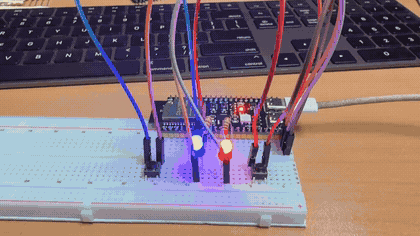
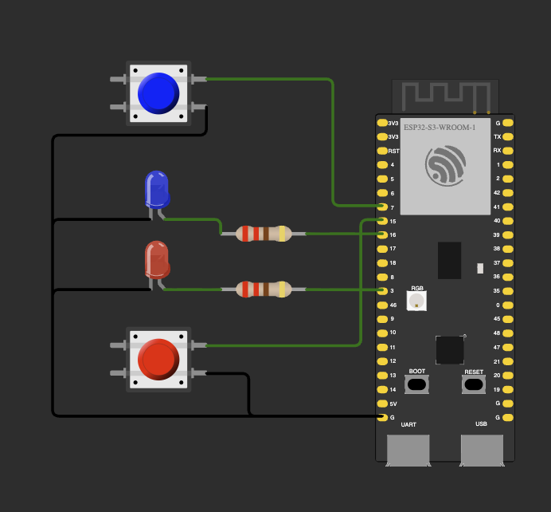
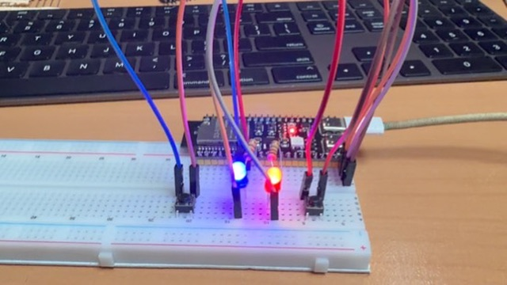

# ДЗ 1.4 — Режими блимання (LED + BUTTON)

Дві кнопки перемикають два режими блимання двох світлодіодів на **ESP32-S3-DevKitC-1**.

| Кнопка | Режим | Поведінка світлодіодів |
|---|---|---|
| 🔵 Синя (GPIO 7) | **Fast Mode** (за замовчуванням) | обидва LED блимають **синхронно** кожні **200 мс** |
| 🔴 Червона (GPIO 15) | **Slow Mode** | LED блимають **по черзі** кожну **1 с** |

## Демо

<a href="video.mp4"></a>

▶️ [Відео в повній якості (MP4)](video.mp4) · [оригінал (MOV)](video.MOV)

## Схема та фото

| Схема (Wokwi) | Зібрана плата |
|---|---|
|  |  |

### Підключення

| Компонент | Пін ESP32-S3 | Примітка |
|---|---|---|
| Синя кнопка | GPIO 7 | другий контакт → GND, `INPUT_PULLUP` |
| Червона кнопка | GPIO 15 | другий контакт → GND, `INPUT_PULLUP` |
| Синій LED | GPIO 16 | через резистор 220 Ω, катод → GND |
| Червоний LED | GPIO 3 | через резистор 220 Ω, катод → GND |

Кнопки активні низьким рівнем: натиснута кнопка замикає пін на GND.

## Як працює код

Файл: [`main.cpp`](main.cpp)

- `LED` і `Button` — тонкі обгортки над `digitalWrite` / `digitalRead`.
- `Mode` — абстрактний клас режиму з методами `name()`, `interval()` і `step()`.
  - `FastMode::step()` вмикає/вимикає обидва LED разом.
  - `SlowMode::step()` вмикає один LED і вимикає інший.
- `currentMode` — вказівник на активний режим (поліморфізм через `virtual`).
- `loop()` робить один `step()`, а потім чекає `interval()` мілісекунд у `waitWithButtons()`.
  Під час очікування кнопки опитуються кожні 10 мс, тому зміна режиму спрацьовує одразу, без чекання кінця паузи.

Вивід у Serial Monitor (115200 бод):

```
Starting...
Initial mode: Fast Mode
Switched to: Slow Mode
Switched to: Fast Mode
```

## Запуск

### На залізі (PlatformIO)

1. У [`platformio.ini`](../../platformio.ini) вкажи цей файл як джерело:
   ```ini
   build_src_filter = +<../dz1.4 (LED + BUTTON)/modes/main.cpp>
   ```
2. Збери, проший і відкрий монітор порту:
   ```sh
   pio run -t upload && pio device monitor
   ```

### У симуляторі (Wokwi for VS Code)

1. Збери прошивку: `pio run`.
2. `Wokwi: Select Config File` → вибери [`wokwi.toml`](wokwi.toml) з цієї папки.
3. Відкрий [`diagram.json`](diagram.json) і запусти `Wokwi: Start Simulator`.

## Файли

| Файл | Опис |
|---|---|
| [`main.cpp`](main.cpp) | прошивка |
| [`diagram.json`](diagram.json) | схема для Wokwi |
| [`wokwi.toml`](wokwi.toml) | конфіг симулятора (шлях до `firmware.bin` / `.elf`) |
| [`schema.png`](schema.png) | скриншот схеми |
| [`photo.jpeg`](photo.jpeg) | фото зібраної схеми |
| [`demo.gif`](demo.gif), [`video.mp4`](video.mp4), [`video.MOV`](video.MOV) | відео роботи |

Інший варіант цього ДЗ: [**toggle**](../toggle/): кожна кнопка вмикає/вимикає свій світлодіод.
