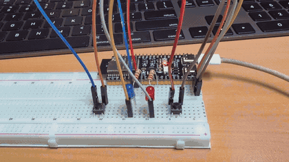
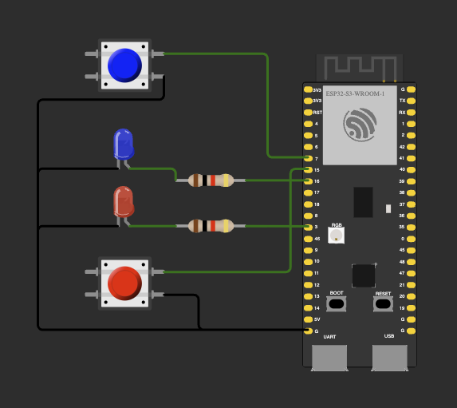
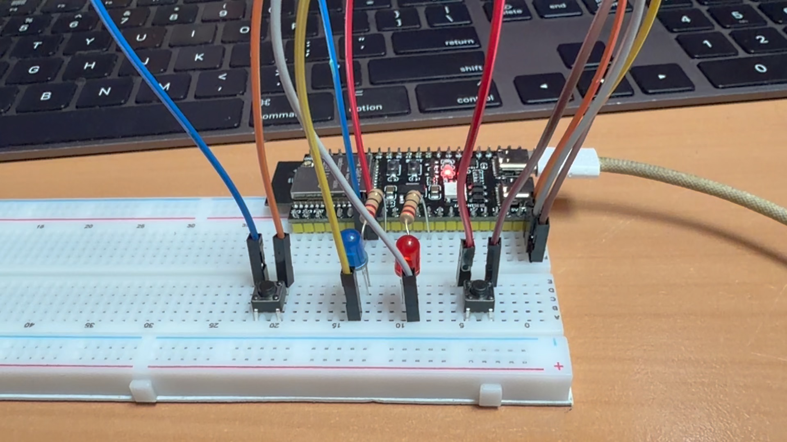

# ДЗ 1.4 — Перемикання світлодіодів (LED + BUTTON)

Кожна кнопка вмикає та вимикає «свій» світлодіод на **ESP32-S3-DevKitC-1**. Для кнопок є програмний антибрязкіт (debounce).

| Кнопка | Світлодіод | Дія |
|---|---|---|
| 🔵 Синя (GPIO 7) | 🔵 Синій (GPIO 16) | натискання перемикає ON ⇄ OFF |
| 🔴 Червона (GPIO 15) | 🔴 Червоний (GPIO 3) | натискання перемикає ON ⇄ OFF |

## Демо

<a href="video.mp4"></a>

▶️ [Відео в повній якості (MP4)](video.mp4) · [оригінал (MOV)](video.MOV)

## Схема та фото

| Схема (Wokwi) | Зібрана плата |
|---|---|
|  |  |

### Підключення

| Компонент | Пін ESP32-S3 | Примітка |
|---|---|---|
| Синя кнопка | GPIO 7 | другий контакт → GND, `INPUT_PULLUP` |
| Червона кнопка | GPIO 15 | другий контакт → GND, `INPUT_PULLUP` |
| Синій LED | GPIO 16 | через резистор 1 kΩ, катод → GND |
| Червоний LED | GPIO 3 | через резистор 1 kΩ, катод → GND |

Кнопки активні низьким рівнем: натиснута кнопка замикає пін на GND.

## Як працює код

Файл: [`main.cpp`](main.cpp)

- `LED` зберігає свій пін, стан і назву. `toggle()` інвертує стан і пише результат у Serial.
- `Button` прив'язана до конкретного `LED*`. `update()` викликається в кожній ітерації `loop()`:
  1. читає пін і, якщо рівень змінився, запам'ятовує час зміни;
  2. якщо рівень тримається довше за `DEBOUNCE_DELAY` (50 мс), вважає його стабільним;
  3. на переході в `LOW` (натискання) викликає `led->toggle()`. Відпускання ігнорується.
- `loop()` просто опитує обидві кнопки. Затримок немає, тому кнопки працюють незалежно одна від одної.

Вивід у Serial Monitor (115200 бод):

```
START
LED ON Blue
LED ON Red
LED OFF Blue
LED OFF Red
```

## Запуск

### На залізі (PlatformIO)

1. У [`platformio.ini`](../../platformio.ini) вкажи цей файл як джерело:
   ```ini
   build_src_filter = +<../dz1.4 (LED + BUTTON)/toggle/main.cpp>
   ```
2. Збери, проший і відкрий монітор порту:
   ```sh
   pio run -t upload && pio device monitor
   ```

### У симуляторі (Wokwi for VS Code)

1. Збери прошивку: `pio run`.
2. `Wokwi: Select Config File` → вибери [`wokwi.toml`](wokwi.toml) з цієї папки.
3. Відкрий [`diagram.json`](diagram.json) і запусти `Wokwi: Start Simulator`.

## Файли

| Файл | Опис |
|---|---|
| [`main.cpp`](main.cpp) | прошивка |
| [`diagram.json`](diagram.json) | схема для Wokwi |
| [`wokwi.toml`](wokwi.toml) | конфіг симулятора (шлях до `firmware.bin` / `.elf`) |
| [`schema.png`](schema.png) | скриншот схеми |
| [`photo.jpeg`](photo.jpeg) | фото зібраної схеми |
| [`demo.gif`](demo.gif), [`video.mp4`](video.mp4), [`video.MOV`](video.MOV) | відео роботи |

Інший варіант цього ДЗ: [**modes**](../modes/): кнопки перемикають режими блимання.
