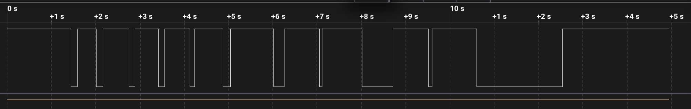
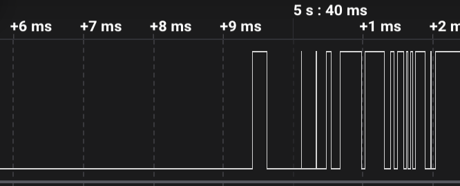
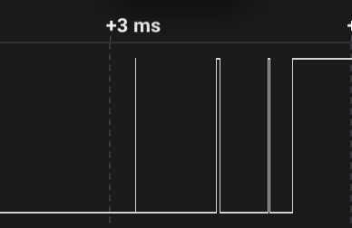

# ДЗ 1.5 — Брязкіт контактів кнопки (BUTTON BOUNCE)

Міряв брязкіт тактової кнопки логічним аналізатором і порівнював з тим, скільки переривань рахує ESP32-S3-DevKitC-1.

## Схема


- кнопка між GPIO 16 і GND, у коді `INPUT_PULLUP`
- аналізатор: CH1 на GPIO 16, GND на GND плати
- аналізатор «24MHz 8CH» (клон Saleae Logic), софт Saleae Logic 2

Від кабелю USB-C ↔ USB-C аналізатор не вмикався, запрацював тільки через перехідник на USB-A.

## Прошивки

- [`counter`](counter/): код з умови, доповнений. Рахує FALLING-переривання окремо для натискання і відпускання та пише час кожного фронту.
- [`debounce`](debounce/): фільтр брязкоту. Новий стан приймається, коли 10 мс не було жодного фронту.

## Як міряв

1. Прошив `counter`, лог із Serial зберігав у `serial.log`.
2. У Logic 2 ставив 24 MS/s і запис на 30 с, натискав кнопку по 10–11 разів: швидко, повільно, сильно, слабко.
3. Експортував канал 0 у CSV і прогнав через [`analysis/bounce_report.py`](analysis/bounce_report.py). Скрипт ділить фронти на натискання й відпускання, рахує імпульси й тривалість брязкоту і звіряє з логом МК.

Перший запис зробив на 4 MS/s, і брязкоту там не було видно зовсім, тому далі писав на 24 MS/s.

## Результати

Основний запис, 24 MS/s, 11 натискань:



| № | Імпульсів на аналізаторі | Переривань МК | Брязкіт відпускання |
|---:|:---:|:---:|---|
| 1 | 1 | 1 | – |
| 2 | 1 | 2 | – |
| 3 | 4 | 5 | 3 імпульси, 0.43 мс |
| 4 | 3 | 4 | 2 імпульси, 0.18 мс |
| 5 | 4 | 7 | 3 імпульси, 0.65 мс |
| 6 | 13 | 20 | 12 імпульсів, 2.62 мс |
| 7 | 1 | 1 | – |
| 8 | 1 | 1 | – |
| 9 | 1 | 1 | – |
| 10 | 1 | 1 | – |
| 11 | 1 | 2 | – |
| разом | 31 | 45 | |

Імпульс тут означає спадаючий фронт (FALLING). На натисканні в кожному рядку 1 і там, і там, уся різниця на відпусканні.

Відпускання №6 і №5 крупно:

 

Усі записи:

| Запис | Натискань | Відпускань з брязкотом | Найдовший брязкіт | Аналізатор / МК |
|---|:---:|:---:|:---:|:---:|
| 4 MS/s | 11 | 0 | – | 11 / 15 |
| 24 MS/s, перший | 10 | 2 | 0.011 мс | 13 / 16 |
| 24 MS/s, основний | 11 | 4 | 2.62 мс | 31 / 45 |
| `debounce`, 24 MS/s | 24 | 6 | 0.85 мс | 24 натискання → 24 `PRESS` |

Детальні таблиці, графіки кожного натискання і скриншоти лежать в [`analysis/`](analysis/).

## Відповіді на питання

### 1. Чи співпадає кількість імпульсів на аналізаторі і в лічильнику МК?

Не завжди. За трьома записами з `counter` збіглося 19 натискань з 32, в інших 13 МК порахував більше: всього 76 переривань проти 55 імпульсів на аналізаторі. Менше, ніж аналізатор, МК не порахував ні разу.

На натисканні збігалось завжди (1 і 1), розбіжності тільки на відпусканні.

### 2. Коли МК пропускає брязкіт, а коли рахує зайве?

Зайве:

- Брязкіт при відпусканні. Код рахує кожен FALLING, тому одне натискання з брязкотом на відпусканні дає кілька «натискань». У №6 основного запису вийшло 20 переривань замість одного.
- Голки, коротші за крок аналізатора. На 4 MS/s аналізатор нічого не побачив, а МК уже порахував зайве в 4 відпусканнях з 11. На 24 MS/s частина голок з'явилась, найкоротша 42 нс, тобто один семпл, і МК її теж зловив. Ще 5 разів на 24 MS/s МК порахував +1 там, де аналізатор не бачив нічого. Переривання GPIO спрацьовує на фронт будь-якої тривалості, а аналізатор бачить тільки те, що довше за крок вибірки.

Пропускає:

- З FALLING пропусків не було. Навіть два спади з інтервалом 9.4 мкс МК порахував окремо.
- У `debounce` переривання на CHANGE, і там МК побачив 89 фронтів з 112. Коротка голка дає спад і наростання з різницею в десятки наносекунд, і вони зливаються в одне переривання.

Брязкіт майже весь на відпусканні, думаю, через слабку вбудовану підтяжку (~45 кОм). Коли контакт при натисканні на мить розмикається, лінія не встигає піднятись до порогу. А при відпусканні контакт на мить торкається GND і скидає лінію в 0 одразу.

### 3. Яка середня тривалість брязкоту?

По всіх записах, 56 натискань:

| | Скільки разів був брязкіт | Середня тривалість | Максимум |
|---|:---:|:---:|:---:|
| натискання | 2 з 56 | 0.03 мс | 0.07 мс |
| відпускання | 12 з 56 | 0.53 мс | 2.62 мс |

У моєї кнопки брязкіт відпускання в середньому близько 0.5 мс, найдовший 2.6 мс, до 13 імпульсів. Більшість натискань і відпускань узагалі без брязкоту.

### 4. Який мінімальний debounce був би достатній?

Залежить від того, як фільтрувати:

- ігнорувати фронти N мс після першого: N має бути більше за найдовший брязкіт, тобто > 2.6 мс;
- чекати N мс тиші (як у `debounce`): N більше за найдовшу паузу всередині брязкоту, тобто > 0.49 мс.

З запасом ×2 це приблизно 6 мс і 1 мс. Я взяв 10 мс: це запас на старіння кнопки і на голки, яких аналізатор не бачить, а затримку в 10 мс людина не помічає. Перевірив на платі: 24 натискання різної сили дали рівно 24 `PRESS` і 24 `RELEASE`.

## Файли

```
dz1.5 (BUTTON BOUNCE)/
├── counter/     прошивка для вимірювань
├── debounce/    прошивка з фільтром
└── analysis/    записи Logic 2, логи МК, скриншоти, скрипт bounce_report.py
```
