# analysis

Записи з аналізатора, логи плати і скрипт, яким я їх обробляв.

| Папка | Що там |
|---|---|
| [`24msps-2/`](24msps-2/) | основний запис: 24 MS/s, 11 натискань, скриншоти з Logic 2 |
| [`24msps-1/`](24msps-1/) | перший запис на 24 MS/s, 10 натискань |
| [`4msps/`](4msps/) | найперший запис на 4 MS/s, 11 натискань |
| [`debounce-10ms/`](debounce-10ms/) | перевірка прошивки `debounce`, 24 натискання |

У кожній папці `capture.csv` (експорт з Logic 2, канал 0), `serial.log` (що друкувала плата) і `plots/` (графіки від скрипта).

## Як записував

1. Аналізатор підключав через перехідник USB-C → USB-A, у Logic 2 він визначився як Logic.
2. Налаштування: 24 MS/s, режим Timer на 30–60 с, Glitch filter вимкнений. Канали 1–7 у цього аналізатора не вимикаються, їх просто ігнорував.
3. Start, потім натискання кнопки.
4. File → Export Data → CSV, тільки канал 0.
5. Паралельно зберігав лог Serial з плати в `serial.log`.

## Скрипт

```sh
python3 analysis/bounce_report.py analysis/24msps-2/capture.csv \
  --mcu-log analysis/24msps-2/serial.log \
  --plots analysis/24msps-2/plots \
  --update-readme analysis/README.md --section 24msps-2
```

Скрипт ділить фронти на пачки (нова пачка після паузи довшої за `--gap-ms`, за замовчуванням 30 мс), визначає натискання і відпускання, рахує імпульси й тривалість брязкоту, звіряє з `serial.log` і вставляє таблицю в цей файл між маркерами. Потрібен тільки Python 3.

| Опція | Що робить |
|---|---|
| `--mcu-log` | лог `counter` або `debounce` для порівняння |
| `--gap-ms` | пауза між пачками, мс. Для `debounce-10ms` ставив 10, бо там були натискання по 17–30 мс |
| `--plots` | SVG-графік кожного натискання |
| `--update-readme`, `--section` | куди вставити таблицю |
| `--channel`, `--mcu-skip`, `--out` | вибір каналу, пропуск перших натискань у лозі, запис у файл |

## Основний запис: 24 MS/s

Скриншоти з Logic 2 по кожному натисканню:

| | |
|---|---|
| 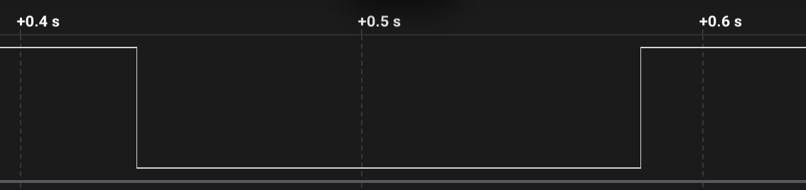 | 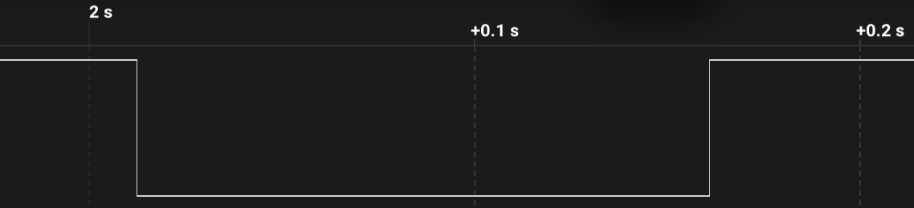 |
| 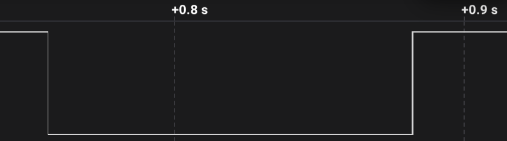 | 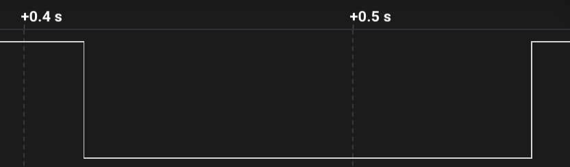 |
| 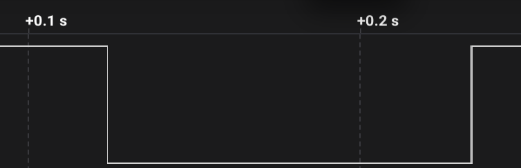 | 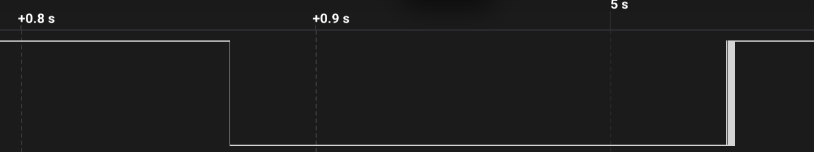 |
| 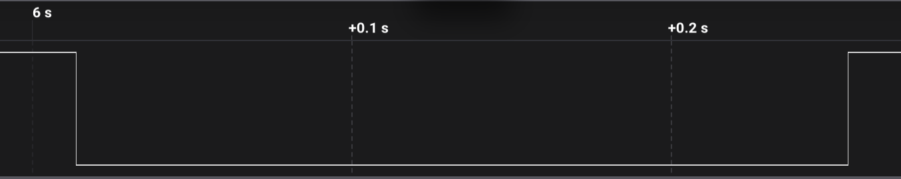 | 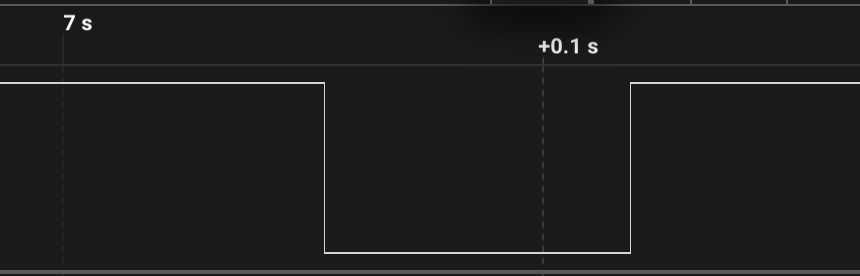 |
| 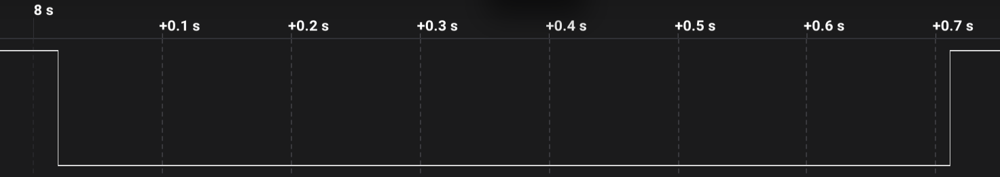 | 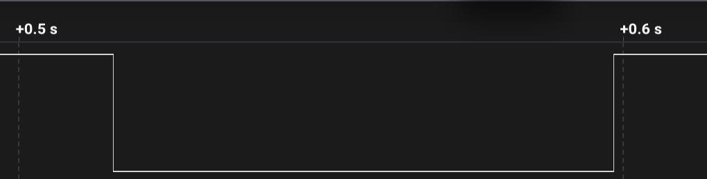 |
|  |  |

<!-- bounce-report:24msps-2:start -->
Запис: `analysis/24msps-2/capture.csv`, канал `Channel 0`. Пачки брязкоту розділяються тишею > 30 мс.
Лог мікроконтролера: `analysis/24msps-2/serial.log` (11 натискань, МК рахує FALLING-переривання).

| № | Натискання: імп. (фронтів) | Брязкіт натискання, мс | Утримання, мс | Відпускання: імп. (фронтів) | Брязкіт відпускання, мс | ЛА: імп. разом | МК: імп. разом | МК − ЛА |
|---:|:---:|---:|---:|:---:|---:|:---:|:---:|:---:|
| 1 | 1 (1) | 0.000 | 148 | 0 (1) | 0.000 | 1 | 1 | 0 |
| 2 | 1 (1) | 0.000 | 148 | 0 (1) | 0.000 | 1 | 2 | +1 |
| 3 | 1 (1) | 0.000 | 126 | 3 (7) | 0.429 | 4 | 5 | +1 |
| 4 | 1 (1) | 0.000 | 136 | 2 (5) | 0.178 | 3 | 4 | +1 |
| 5 | 1 (1) | 0.000 | 109 | 3 (7) | 0.651 | 4 | 7 | +3 |
| 6 | 1 (1) | 0.000 | 168 | 12 (25) | 2.618 | 13 | 20 | +7 |
| 7 | 1 (1) | 0.000 | 242 | 0 (1) | 0.000 | 1 | 1 | 0 |
| 8 | 1 (1) | 0.000 | 64 | 0 (1) | 0.000 | 1 | 1 | 0 |
| 9 | 1 (1) | 0.000 | 692 | 0 (1) | 0.000 | 1 | 1 | 0 |
| 10 | 1 (1) | 0.000 | 83 | 0 (1) | 0.000 | 1 | 1 | 0 |
| 11 | 1 (1) | 0.000 | 1940 | 0 (1) | 0.000 | 1 | 2 | +1 |

_імп._ = FALLING-фронти (саме їх рахує переривання `FALLING`), у дужках усі фронти, _брязкіт_ = час від першого до останнього фронту пачки.

**Підсумок (11 натискань)**

| Показник | Натискання | Відпускання |
|---|:---:|:---:|
| Імпульсів (FALLING): середнє / макс | 1.0 / 1 | 1.8 / 12 |
| Брязкіт, мс: середнє / медіана / макс | 0.000 / 0.000 / 0.000 | 0.352 / 0.000 / 2.618 |
| Найдовша пауза між фронтами в пачці, мс | 0.000 | 0.488 |

- Лічильник МК збігся з аналізатором у **5 з 11** натискань; МК порахував менше: 0, більше: 6. Разом МК 45 із 31 імп. (145 %).
- Найдовший брязкіт: **2.618 мс**. Debounce «ігнорувати фронти N мс після першого» має бути не менше за нього, із запасом ×2: **6 мс**.
- Найдовша пауза всередині брязкоту: **0.488 мс**. Debounce «чекати N мс тиші» (варіант `debounce`) має бути більшим за неї, із запасом ×2: **1 мс**.

<details open>
<summary><b>Графіки: 11 натискань</b>, ліворуч натискання, праворуч відпускання</summary>

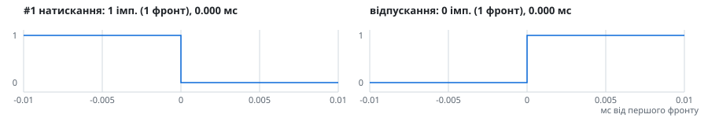

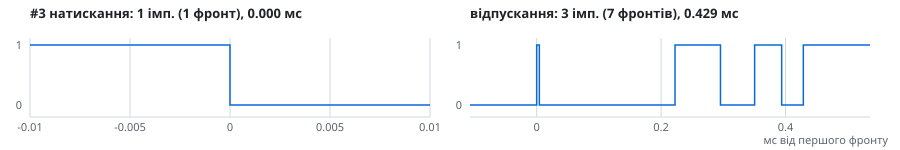
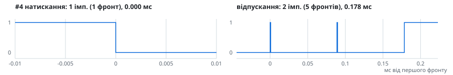
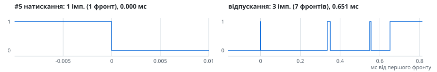
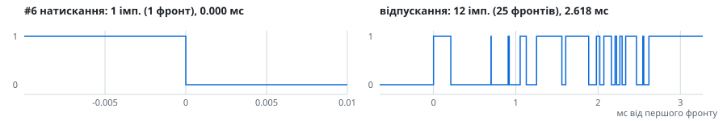
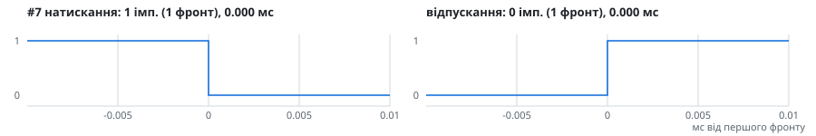


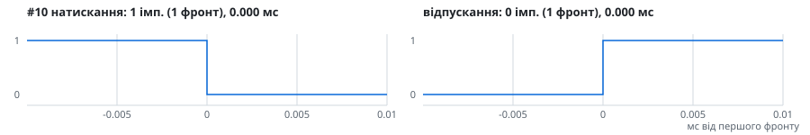


</details>
<!-- bounce-report:24msps-2:end -->

## Перший запис на 24 MS/s

<!-- bounce-report:24msps-1:start -->
Запис: `analysis/24msps-1/capture.csv`, канал `Channel 0`. Пачки брязкоту розділяються тишею > 30 мс.
Лог мікроконтролера: `analysis/24msps-1/serial.log` (10 натискань, МК рахує FALLING-переривання).

| № | Натискання: імп. (фронтів) | Брязкіт натискання, мс | Утримання, мс | Відпускання: імп. (фронтів) | Брязкіт відпускання, мс | ЛА: імп. разом | МК: імп. разом | МК − ЛА |
|---:|:---:|---:|---:|:---:|---:|:---:|:---:|:---:|
| 1 | 1 (1) | 0.000 | 203 | 0 (1) | 0.000 | 1 | 1 | 0 |
| 2 | 1 (1) | 0.000 | 350 | 2 (5) | 0.011 | 3 | 3 | 0 |
| 3 | 1 (1) | 0.000 | 124 | 0 (1) | 0.000 | 1 | 2 | +1 |
| 4 | 1 (1) | 0.000 | 128 | 0 (1) | 0.000 | 1 | 1 | 0 |
| 5 | 1 (1) | 0.000 | 209 | 0 (1) | 0.000 | 1 | 2 | +1 |
| 6 | 1 (1) | 0.000 | 262 | 0 (1) | 0.000 | 1 | 1 | 0 |
| 7 | 1 (1) | 0.000 | 286 | 1 (3) | 0.001 | 2 | 2 | 0 |
| 8 | 1 (1) | 0.000 | 145 | 0 (1) | 0.000 | 1 | 1 | 0 |
| 9 | 1 (1) | 0.000 | 171 | 0 (1) | 0.000 | 1 | 1 | 0 |
| 10 | 1 (1) | 0.000 | 2104 | 0 (1) | 0.000 | 1 | 2 | +1 |

_імп._ = FALLING-фронти (саме їх рахує переривання `FALLING`), у дужках усі фронти, _брязкіт_ = час від першого до останнього фронту пачки.

**Підсумок (10 натискань)**

| Показник | Натискання | Відпускання |
|---|:---:|:---:|
| Імпульсів (FALLING): середнє / макс | 1.0 / 1 | 0.3 / 2 |
| Брязкіт, мс: середнє / медіана / макс | 0.000 / 0.000 / 0.000 | 0.001 / 0.000 / 0.011 |
| Найдовша пауза між фронтами в пачці, мс | 0.000 | 0.009 |

- Лічильник МК збігся з аналізатором у **7 з 10** натискань; МК порахував менше: 0, більше: 3. Разом МК 16 із 13 імп. (123 %).
- Найдовший брязкіт: **0.011 мс**. Debounce «ігнорувати фронти N мс після першого» має бути не менше за нього, із запасом ×2: **1 мс**.
- Найдовша пауза всередині брязкоту: **0.009 мс**. Debounce «чекати N мс тиші» (варіант `debounce`) має бути більшим за неї, із запасом ×2: **1 мс**.

<details open>
<summary><b>Графіки: 10 натискань</b>, ліворуч натискання, праворуч відпускання</summary>


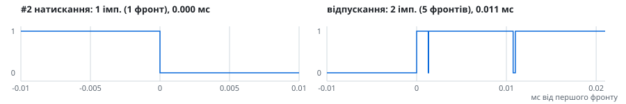


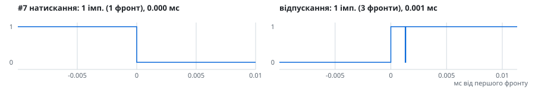


</details>
<!-- bounce-report:24msps-1:end -->

## Запис на 4 MS/s

На цьому кроці брязкоту не видно взагалі, хоча МК уже рахував зайві переривання.

<!-- bounce-report:4msps:start -->
Запис: `analysis/4msps/capture.csv`, канал `Channel 0`. Пачки брязкоту розділяються тишею > 30 мс.
Лог мікроконтролера: `analysis/4msps/serial.log` (11 натискань, МК рахує FALLING-переривання).

| № | Натискання: імп. (фронтів) | Брязкіт натискання, мс | Утримання, мс | Відпускання: імп. (фронтів) | Брязкіт відпускання, мс | ЛА: імп. разом | МК: імп. разом | МК − ЛА |
|---:|:---:|---:|---:|:---:|---:|:---:|:---:|:---:|
| 1 | 1 (1) | 0.000 | 165 | 0 (1) | 0.000 | 1 | 1 | 0 |
| 2 | 1 (1) | 0.000 | 166 | 0 (1) | 0.000 | 1 | 1 | 0 |
| 3 | 1 (1) | 0.000 | 100 | 0 (1) | 0.000 | 1 | 2 | +1 |
| 4 | 1 (1) | 0.000 | 108 | 0 (1) | 0.000 | 1 | 1 | 0 |
| 5 | 1 (1) | 0.000 | 361 | 0 (1) | 0.000 | 1 | 2 | +1 |
| 6 | 1 (1) | 0.000 | 383 | 0 (1) | 0.000 | 1 | 1 | 0 |
| 7 | 1 (1) | 0.000 | 513 | 0 (1) | 0.000 | 1 | 1 | 0 |
| 8 | 1 (1) | 0.000 | 537 | 0 (1) | 0.000 | 1 | 2 | +1 |
| 9 | 1 (1) | 0.000 | 107 | 0 (1) | 0.000 | 1 | 2 | +1 |
| 10 | 1 (1) | 0.000 | 124 | 0 (1) | 0.000 | 1 | 1 | 0 |
| 11 | 1 (1) | 0.000 | 125 | 0 (1) | 0.000 | 1 | 1 | 0 |

_імп._ = FALLING-фронти (саме їх рахує переривання `FALLING`), у дужках усі фронти, _брязкіт_ = час від першого до останнього фронту пачки.

**Підсумок (11 натискань)**

| Показник | Натискання | Відпускання |
|---|:---:|:---:|
| Імпульсів (FALLING): середнє / макс | 1.0 / 1 | 0.0 / 0 |
| Брязкіт, мс: середнє / медіана / макс | 0.000 / 0.000 / 0.000 | 0.000 / 0.000 / 0.000 |
| Найдовша пауза між фронтами в пачці, мс | 0.000 | 0.000 |

- Лічильник МК збігся з аналізатором у **7 з 11** натискань; МК порахував менше: 0, більше: 4. Разом МК 15 із 11 імп. (136 %).
- Найдовший брязкіт: **0.000 мс**. Debounce «ігнорувати фронти N мс після першого» має бути не менше за нього, із запасом ×2: **1 мс**.
- Найдовша пауза всередині брязкоту: **0.000 мс**. Debounce «чекати N мс тиші» (варіант `debounce`) має бути більшим за неї, із запасом ×2: **1 мс**.

<details open>
<summary><b>Графіки: 11 натискань</b>, ліворуч натискання, праворуч відпускання</summary>


</details>
<!-- bounce-report:4msps:end -->

## Перевірка debounce

Прошивка `debounce` з `DEBOUNCE_MS 10`, пауза між пачками 10 мс.

<!-- bounce-report:debounce-10ms:start -->
Запис: `analysis/debounce-10ms/capture.csv`, канал `Channel 0`. Пачки брязкоту розділяються тишею > 10 мс.
Лог мікроконтролера: `analysis/debounce-10ms/serial.log` (24 натискань, МК рахує всі фронти через CHANGE).

| № | Натискання: імп. (фронтів) | Брязкіт натискання, мс | Утримання, мс | Відпускання: імп. (фронтів) | Брязкіт відпускання, мс | ЛА: фронтів разом | МК: фронтів разом | МК − ЛА |
|---:|:---:|---:|---:|:---:|---:|:---:|:---:|:---:|
| 1 | 1 (1) | 0.000 | 76 | 0 (1) | 0.000 | 2 | 2 | 0 |
| 2 | 1 (1) | 0.000 | 46 | 0 (1) | 0.000 | 2 | 2 | 0 |
| 3 | 1 (1) | 0.000 | 560 | 13 (27) | 0.846 | 28 | 21 | -7 |
| 4 | 1 (1) | 0.000 | 366 | 1 (3) | 0.101 | 4 | 2 | -2 |
| 5 | 1 (1) | 0.000 | 142 | 0 (1) | 0.000 | 2 | 2 | 0 |
| 6 | 1 (1) | 0.000 | 51 | 0 (1) | 0.000 | 2 | 2 | 0 |
| 7 | 1 (1) | 0.000 | 263 | 0 (1) | 0.000 | 2 | 2 | 0 |
| 8 | 2 (3) | 0.065 | 355 | 0 (1) | 0.000 | 4 | 4 | 0 |
| 9 | 1 (1) | 0.000 | 378 | 0 (1) | 0.000 | 2 | 2 | 0 |
| 10 | 1 (1) | 0.000 | 30 | 0 (1) | 0.000 | 2 | 2 | 0 |
| 11 | 1 (1) | 0.000 | 17 | 0 (1) | 0.000 | 2 | 2 | 0 |
| 12 | 1 (1) | 0.000 | 35 | 5 (11) | 0.346 | 12 | 8 | -4 |
| 13 | 2 (3) | 0.001 | 33 | 0 (1) | 0.000 | 4 | 2 | -2 |
| 14 | 1 (1) | 0.000 | 36 | 0 (1) | 0.000 | 2 | 2 | 0 |
| 15 | 1 (1) | 0.000 | 41 | 0 (1) | 0.000 | 2 | 2 | 0 |
| 16 | 1 (1) | 0.000 | 565 | 0 (1) | 0.000 | 2 | 2 | 0 |
| 17 | 1 (1) | 0.000 | 228 | 7 (15) | 0.084 | 16 | 11 | -5 |
| 18 | 1 (1) | 0.000 | 169 | 3 (7) | 0.833 | 8 | 6 | -2 |
| 19 | 1 (1) | 0.000 | 185 | 1 (3) | 0.319 | 4 | 3 | -1 |
| 20 | 1 (1) | 0.000 | 47 | 0 (1) | 0.000 | 2 | 2 | 0 |
| 21 | 1 (1) | 0.000 | 55 | 0 (1) | 0.000 | 2 | 2 | 0 |
| 22 | 1 (1) | 0.000 | 248 | 0 (1) | 0.000 | 2 | 2 | 0 |
| 23 | 1 (1) | 0.000 | 184 | 0 (1) | 0.000 | 2 | 2 | 0 |
| 24 | 1 (1) | 0.000 | 458 | 0 (1) | 0.000 | 2 | 2 | 0 |

_імп._ = FALLING-фронти (саме їх рахує переривання `FALLING`), у дужках усі фронти, _брязкіт_ = час від першого до останнього фронту пачки.

**Підсумок (24 натискань)**

| Показник | Натискання | Відпускання |
|---|:---:|:---:|
| Імпульсів (FALLING): середнє / макс | 1.1 / 2 | 1.2 / 13 |
| Брязкіт, мс: середнє / медіана / макс | 0.003 / 0.000 / 0.065 | 0.105 / 0.000 / 0.846 |
| Найдовша пауза між фронтами в пачці, мс | 0.055 | 0.375 |

- Фільтр МК зарахував **24** натискань, на записі аналізатора **24**: кожне натискання зараховане один раз.
- Лічильник МК збігся з аналізатором у **17 з 24** натискань; МК порахував менше: 7, більше: 0. Разом МК 89 із 112 фронтів (79 %).
- Найдовший брязкіт: **0.846 мс**. Debounce «ігнорувати фронти N мс після першого» має бути не менше за нього, із запасом ×2: **2 мс**.
- Найдовша пауза всередині брязкоту: **0.375 мс**. Debounce «чекати N мс тиші» (варіант `debounce`) має бути більшим за неї, із запасом ×2: **1 мс**.

<details open>
<summary><b>Графіки: 24 натискання</b>, ліворуч натискання, праворуч відпускання</summary>


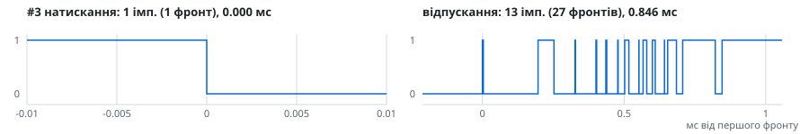
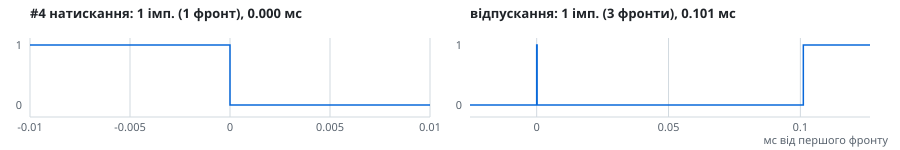


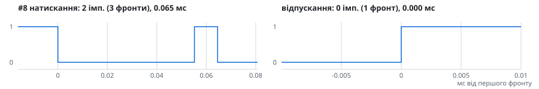


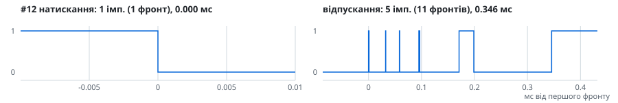
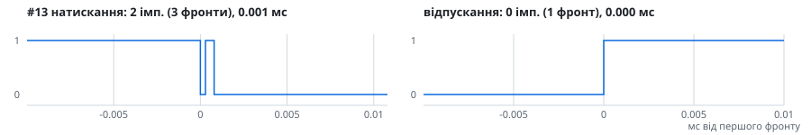
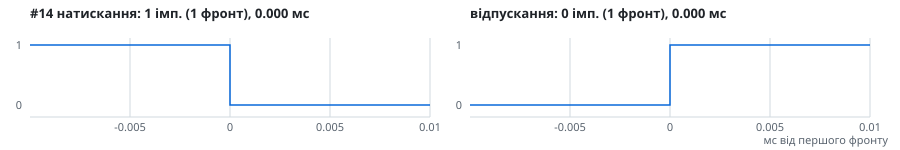

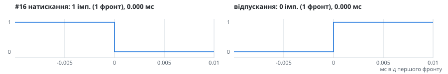
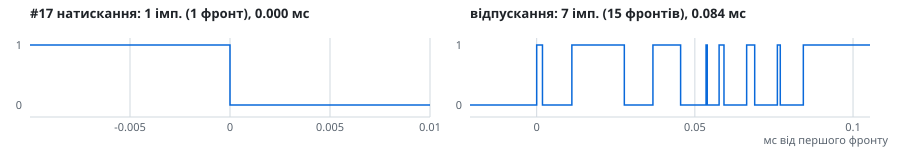
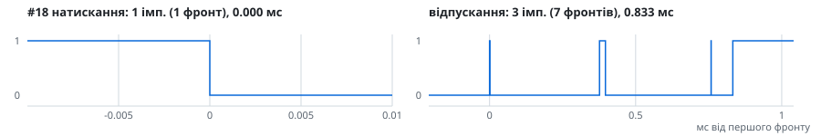
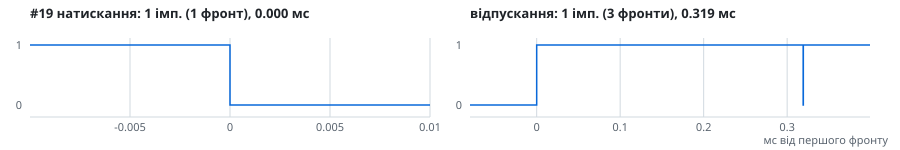
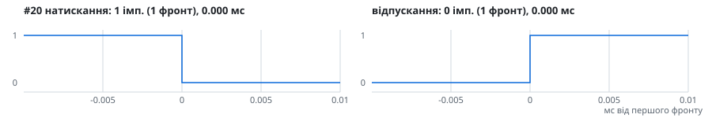
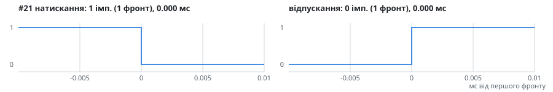


</details>
<!-- bounce-report:debounce-10ms:end -->
