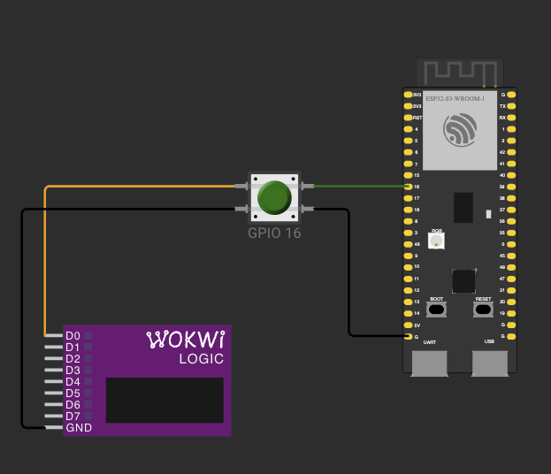

# ДЗ 1.5 — Фільтр брязкоту (BUTTON BOUNCE)

Та сама кнопка, але з програмним debounce: кожне натискання рахується один раз. Прошивку зробив, щоб перевірити відповідь на питання 4.

## Схема

Та сама, що в [`counter`](../counter/).



## Як працює код

Файл: [`main.cpp`](main.cpp)

- `button_isr()` спрацьовує на CHANGE (обидва фронти): рахує фронт і запам'ятовує час останнього.
- `loop()` раз на 1 мс порівнює рівень піна з відфільтрованим станом. Новий стан приймається, тільки якщо після останнього фронту минуло `DEBOUNCE_MS` (10 мс).
- У лозі `edges` показує, скільки фронтів було за перехід, `ignored` показує, скільки з них відкинуто.

FALLING тут не підходить: відпускання закінчується наростаючим фронтом, і без нього не видно, коли брязкіт закінчився.

## Результат на платі

24 натискання різної сили дали 24 `PRESS` і 24 `RELEASE`. Шматок логу, у відпусканні №3 фільтр відкинув 19 фронтів:

```
PRESS   #3   edges: 1   ignored: 0   (released for 380 ms)
RELEASE #3   edges: 20  ignored: 19  (held for 561 ms)
PRESS   #4   edges: 1   ignored: 0   (released for 281 ms)
RELEASE #4   edges: 1   ignored: 0   (held for 366 ms)
```

Запис і таблиця: [`analysis/debounce-10ms`](../analysis/debounce-10ms/), розділ «Перевірка debounce» в [`analysis/README.md`](../analysis/README.md).

## Запуск

1. У [`platformio.ini`](../../platformio.ini):
   ```ini
   build_src_filter = +<../dz1.5 (BUTTON BOUNCE)/debounce/main.cpp>
   ```
2. `pio run -t upload && pio device monitor`

У Wokwi: `pio run`, потім `Wokwi: Select Config File` → [`wokwi.toml`](wokwi.toml) і запуск [`diagram.json`](diagram.json).

## Файли

| Файл | Опис |
|---|---|
| [`main.cpp`](main.cpp) | прошивка |
| [`diagram.json`](diagram.json) | схема для Wokwi |
| [`wokwi.toml`](wokwi.toml) | конфіг Wokwi |
| [`schema.png`](schema.png) | скриншот схеми |

Інший варіант: [**counter**](../counter/), лічильник переривань без фільтра, на ньому робились виміри.
