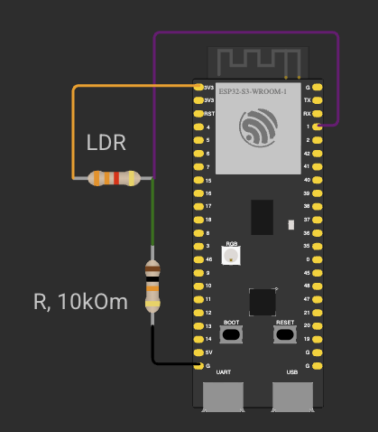
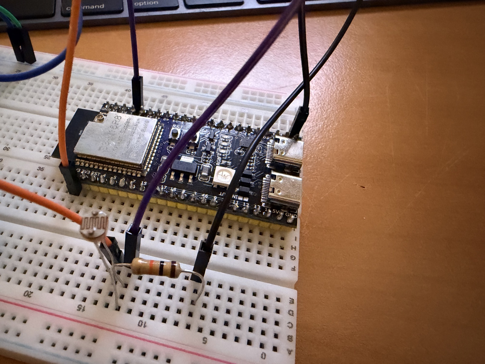

<!--
  TODO перед комітом:
  - photo.jpeg (обов'язково), video.MOV → tools/media.sh "dz1.6 (LDR LIGHT)/light"
  - schema.png: скриншот твоєї схеми з Wokwi
-->
# ДЗ 1.6 — Вимірювання освітленості (LDR)

Фоторезистор у подільнику напруги на **ESP32-S3-DevKitC-1**. Кожні 100 мс читаю АЦП, рахую напругу вручну за формулою з умови, поруч беру те саме через `analogReadMilliVolts()` і дивлюсь, наскільки розходяться обидва числа.

```
U(calc) = RAW × Uref / ADCmax = RAW × 3100 мВ / 4095
```

## Схема та фото

| Схема підключення | Зібрана плата |
|---|---|
|  |  |

Подільник як в умові: **+3.3 В → LDR → вузол → 10 кΩ → GND**, вузол іде на АЦП.

| Вузол схеми | Пін ESP32-S3 | Примітка |
|---|---|---|
| LDR, верхнє плече | 3V3 | сотні кΩ у темряві, одиниці кΩ на світлі |
| Середня точка подільника | GPIO 1 | ADC1_CH0 |
| Резистор 10 кΩ, нижнє плече | GND | |

Напруга на вузлі рахується як `U = 3.3 В × 10 кΩ / (R_LDR + 10 кΩ)`. У темряві, коли `R_LDR ≈ 580 кΩ`, це `3.3 × 10 / 590.1 ≈ 56 мВ` — те саме, що показує вольтметр на схемі з умови. Чим більше світла, тим менший опір LDR і тим вища напруга на АЦП.

Перед макеткою зібрав те саме в Wokwi. Голого фоторезистора там немає — лише модуль `wokwi-photoresistor-sensor` з уже впаяним подільником, до того ж дзеркальним до умови. Тому в симуляторі подільник стоїть на двох звичайних резисторах: верхнє плече замість LDR, нижнє — ті самі 10 кΩ, вузол між ними на GPIO 1. Опір фіксований, тож покази статичні — це стенд для перевірки прошивки, а живі виміри йдуть з макетки.

## Як працює код

Файл: [`main.cpp`](main.cpp)

- `setup()` виставляє `analogReadResolution(12)` (щоб `ADCmax` справді був 4095) і `ADC_11db` на піні — це найбільше послаблення, вхідний діапазон ~0…3.1 В, звідки й `Uref = 3100 мВ`.
- `loop()` не використовує `delay()`: порівнює `millis()` з часом попереднього виміру і додає рівно 100 мс, тому період не «пливе», якщо друк у Serial трохи затримався.
- На кожному вимірі йдуть два окремі перетворення: `analogRead()` дає сирий код, `analogReadMilliVolts()` — ту саму напругу, але вже через заводську калібрувальну криву з eFuse.
- Похибка рахується відносно каліброваного значення: `err = (U(calc) − U(API)) / U(API) × 100%`.
- Кожні 20 рядків друкується середня і максимальна за модулем похибка блоку, щоб не зводити її очима.

## Вивід

Serial Monitor, 115200 бод. Спершу датчик відкритий, далі накривав його рукою і знову відкривав. Повний запис — [`serial.log`](serial.log), 139 вимірів.

```
=== DZ 1.6: LDR light meter ===
GPIO 1 (ADC1), period 100 ms, ADCmax 4095, Uref 3100 mV
U(calc) = RAW * Uref / ADCmax,  U(API) = analogReadMilliVolts()
dU = U(calc) - U(API),  err = dU / U(API) * 100%

    # |   RAW | U(calc), mV | U(calc), V | U(API), mV |  dU, mV |  err, %
------+-------+-------------+------------+------------+---------+--------
   17 |  3981 |      3013.7 |      3.014 |       3101 |   -87.3 |   -2.82
   18 |  3967 |      3003.1 |      3.003 |       3094 |   -90.9 |   -2.94
   19 |  3955 |      2994.0 |      2.994 |       3090 |   -96.0 |   -3.11
   20 |  3951 |      2991.0 |      2.991 |       3089 |   -98.0 |   -3.17
      avg err: -4.03 %   max |err|: 4.82 %   (20 samples)
...
   30 |  3689 |      2792.6 |      2.793 |       2954 |  -161.4 |   -5.46
   31 |  3131 |      2370.2 |      2.370 |       2590 |  -219.8 |   -8.49
   32 |  2333 |      1766.1 |      1.766 |       1959 |  -192.9 |   -9.85
   33 |  1775 |      1343.7 |      1.344 |       1494 |  -150.3 |  -10.06
...
   66 |   845 |       639.7 |      0.640 |        713 |   -73.3 |  -10.28
   67 |   793 |       600.3 |      0.600 |        682 |   -81.7 |  -11.98
   68 |   792 |       599.6 |      0.600 |        679 |   -79.4 |  -11.70
      avg err: -10.83 %   max |err|: 11.98 %   (20 samples)
```

## Що вийшло

RAW пройшов 792…3981, тобто 0.68…3.10 В за `analogReadMilliVolts()`. Обчислена напруга щоразу виявилась меншою за калібровану — знак похибки не змінився жодного разу. Але сама похибка не стала: від −2.8 % на відкритому датчику до −12 % у затінку.

| RAW | U(API) | Середня похибка | Вимірів |
|---|---|---|---|
| 3400–3981 | 2.88–3.10 В | −3.8 % | 51 |
| 2600–3399 | 2.30–2.59 В | −8.8 % | 2 |
| 1800–2599 | 1.52–1.96 В | −10.0 % | 4 |
| 1200–1799 | 1.02–1.50 В | −10.1 % | 59 |
| 792–1199 | 0.68–1.01 В | −10.9 % | 21 |

Пояснення видно в стовпці `dU`: абсолютна різниця тримається в межах −73…−220 мВ, у середньому −125 мВ, і це при тому, що сама напруга змінюється більш ніж учетверо. Тобто розходження не пропорційне сигналу, а майже стале, і у відсотках воно просто ділиться на меншу напругу — звідси −3 % зверху шкали і −11 % знизу.

Якщо прогнати весь лог через лінійну апроксимацію, виходить `U(API) ≈ 0.755 × RAW + 130 мВ`. Нахил майже точно збігається з тим, що закладено у формулі (`3100 / 4095 = 0.757`), тобто 3.1 В як масштаб обрано правильно. Формула не враховує інше — власний зсув АЦП близько 130 мВ: при `RAW = 0` на вході не нуль. Саме цей зсув і дає всю похибку.

Ще два спостереження:

- Рядки 42 і 45 вибиваються (−14.9 % і −18.6 %): там `RAW` просів, а `analogReadMilliVolts()` навпаки виріс. Це два різні перетворення одне за одним, і я саме в цей момент рухав рукою — між ними освітлення встигло змінитись. Решта 137 вимірів лягає рівно.
- На відкритому датчику `U(API)` дійшов до 3101 мВ при `RAW` 3981. Це вже стеля діапазону `ADC_11db`: ще трохи світла — і `RAW` впреться в 4095, після чого АЦП перестане розрізняти освітленість. Якщо потрібен запас, варто збільшити нижнє плече подільника.

## Запуск

1. У [`platformio.ini`](../../platformio.ini):
   ```ini
   build_src_filter = +<../dz1.6 (LDR LIGHT)/light/main.cpp>
   ```
2. `pio run -t upload && pio device monitor`

У Wokwi: `pio run`, потім `Wokwi: Select Config File` → [`wokwi.toml`](wokwi.toml) і запуск [`diagram.json`](diagram.json).

## Файли

| Файл | Опис |
|---|---|
| [`main.cpp`](main.cpp) | прошивка |
| [`diagram.json`](diagram.json) | схема для Wokwi: подільник на двох резисторах |
| [`wokwi.toml`](wokwi.toml) | конфіг Wokwi |
| [`schema.png`](schema.png) | скриншот схеми з Wokwi |
| [`photo.jpeg`](photo.jpeg) | фото зібраної схеми |
| [`serial.log`](serial.log) | повний лог вимірювань з плати |
