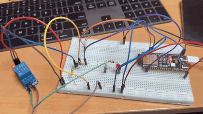
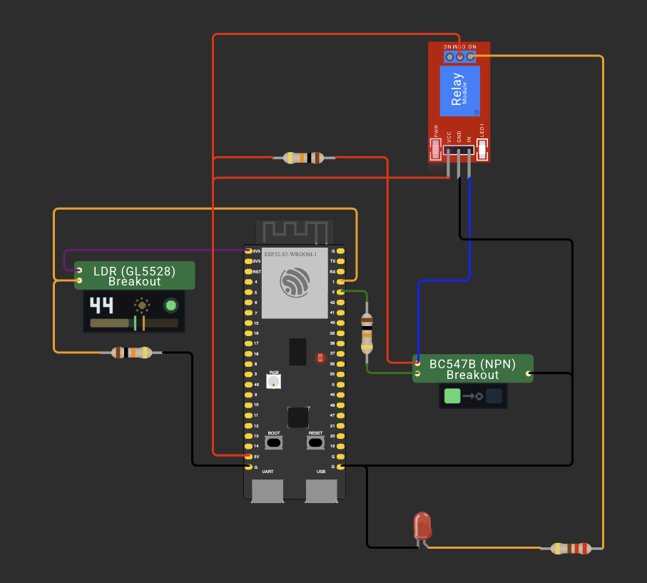
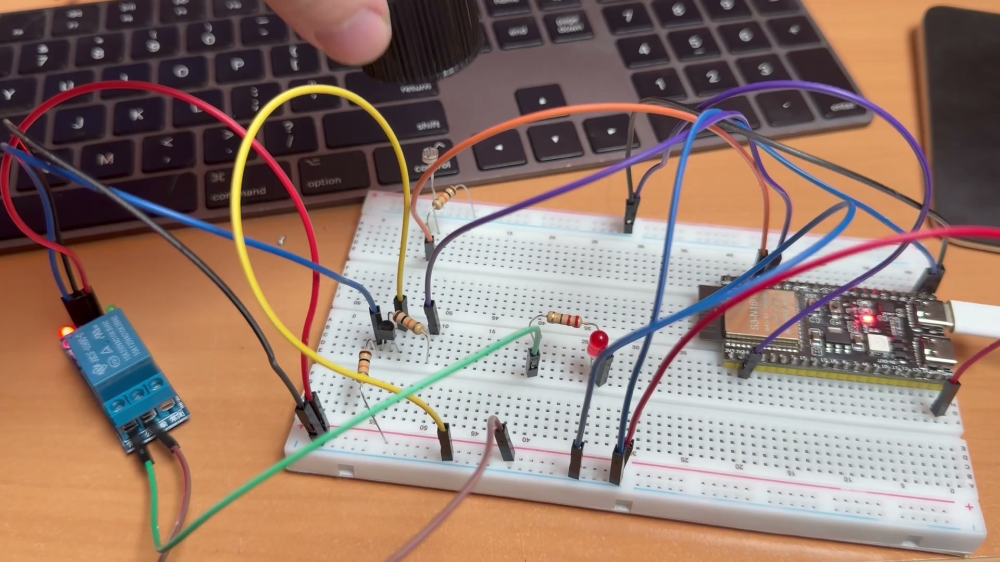
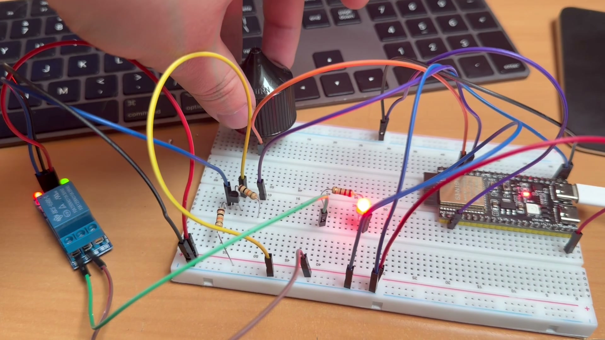

# ДЗ 1.7 — Сутінковий перемикач (TWILIGHT SWITCH)

Міні-проєкт на **ESP32-S3-DevKitC-1**: фоторезистор міряє освітлення, а навантаження вмикається через транзисторний ключ і модуль реле. Логіка з гістерезисом: темніє — реле замикається, світлішає — розмикається, а між порогами стан не чіпається, щоб реле не тріщало в сутінках.

## Демо

<a href="video.mp4"></a>

https://github.com/user-attachments/assets/ce361e3b-713f-4368-b7a4-91b5092e6031

## Схема та фото

| Схема (Wokwi) | Зібрана плата |
|---|---|
|  |  |

Ліворуч — світло є, навантаження вимкнене. А так виглядає спрацювання, коли датчик накрили: на модулі реле загорається другий світлодіод, і навантаження вмикається.



### Підключення

| Вузол | Пін ESP32-S3 | Примітка |
|---|---|---|
| Фоторезистор R1, верхнє плече | 3V3 | сотні кОм у темряві, одиниці кОм на світлі |
| Середня точка дільника | GPIO 1 | ADC1_CH0, вхід `GPIO In` |
| Резистор R2 10 кОм, нижнє плече | GND | |
| База VT1 (BC547B) через R3 10 кОм | GPIO 2 | вихід `GPIO Out` |
| Емітер VT1 | GND | спільна земля плати й модуля реле |
| Колектор VT1 | вхід `IN` реле | і через R4 10 кОм на +5V |
| `VCC` / `GND` модуля реле | 5V / GND | |
| Навантаження | `COM` і `OUT NO` | сухі контакти, у мене світлодіод на 5 В |

Ключ потрібен для узгодження рівнів: вхід модуля реле розрахований на 5 В, а плата видає 3.3 В. Працює він так:

- **`HIGH` на GPIO** — транзистор відкритий, колектор майже на нулі, на `IN` модуля приходить **низький** рівень.
- **`LOW` на GPIO** — транзистор закритий, підтяжка R4 тягне колектор до +5 В, на `IN` приходить **високий** рівень.

Тобто каскад інвертує сигнал, і кінцева полярність залежить від того, яким рівнем запускається сам модуль реле:

| Модуль | `IN` активний | Реле вмикається, коли на GPIO |
|---|---|---|
| з оптопарою, «low level trigger» (більшість у продажу) | низьким | `HIGH` — як у тексті завдання |
| як на кресленні: `IN` через 1 кОм прямо на базу VT1.1 | високим | `LOW` |

У коді це одна константа `RELAY_ON_LEVEL`. За замовчуванням стоїть `HIGH`, як у завданні. Перевіряється за секунду: подай цей рівень на GPIO і послухай, чи клацнуло реле; якщо ні — постав протилежний.

## Пороги

| Стан | Значення ADC |
|---|---|
| темно, реле вмикається | нижче `THRESHOLD_DARK` = 1200 |
| сутінки, стан не міняється | 1200…1800 |
| світло, реле вимикається | вище `THRESHOLD_LIGHT` = 1800 |

У дільнику `3V3 → LDR → вузол → 10 кОм → GND` більше світла дає більше значення. На моєму столі вийшло так:

| Умова | RAW | Напруга |
|---|---:|---:|
| звичайне освітлення кімнати | ~2490 | ~2.29 В |
| датчик накритий | ~930 | ~0.88 В |

Пороги поставив між цими двома значеннями з запасом на обидва боки: 1200 і 1800. Зона нечутливості 600 одиниць виходить ширшою за шум АЦП, тому реле не тріщить.

## Як працює код

Файл: [`main.cpp`](main.cpp)

- `setup()` виставляє `analogReadResolution(12)` і `ADC_11db` на піні — діапазон 0…4095 і вхід до ~3.1 В, як у [ДЗ 1.6](../../dz1.6%20%28LDR%20LIGHT%29/light/).
- `loop()` не використовує `delay()`: порівнює `millis()` з часом попереднього виміру і додає рівно `SAMPLE_INTERVAL_MS`, тому період не «пливе» через друк у Serial.
- Уся логіка — три гілки з умови: нижче `THRESHOLD_DARK` вмикаємо, вище `THRESHOLD_LIGHT` вимикаємо, між ними нічого не робимо.
- У Serial друкується кожне перемикання і кожен десятий вимір, щоб бачити і події, і фон. Поруч із `RAW` виводиться напруга через `analogReadMilliVolts()` — з нею зручніше підбирати пороги.

## Вивід

Serial Monitor, 115200 бод:

```
=== DZ 1.7: twilight switch ===
LDR on GPIO 1 (ADC1), relay on GPIO 2, sample every 200 ms
dark < 1200, light > 1800, between - keep the current state
relay is on when GPIO 2 is HIGH

    # |   RAW | U, mV | relay | note
------+-------+-------+-------+----------------------
   10 |  2491 |  2293 | OFF   | light
   20 |  2491 |  2293 | OFF   | light
   30 |  1507 |  1400 | OFF   | between thresholds
   33 |   976 |   916 | ON    | -> DARK, load on
   34 |  2976 |  2695 | OFF   | -> LIGHT, load off
   38 |  1195 |  1115 | ON    | -> DARK, load on
   40 |   933 |   877 | ON    | dark
   50 |  1266 |  1179 | ON    | between thresholds
   60 |   933 |   877 | ON    | dark
  100 |   933 |   877 | ON    | dark
```

Видно, як працює гістерезис. Вимір 30 попадає між порогами — стан не міняється, реле лишається вимкненим. На 33 значення провалюється нижче 1200, і навантаження вмикається. Записи 34 і 38 — це рука, що ще рухалася над датчиком: світло на мить повернулося, реле встигло клацнути туди й назад. Далі датчик накритий стабільно, значення тримається біля 930, і навіть вимір 50 зі значенням 1266 (знову між порогами) нічого не міняє — саме для цього гістерезис і потрібен.

## Запуск

### На залізі (PlatformIO)

1. У [`platformio.ini`](../../platformio.ini):
   ```ini
   build_src_filter = +<../dz1.7 (TWILIGHT SWITCH)/twilight/main.cpp>
   ```
2. `pio run -t upload && pio device monitor`

### У симуляторі (Wokwi for VS Code)

1. `pio run`
2. `Wokwi: Select Config File` → [`wokwi.toml`](wokwi.toml)
3. Відкрий [`diagram.json`](diagram.json) і запусти `Wokwi: Start Simulator`

**Транзисторний ключ у симуляторі є** — сам VT1 зібраний як кастомний чип Wokwi, [`chips/bc547-switch.chip.c`](chips/bc547-switch.chip.c), з трьома виводами `C`, `B`, `E`, як у корпусі TO-92. R3 у базі та R4 у колекторі стоять поруч звичайними резисторами 10 кОм. Чип підключений у [`wokwi.toml`](wokwi.toml) секцією `[[chip]]`.

Правило просте: база висока — транзистор відкритий і притискає колектор до землі; база низька — транзистор закритий, чип відпускає пін у високий імпеданс, і рівень на колекторі задає підтяжка R4. Струмів Wokwi не рахує, тому R3 у моделі ні на що не впливає: у залізі він обмежує струм бази.

Модуль реле стоїть у режимі `"transistor": "npn"`, тобто його вхід активний низьким рівнем, як в оптомодулів «low level trigger». Разом з інвертором це й дає `RELAY_ON_LEVEL = HIGH` у коді. Якщо твій модуль такий, як на кресленні (вхід активний високим), постав `"pnp"` тут і `LOW` у коді.

**Фоторезистор — теж кастомний чип,** [`chips/photoresistor.chip.c`](chips/photoresistor.chip.c), окрема деталь на два виводи. Нижнє плече дільника — звичайний резистор 10 кОм поруч на схемі, як на кресленні. Повзунок «Light, %» грає роль освітлення, опір береться за моделлю GL5528: 500 кОм у темряві, 1 кОм на яскравому світлі.

Одна незручність нікуди не дінеться: **Wokwi не розвʼязує кола з резисторів**, кожна деталь лише читає або задає рівень на своєму піні. Тому напругу вузла рахує сам чип, а номінал нижнього плеча бере з атрибута `r2` (у кОм) в `diagram.json`. Тримай його однаковим з номіналом резистора на схемі, інакше картинка і математика розійдуться.

| Повзунок | Опір LDR | Напруга на вузлі | ADC | Що робить реле |
|---:|---:|---:|---:|---|
| 0 % | 500 кОм | 0.07 В | 80 | вмикається |
| 40 % | 41.6 кОм | 0.64 В | 793 | вмикається |
| 50 % | 22.3 кОм | 1.02 В | 1266 | зона гістерезису, стан не міняється |
| 60 % | 12 кОм | 1.50 В | 1861 | вимикається |
| 100 % | 1 кОм | 3.00 В | 3722 | вимикається |

Навантаження в симуляторі — світлодіод на 5 В через резистор, підключений до `COM` і `NO`.

### Дисплеї чипів

Вигляд самого чипа Wokwi змінити не дає: це завжди зелена «breakout» плата. Єдине, чим можна керувати, — дисплей, який чіпляється через поле `display` у `chip.json` і малюється з коду. Тож обидва чипи показують свій стан прямо на схемі.

**Фоторезистор** показує поточне освітлення, сонечко, що світлішає разом з повзунком, і смужку зі шкалою:


- **Кружечок праворуч** показує, що прошивка зробить з реле: зелений — увімкне, бурштиновий — вимкне, сірий — зона гістерезису, стан не зміниться.
- **Дві вертикальні позначки** на смужці — це `THRESHOLD_DARK` і `THRESHOLD_LIGHT` з `main.cpp`, перераховані в освітлення. Зелена ліворуч, бурштинова праворуч.
- **Підкладка смужки** підфарбована зонами: ліворуч від зеленої позначки реле вмикається, праворуч від бурштинової — вимикається.

**Ключ на BC547B** — рівень на вході від GPIO і рівень на виході до реле, між ними кружечок інверсії:


Ліворуч високий рівень на GPIO і низький на виході (транзистор відкритий), праворуч навпаки. Видно одразу, що каскад інвертує сигнал.

Малювання зібрано в [`chips/chip-gfx.h`](chips/chip-gfx.h): прямокутники, кола, шрифт 3×5 для цифр, змішування кольорів. Картинки вище — рендер цього ж коду на комп'ютері, у симуляторі дисплеї виглядають так само.

### Перезбірка чипів

Обидва `.wasm` уже лежать у репозиторії, тож для запуску симулятора нічого робити не треба. Якщо правитимеш `.c`:

```sh
brew install llvm lld          # потрібен clang з ціллю wasm32 і лінкер wasm-ld
cd "dz1.7 (TWILIGHT SWITCH)/twilight/chips"
PATH="/opt/homebrew/opt/lld/bin:$PATH" make
```

## Файли

| Файл | Опис |
|---|---|
| [`main.cpp`](main.cpp) | прошивка |
| [`diagram.json`](diagram.json) | схема для Wokwi |
| [`wokwi.toml`](wokwi.toml) | конфіг симулятора |
| [`chips/`](chips/) | кастомні чипи для симулятора: ключ на BC547B і дільник з фоторезистором |
| [`schema.png`](schema.png) | скриншот схеми |
| [`photo.jpeg`](photo.jpeg), [`photo-dark.jpeg`](photo-dark.jpeg) | фото зібраної схеми до і під час спрацювання |
| [`demo.gif`](demo.gif), [`video.mp4`](video.mp4) | відео роботи |
