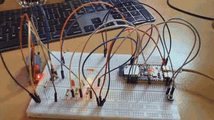
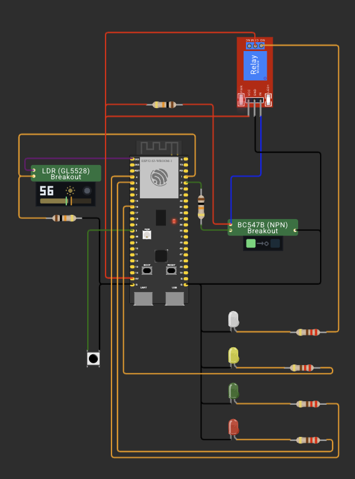

# ДЗ 1.7 — Сутінковий перемикач з режимами (TWILIGHT SWITCH)

Розширення варіанту [`twilight`](../twilight/): та сама схема з фоторезистором, транзисторним ключем і модулем реле, але додалася кнопка, яка перемикає режими, і три світлодіоди-індикатори. Автоматика з гістерезисом нікуди не поділася — вона просто стала одним із трьох режимів.

| Режим | Індикатор | Що робить реле |
|---|---|---|
| `ON` — автомат | 🟡 жовтий (GPIO 6) | вмикає і вимикає навантаження за освітленням |
| `PERMANENT_ON` | 🟢 зелений (GPIO 4) | замкнене завжди, фоторезистор не опитується |
| `OFF` | 🔴 червоний (GPIO 5) | розімкнене завжди, фоторезистор не опитується |

Кнопка на GPIO 3 перемикає їх по колу: автомат → постійно увімкнено → вимкнено → автомат. Після подачі живлення плата стартує в автоматі.

## Демо

<a href="video.mp4"></a>

▶️ [Відео в повній якості (MP4)](video.mp4)

## Схема



Силова частина один в один як у [`twilight`](../twilight/): дільник з фоторезистором на ADC, ключ на BC547B для узгодження 3.3 В і 5 В, модуль реле, навантаження на сухих контактах. Фото зібраної плати і розбір транзисторного каскаду лишив там, щоб не дублювати. Тут нове тільки керування.

### Підключення, що додалося

| Компонент | Пін ESP32-S3 | Примітка |
|---|---|---|
| Кнопка | GPIO 3 | другий контакт → GND, `INPUT_PULLUP` |
| 🟢 Зелений LED | GPIO 4 | через резистор 220 Ω, катод → GND |
| 🔴 Червоний LED | GPIO 5 | через резистор 220 Ω, катод → GND |
| 🟡 Жовтий LED | GPIO 6 | через резистор 220 Ω, катод → GND |

Кнопка активна низьким рівнем: натиснута замикає пін на GND, відпущена тримається на `HIGH` внутрішньою підтяжкою.

## Кнопка і дребезг

Кнопка читається на кожній ітерації `loop()`, без `delay()`. Працюють дві змінні:

- `buttonReading` — останній сирий рівень з піна. Щойно він змінився, я запамʼятовую час зміни і більше нічого не роблю. Це і є фільтр: поки контакт брязкає, таймер весь час скидається.
- `buttonStable` — підтверджений рівень. Оновлюється тільки тоді, коли сирий рівень протримався незмінним довше `BTN_DEBOUNCE_MS` = 50 мс.

Режим перемикається в момент, коли `buttonStable` стає `LOW`, тобто на фронті натискання, а не на рівні. Різниця принципова: перша версія перевіряла саме рівень, і поки я тримав кнопку, режими проскакували по колу кожні 50 мс — одне «клац» пальцем встигало прокрутити два-три стани. Відпускання кнопки теж проходить через фільтр, але гілку перемикання не зачіпає, бо там перевірка на `LOW`.

Скільки насправді триває дребезг у цих кнопок, я міряв логічним аналізатором у [ДЗ 1.5](../../dz1.5%20%28BUTTON%20BOUNCE%29/debounce/) — звідти й узяв 50 мс.

## Як працює код

Файл: [`main.cpp`](main.cpp)

- `applyRelay()` — єдине місце, де смикається пін реле, і заодно тримає прапорець `relayOn` для логів.
- `turnOn()`, `turnOnPermanently()`, `turnOffPermanently()` — вхід у режим: виставляють `relayState`, реле і індикатори. Усередині кожної перевірка «а ми вже не в цьому режимі?», тому повторний виклик нічого не робить.
- `loop()` спочатку обробляє кнопку і лише потім, якщо режим автоматичний, робить черговий вимір. У двох ручних режимах ADC взагалі не опитується.
- Вимір раз на `SAMPLE_INTERVAL_MS` = 200 мс через порівняння `millis()`. Кнопка при цьому опитується на повній швидкості loop, а не раз на 200 мс.
- Логіка порогів не змінилася: нижче `THRESHOLD_DARK` = 1200 вмикаємо, вище `THRESHOLD_LIGHT` = 1800 вимикаємо, між ними стан не чіпаємо.

Одна деталь: при поверненні в автомат `turnOn()` навмисно не чіпає реле. Його стан підхопить найближчий вимір, тобто не пізніше ніж через 200 мс, і реле не клацне зайвий раз, якщо освітлення і так вимагає того ж самого.

## Вивід

Serial Monitor, 115200 бод:

```
=== DZ 1.7: twilight switch ===
LDR on GPIO 1 (ADC1), relay on GPIO 2, sample every 200 ms
dark < 1200, light > 1800, between - keep the current state
relay is on when GPIO 2 is HIGH

    # |   RAW | U, mV | relay | note
------+-------+-------+-------+----------------------
   10 |  2511 |  2104 | OFF   | light
   18 |   887 |   762 | ON    | -> DARK, load on
   20 |   633 |   545 | ON    | dark
   23 |  2291 |  1920 | OFF   | -> LIGHT, load off
   28 |   876 |   748 | ON    | -> DARK, load on
   30 |   716 |   608 | ON    | dark
   31 |  2461 |  2061 | OFF   | -> LIGHT, load off
Switched to PERMANENT_ON
Switched to OFF
Switched to ON
   40 |  2510 |  2104 | OFF   | light
   49 |   939 |   800 | ON    | -> DARK, load on
   50 |   729 |   630 | ON    | dark
   53 |  2453 |  2058 | OFF   | -> LIGHT, load off
   57 |  1003 |   853 | ON    | -> DARK, load on
   60 |   821 |   698 | ON    | dark
   62 |  2229 |  1869 | OFF   | -> LIGHT, load off
   70 |  2514 |  2108 | OFF   | light
   80 |  2514 |  2106 | OFF   | light
```

Перші рядки — звичайна робота автомата: на 18 вимірі я накрив датчик і навантаження увімкнулось, на 23 прибрав руку — вимкнулось, і так ще раз. Далі три натискання кнопки: `PERMANENT_ON`, `OFF`, знову автомат. Між ними немає жодного рядка з виміром, і це не збіг — у ручних режимах `loop()` взагалі не заходить в опитування ADC. Видно це й по нумерації: лічильник завмер на 31 і продовжив з того ж місця аж після повернення в автомат, хоча часу на ручні режими пішло більше, ніж на дев'ять вимірів.

## Запуск

### На залізі (PlatformIO)

1. У [`platformio.ini`](../../platformio.ini):
   ```ini
   build_src_filter = +<../dz1.7 (TWILIGHT SWITCH)/twilight_with_modes/main.cpp>
   ```
2. `pio run -t upload && pio device monitor`

### У симуляторі (Wokwi for VS Code)

1. `pio run`
2. `Wokwi: Select Config File` → [`wokwi.toml`](wokwi.toml)
3. Відкрий [`diagram.json`](diagram.json) і запусти `Wokwi: Start Simulator`

Кастомні чипи — ключ на BC547B і фоторезистор — ті самі, що в базовому варіанті. Як вони влаштовані, що показують їхні дисплеї і як їх перезібрати, описано [в його README](../twilight/).

Одне відоме розходження: у [`diagram.json`](diagram.json) жовтий світлодіод підключений до GPIO 16, а прошивка світить на GPIO 6. На залізі все правильно, а в симуляторі індикатор автомата не горить.

## Файли

| Файл | Опис |
|---|---|
| [`main.cpp`](main.cpp) | прошивка |
| [`diagram.json`](diagram.json) | схема для Wokwi |
| [`wokwi.toml`](wokwi.toml) | конфіг симулятора |
| [`chips/`](chips/) | кастомні чипи для симулятора: ключ на BC547B і фоторезистор |
| [`schema.png`](schema.png) | скриншот схеми |
| [`demo.gif`](demo.gif), [`video.mp4`](video.mp4) | відео роботи |

Інші варіанти цього ДЗ: [**twilight**](../twilight/) — та сама сутінкова автоматика, але без кнопки і режимів; [**twilight_with_modes_rgb**](../twilight_with_modes_rgb/) — ті самі режими, але замість трьох світлодіодів вбудований RGB на платі.
