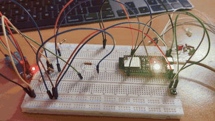
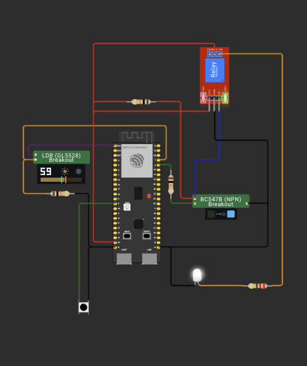

# ДЗ 1.7 — Сутінковий перемикач з режимами на RGB (TWILIGHT SWITCH)

Те саме, що [`twilight_with_modes`](../twilight_with_modes/), але режим показує не три окремі світлодіоди, а вбудований адресний RGB на самій платі. Логіка не змінилася — змінився тільки індикатор.

| Режим | Колір RGB | Що робить реле |
|---|---|---|
| `ON` — автомат | 🟡 жовтий | вмикає і вимикає навантаження за освітленням |
| `PERMANENT_ON` | 🟢 зелений | замкнене завжди, фоторезистор не опитується |
| `OFF` | 🔴 червоний | розімкнене завжди, фоторезистор не опитується |

Кнопка на GPIO 3 перемикає їх по колу: автомат → постійно увімкнено → вимкнено → автомат. Після подачі живлення плата стартує в автоматі.

## Демо

<a href="video.mp4"></a>

https://github.com/user-attachments/assets/25c5ec04-97f5-4b2b-8090-36260e2f3c6b

## Схема



Силова частина один в один як у [`twilight`](../twilight/): дільник з фоторезистором на ADC, ключ на BC547B для узгодження 3.3 В і 5 В, модуль реле, навантаження на сухих контактах. Фото зібраної плати і розбір транзисторного каскаду лишив там.

Порівняно з варіантом на окремих світлодіодах зі схеми зникли три LED, три резистори 220 Ω і три дроти — індикатор переїхав на плату.

### Підключення

| Компонент | Пін ESP32-S3 | Примітка |
|---|---|---|
| Середня точка дільника з фоторезистором | GPIO 1 | ADC1_CH0 |
| База ключа на BC547B через 10 кОм | GPIO 2 | далі транзистор і вхід `IN` модуля реле |
| Кнопка | GPIO 3 | другий контакт → GND, `INPUT_PULLUP` |
| Вбудований RGB | GPIO 48 | на платі, паяти й тягнути нічого не треба |

## Індикатор на вбудованому RGB

Це WS2812 — адресний світлодіод, а не три звичайні ноги під резистори. Керується одним піном даних за власним протоколом, тому знадобилася бібліотека:

```cpp
Adafruit_NeoPixel rgbLed(1, RGB_LED_PIN, NEO_GRB + NEO_KHZ800);
```

Один світлодіод у ланцюжку, пін даних GPIO 48, порядок байтів GRB і частота 800 кГц. Колір виставляється у два кроки: `setPixelColor()` кладе його в буфер, `show()` віддає в лінію. Без `show()` нічого не зміниться.

`rgbLed.setBrightness(50)` зі 255 — на повній яскравості камера бачить тільки білу пляму замість кольору, та й очима дивитися неприємно.

Бібліотека підтягується рядком у [`platformio.ini`](../../platformio.ini):

```ini
lib_deps = adafruit/Adafruit NeoPixel@^1.15.5
```

На моїй платі RGB сидить на GPIO 48. У частини ревізій ESP32-S3-DevKitC-1 його вішають на GPIO 38 — якщо індикатор мовчить, це перше, що варто перевірити.

Побічний ефект переїзду: звільнилися GPIO 4, 5, 6 і три резистори, а схема стала помітно чистішою.

## Як працює код

Файл: [`main.cpp`](main.cpp)

- `applyRelay()` — єдине місце, де смикається пін реле, і заодно тримає прапорець `relayOn` для логів.
- `turnOn()`, `turnOnPermanently()`, `turnOffPermanently()` — вхід у режим: виставляють `relayState`, реле і колір RGB. Усередині кожної перевірка «а ми вже не в цьому режимі?», тому повторний виклик нічого не робить.
- `loop()` спочатку обробляє кнопку і лише потім, якщо режим автоматичний, робить черговий вимір. У двох ручних режимах ADC взагалі не опитується.
- Вимір раз на `SAMPLE_INTERVAL_MS` = 200 мс через порівняння `millis()`, без `delay()`. Кнопка при цьому опитується на повній швидкості loop.
- Пороги ті самі: нижче `THRESHOLD_DARK` = 1200 вмикаємо, вище `THRESHOLD_LIGHT` = 1800 вимикаємо, між ними стан не чіпаємо.

Кнопка проходить через фільтр дребезгу на двох змінних — `buttonReading` тримає сирий рівень і скидає таймер на кожній зміні, `buttonStable` оновлюється тільки після 50 мс спокою. Режим перемикається на фронті натискання, а не на рівні; детальніше розписав [у варіанті з окремими світлодіодами](../twilight_with_modes/).

Окремо варто пам'ятати про `pinMode(BUTTON_PIN, INPUT_PULLUP)` у `setup()`. GPIO 3 на ESP32-S3 — strapping-пін без власної підтяжки, і без цього рядка вхід просто висить у повітрі: кнопка не дає жодного фронту, і перемикання не працює взагалі.

## Вивід

Serial Monitor, 115200 бод:

```
=== DZ 1.7: twilight switch ===
LDR on GPIO 1 (ADC1), relay on GPIO 2, sample every 200 ms
dark < 1200, light > 1800, between - keep the current state
relay is on when GPIO 2 is HIGH

    # |   RAW | U, mV | relay | note
------+-------+-------+-------+----------------------
   10 |  2511 |  2104 | OFF   | light
   18 |   887 |   762 | ON    | -> DARK, load on
   20 |   633 |   545 | ON    | dark
   23 |  2291 |  1920 | OFF   | -> LIGHT, load off
   28 |   876 |   748 | ON    | -> DARK, load on
   30 |   716 |   608 | ON    | dark
   31 |  2461 |  2061 | OFF   | -> LIGHT, load off
Switched to PERMANENT_ON
Switched to OFF
Switched to ON
   40 |  2510 |  2104 | OFF   | light
   49 |   939 |   800 | ON    | -> DARK, load on
   50 |   729 |   630 | ON    | dark
   53 |  2453 |  2058 | OFF   | -> LIGHT, load off
   57 |  1003 |   853 | ON    | -> DARK, load on
   60 |   821 |   698 | ON    | dark
   62 |  2229 |  1869 | OFF   | -> LIGHT, load off
   70 |  2514 |  2108 | OFF   | light
   80 |  2514 |  2106 | OFF   | light
```

Формат виводу від індикатора не залежить, тому він точно такий, як у варіанті з окремими світлодіодами. Три `Switched to ...` підряд — це натискання кнопки, і між ними немає жодного виміру: у ручних режимах ADC не опитується, лічильник завмирає на 31 і продовжує з того ж місця вже після повернення в автомат.

## Запуск

### На залізі (PlatformIO)

1. У [`platformio.ini`](../../platformio.ini) потрібні обидва рядки — джерело і бібліотека:
   ```ini
   build_src_filter = +<../dz1.7 (TWILIGHT SWITCH)/twilight_with_modes_rgb/main.cpp>
   lib_deps = adafruit/Adafruit NeoPixel@^1.15.5
   ```
2. `pio run -t upload && pio device monitor`

### У симуляторі (Wokwi for VS Code)

1. `pio run`
2. `Wokwi: Select Config File` → [`wokwi.toml`](wokwi.toml)
3. Відкрий [`diagram.json`](diagram.json) і запусти `Wokwi: Start Simulator`

Кастомні чипи — ключ на BC547B і фоторезистор — ті самі, що в базовому варіанті. Як вони влаштовані, що показують їхні дисплеї і як їх перезібрати, описано [в його README](../twilight/). Окремої деталі для індикатора на схемі немає: RGB належить моделі плати.

## Файли

| Файл | Опис |
|---|---|
| [`main.cpp`](main.cpp) | прошивка |
| [`diagram.json`](diagram.json) | схема для Wokwi |
| [`wokwi.toml`](wokwi.toml) | конфіг симулятора |
| [`chips/`](chips/) | кастомні чипи для симулятора: ключ на BC547B і фоторезистор |
| [`schema.png`](schema.png) | скриншот схеми |
| [`demo.gif`](demo.gif), [`video.mp4`](video.mp4) | відео роботи |

Інші варіанти цього ДЗ: [**twilight**](../twilight/) — сутінкова автоматика без кнопки і режимів; [**twilight_with_modes**](../twilight_with_modes/) — ті самі режими, але на трьох окремих світлодіодах.
