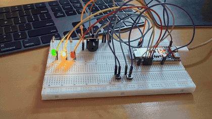
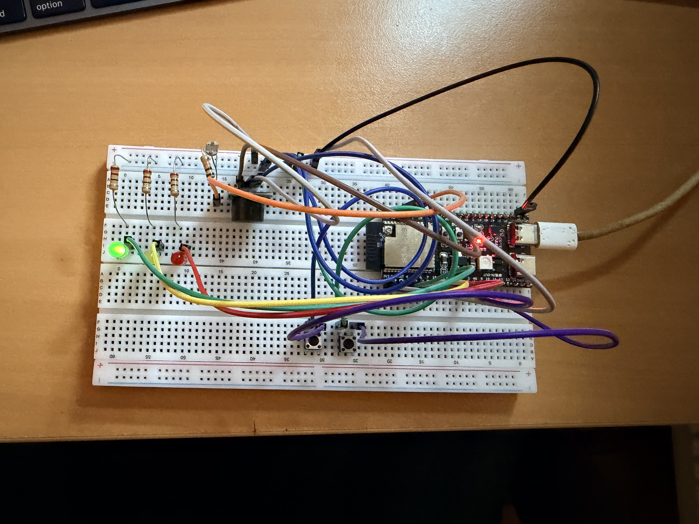
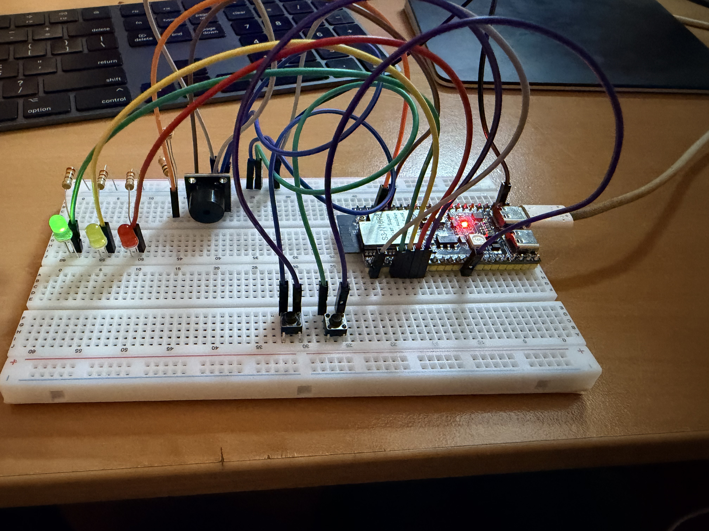
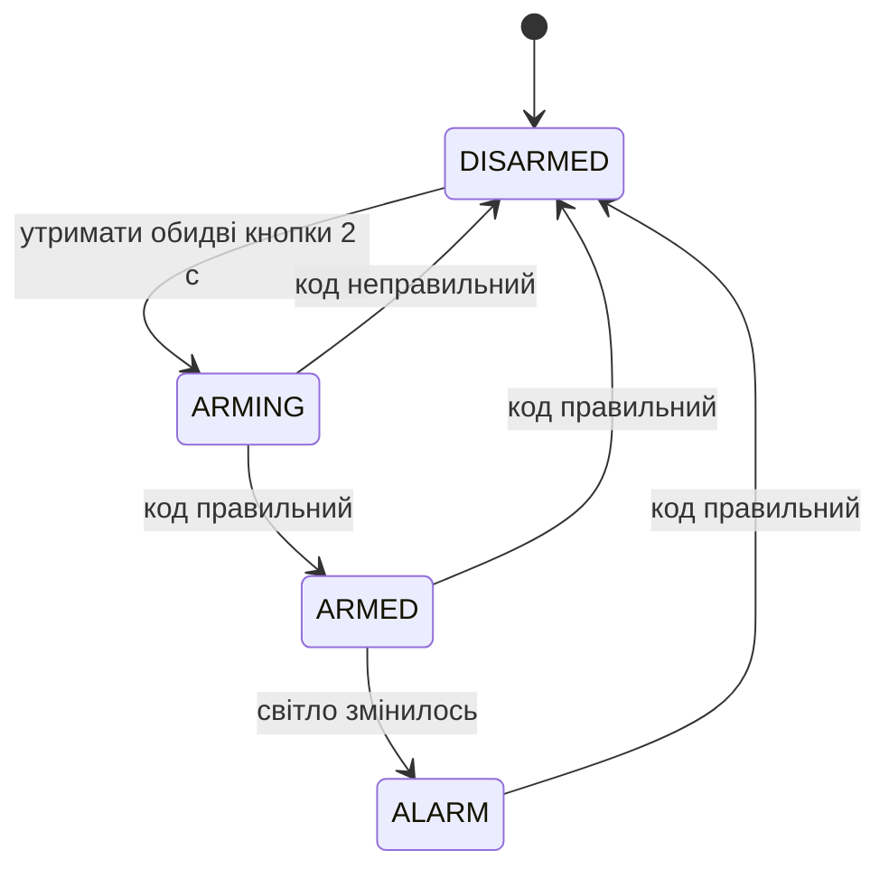

<!--
  TODO перед комітом:
  - у diagram.json підключити VCC модуля фоторезистора (зараз висить у повітрі) і перезняти schema.png
  - video.mp4 перетягнути в README на github.com, щоб відео грало зі звуком (див. «Демо»)
-->
# ДЗ 1.8 — Розумна сигналізація (SMART ALARM)

Міні-проєкт на **ESP32-S3-DevKitC-1**. Сигналізація стежить за освітленням через фоторезистор: якщо в охороні світло змінилось, вмикається сирена, і вимкнути її можна лише кодом. Код набирається двома кнопками, стан показують три світлодіоди, а озвучено все бузером — від мелодії ввімкнення Nokia до відліку табло Верховної Ради.

## Демо

<a href="video.mp4"></a>

https://github.com/user-attachments/assets/64884f4e-b907-4220-bb8b-71de54057a61

Звук тут важливіший за картинку: на відео чути всі сигнали, а на GIF їх немає.

## Схема та фото

| Зібрана плата | Інший ракурс |
|---|---|
|  |  |

### Підключення

| Компонент | Пін ESP32-S3 | Примітка |
|---|---|---|
| Зелений LED | GPIO 4 | через резистор 220 Ω, катод → GND |
| Жовтий LED | GPIO 5 | через резистор 220 Ω, катод → GND |
| Червоний LED | GPIO 6 | через резистор 220 Ω, катод → GND |
| Ліва кнопка | GPIO 7 | другий контакт → GND, `INPUT_PULLUP` |
| Права кнопка | GPIO 3 | другий контакт → GND, `INPUT_PULLUP` |
| Фоторезистор | GPIO 1 | середня точка подільника з 10 кΩ, ADC1_CH0 |
| Бузер | GPIO 2 | пасивний, керується через `tone()` |

Подільник той самий, що в [ДЗ 1.6](../../dz1.6%20%28LDR%20LIGHT%29/light/): **3V3 → фоторезистор → вузол → 10 кΩ → GND**, вузол на GPIO 1. Живити тільки від 3V3: вхід АЦП не терпить 5 В.

## Як користуватись

| Дія | Як зробити |
|---|---|
| Поставити на охорону | утримати обидві кнопки 2 с |
| Ввести символ коду | коротке натискання: ліва = `L`, права = `R` |
| Зняти з охорони | набрати код `LRRL` |

Натискання довші за 500 мс символом не вважаються, тому жест постановки на охорону не потрапляє в код. Якщо збився — просто набирай код далі: враховуються останні чотири натискання, як у Раді, де голос можна змінити до кінця голосування.

## Стани



| Стан | Жовтий | Червоний | Звук |
|---|---|---|---|
| `DISARMED` | — | — | тиша |
| `ARMING` | спалах на кожен біп | — | відлік табло Ради, 8.6 с |
| `ARMED` | спалах раз на 2 с | — | тиша |
| `ALARM` | горить | блимає кожні 200 мс | модем по колу, поки не знімеш |

Зелений горить постійно як індикатор живлення.

Постановка на охорону влаштована як голосування в Раді: поки йде відлік, можна набирати код, «дзинь» закриває голосування, і аж тоді прошивка порівнює набране з паролем. Достроково відлік не уривається — як і в залі, результат оголошують лише після закінчення.

## Датчик освітленості

Тривога вмикається, коли значення АЦП падає нижче `LDR_THRESHOLD` (зараз 200). Поріг підбирав під своє освітлення: на столі система стоїть спокійно, а на перекритий датчик реагує одразу.

## Звуки

Усі мелодії лежать у [`include/melodies.h`](include/melodies.h) у форматі `{частота, тривалість}`.

| Коли | Що звучить | Звідки взято |
|---|---|---|
| старт плати | мелодія ввімкнення Nokia | ноти G#6 F#6 A#5 C#6 F#6, темп 118 — зняв зі спектра запису, октави звірив з двома транскрипціями |
| постановка на охорону | відлік табло Верховної Ради | гама мі-бемоль мажор униз, один біп на секунду — виміряв з двох записів табла |
| кінець відліку | «дзинь» G6 | там само, ним у Раді закривають голосування |
| код прийнято / відхилено | арпеджіо вгору / «сумний тромбон» | власні, у Раді окремих сигналів результату немає |
| тривога | модем | стилізація під dial-up 90-х |

Мелодії грає `MelodyPlayer` — він перемикає ноти по `millis()`, тому під час звуку кнопки й датчик опитуються далі. Блокуючий `delay()` лишився тільки в стартовій анімації.

## Як працює код

```
include/            src/
├── config.h        ├── main.cpp        setup() і loop(), усе інше в Alarm
├── Alarm.h         ├── Alarm.cpp       стани, індикація, ввід коду
├── LED.h           ├── LED.cpp         вмикання, блимання по millis()
├── Button.h        ├── Button.cpp      антибрязкіт, короткий клік, утримання
├── MelodyPlayer.h  └── MelodyPlayer.cpp  неблокуючий програвач мелодій
└── melodies.h
```

- **`config.h`** — усі піни, часи, темпи й пароль в одному місці, нічого не розкидано по коду.
- **`Button`** рахує натискання так само, як фільтр з [ДЗ 1.5](../../dz1.5%20%28BUTTON%20BOUNCE%29/debounce/): будь-який фронт перезапускає вікно, новий стан приймається після 50 мс тиші. Окремо віддає `wasClicked()` для коротких натискань і `heldFor()` для жестів.
- **`Alarm`** тримає автомат станів. Ввід коду дозволено лише там, де він має сенс: під час відліку, в охороні й під час тривоги.
- **`MelodyPlayer`** наздоганяє пропущені ноти, якщо ітерація циклу затяглась, і вміє сказати, чи саме зараз звучить нота — за цим і блимає жовтий у такт відліку.

## Вивід

Serial Monitor, 115200 бод:

```
--------------------------------
Initializing Smart Alarm System...
Smart Alarm System initialized
--------------------------------
Transitioning to ARMING
Entered code: RRRR
Code rejected: returning to DISARMED
Transitioning to ARMING
Entered code: LRRL
Transitioning to ARMED
Alarm triggered
Correct code: alarm disarmed
```

Тут два голосування поспіль: перше з неправильним кодом `RRRR` повернуло систему в `DISARMED`, друге з `LRRL` поставило на охорону. Далі я перекрив датчик, спрацювала тривога, і той самий код її зняв.

## Запуск

### На залізі (PlatformIO)

1. У [`platformio.ini`](../../platformio.ini) вкажи джерела й теку заголовків:
   ```ini
   build_src_filter = +<../dz1.8 (SMART ALARM)/alarm/src/*.cpp>
   build_flags = -I "dz1.8 (SMART ALARM)/alarm/include"
   ```
   Маска `*.cpp` обов'язкова: з одним `main.cpp` лінкер не знайде решту класів.
2. Збери, проший і відкрий монітор:
   ```sh
   pio run -t upload && pio device monitor
   ```

### У симуляторі (Wokwi for VS Code)

1. `pio run`
2. `Wokwi: Select Config File` → [`wokwi.toml`](wokwi.toml)
3. Відкрий [`diagram.json`](diagram.json) і запусти `Wokwi: Start Simulator`

У Wokwi стоїть модуль `wokwi-photoresistor-sensor` з уже впаяним подільником, і він дзеркальний до мого: там більше світла дає менше значення. Для перевірки звуків і кнопок це не заважає, а живі виміри освітлення робив на макетці.

## Файли

| Файл | Опис |
|---|---|
| [`src/`](src/), [`include/`](include/) | прошивка |
| [`diagram.json`](diagram.json) | схема для Wokwi |
| [`wokwi.toml`](wokwi.toml) | конфіг симулятора |
| [`schema.png`](schema.png) | скриншот схеми |
| [`photo_1.jpeg`](photo_1.jpeg), [`photo_2.jpeg`](photo_2.jpeg) | фото зібраної схеми |
| [`demo.gif`](demo.gif), [`video.mp4`](video.mp4) | відео роботи |

## Що можна покращити

- **Поріг освітлення** без усереднення й гістерезису, тож біля межі можливі хибні спрацювання.
- **Відлік не скасувати:** якщо почав постановку на охорону випадково, доведеться дочекатися кінця або ввести неправильний код.
- **Тривога триває вічно** — немає обмеження за часом, як у справжніх сиренах, які замовкають через кілька хвилин.
