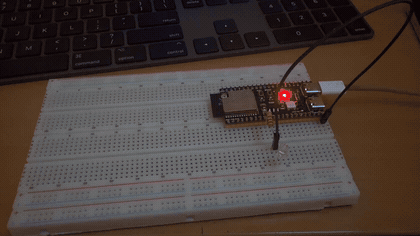
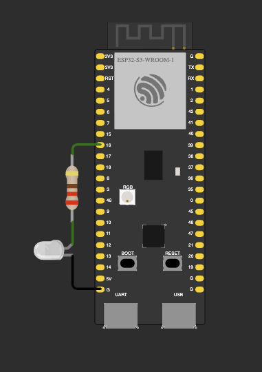
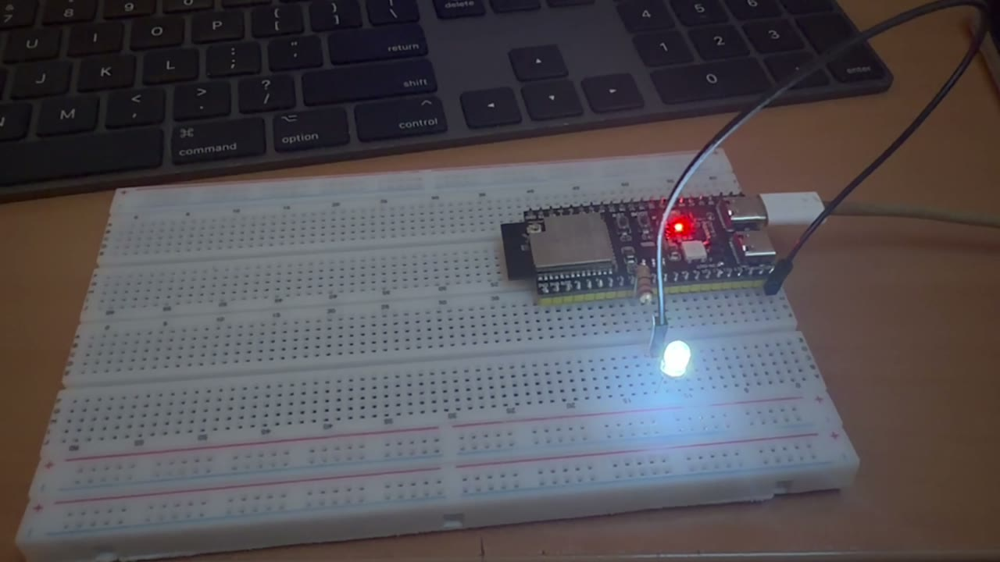

# ДЗ 2.1 — Неблокуюче блимання (EMBEDDED C++)

Класичний Arduino blink, переписаний за правилами embedded C++: пін і інтервал у `constexpr`, стан світлодіода в `enum class`, робота з піном — через клас `Led`, а сам цикл неблокуючий, на `millis()`. Світлодіод перемикається раз на 500 мс, у Serial падає рядок на кожне перемикання.

Другий варіант цього ДЗ — [`blink_modes`](../blink_modes/) — додає кнопку на перериванні та вимір часу ітерації `loop()`.

## Демо

<a href="video.mp4"></a>

▶️ [Відео в повній якості (MP4)](video.mp4)

## Схема та фото

| Схема (Wokwi) | Зібрана плата |
|---|---|
|  |  |

Фото — кадр із того ж відео.

### Підключення

| Компонент | Пін ESP32-S3 | Примітка |
|---|---|---|
| Білий LED | GPIO 16 | через резистор 220 Ω, катод → GND |

## Конфігурація замість магічних чисел

```cpp
struct BlinkConfig {
  static constexpr uint8_t  LED_PIN           = 16;
  static constexpr bool     LED_ACTIVE_HIGH   = true;
  static constexpr uint32_t BLINK_INTERVAL_MS = 500;
  static constexpr uint32_t SERIAL_BAUD       = 115200;

  static constexpr uint32_t periodMs() { return BLINK_INTERVAL_MS * 2; }
};
```

Нижче по файлу немає жодного числа, крім цих: пін, полярність, інтервал і швидкість порту існують в одному місці. `periodMs()` — теж `constexpr`, період для банера рахує компілятор, а не плата.

Чому саме `static constexpr`, а не інше:

| Запис | Коли обчислюється | Що з типом і памʼяттю |
|---|---|---|
| `#define LED_PIN 16` | препроцесор, проста підстановка тексту | типу немає, області видимості немає, у помилці компілятора видно `16`, а не назву |
| `const uint8_t ledPin = 16;` | може бути і в рантаймі | тип є, але це справжня змінна: якщо взяти адресу — займе RAM |
| `static constexpr uint8_t LED_PIN = 16;` | завжди на етапі компіляції | тип є, значення підставляється в місце використання, RAM не займає |

`static` тут — бо константа належить типу, а не об'єкту: її не треба носити в кожному екземплярі, і звертаються до неї через `BlinkConfig::LED_PIN`.

Поруч стоїть перевірка, яка нічого не коштує в рантаймі:

```cpp
static_assert(BlinkConfig::BLINK_INTERVAL_MS > 0, "blink interval must be positive");
```

Нуль в інтервалі — це блимання на частоті циклу, і помітив би я це вже на платі. З `static_assert` така конфігурація просто не збереться.

## Стан світлодіода — enum class

```cpp
enum class LedState : uint8_t {
  Off = 0,
  On  = 1,
};
```

`: uint8_t` фіксує розмір типу в один байт — компілятор не візьме під нього `int`. `class` прибирає неявне перетворення в число: `led.set(1)` або переплутані місцями пін і стан не скомпілюються взагалі. Імена не течуть у глобальний простір, тому `On` і `Off` ніде ні з чим не конфліктують.

## Клас Led

```cpp
class Led {
  private:
    const uint8_t pin_;
    const bool activeHigh_;
    LedState state_ = LedState::Off;

    constexpr uint8_t levelFor(LedState state) const {
      return (state == LedState::On) == activeHigh_ ? HIGH : LOW;
    }

  public:
    constexpr explicit Led(uint8_t pin, bool activeHigh = true)
      : pin_(pin), activeHigh_(activeHigh) {}

    void init();
    void set(LedState state);
    void toggle();
    LedState state() const;
};
```

- `init()` — `pinMode(OUTPUT)` і гарантовано погашений світлодіод на старті.
- `set()` — порівнює з поточним станом і мовчки виходить, якщо нічого не змінилось: зайвий `digitalWrite` у той самий рівень нічого не дає.
- `levelFor()` — єдине місце в прошивці, де живе знання про полярність. Для схеми з катодом на GND це `HIGH = світить`, для active-low достатньо поміняти `LED_ACTIVE_HIGH` у конфігурації, і решта коду не помітить різниці.
- Класу вистачає трьох байт, і в ньому немає жодного `virtual` — без таблиці віртуальних функцій і без вказівника на неї в кожному об'єкті.

`constexpr` у конструкторі — не прикраса. Об'єкт створюється так:

```cpp
static Led led(BlinkConfig::LED_PIN, BlinkConfig::LED_ACTIVE_HIGH);
```

`static` на рівні файлу — внутрішнє зв'язування: символ не видно з інших одиниць трансляції. А `constexpr`-конструктор з константними аргументами означає, що об'єкт збирається на етапі компіляції і потрапляє у прошивку вже готовим.

## Superloop

```cpp
void loop() {
  static uint32_t lastToggleMs = 0;

  const uint32_t now = millis();

  if (now - lastToggleMs < BlinkConfig::BLINK_INTERVAL_MS) return;

  lastToggleMs = now;
  led.toggle();
  ...
}
```

`delay(500)` — це півсекунди, протягом яких процесор не робить нічого корисного: не читає кнопку, не рахує, не відповідає. Тут замість очікування — перевірка «чи минуло вже 500 мс», і якщо ні, ітерація просто закінчується. Плата вільна майже весь час, а додати в такий цикл ще одну задачу — це дописати другий такий самий блок, а не переписати таймінг.

Три деталі, які легко пропустити:

- `static` всередині `loop()` — змінна переживає вихід з функції, але зовні її не існує. Глобальна змінна для цього не потрібна.
- Ініціалізація константою (`= 0`) — важлива: якби там був виклик функції, компілятор додав би приховану guard-змінну і перевірку «чи вже ініціалізовано» на кожному заході в `loop()`.
- `now - lastToggleMs` рахується в беззнакових, і саме тому працює після переповнення `millis()` через 49.7 доби. Порівняння виду `now >= lastToggleMs + INTERVAL` у цей момент зламалося б.

## Чого тут немає

Ні `new`, ні `malloc`, ні `String`, ні `std::vector`, ні `std::function`. Увесь стан прошивки — це три байти об'єкта `Led` і чотири байти лічильника часу, і всі вони розподілені на етапі лінкування. Купи немає, а значить немає ні фрагментації, ні несподіваного `nullptr` через півдня роботи, ні стрибків часу виконання через аллокатор.

Перевірити це можна прямо в об'єктному файлі:

```
$ xtensa-esp32s3-elf-nm -C -S ".pio/build/esp32-s3-devkitc-1/dz2.1 (EMBEDDED C++)/blink/main.cpp.o"
                              # зовнішні символи (U) тут і далі прибрав
00000000 00000064 T loop()
00000000 0000009a T setup()
00000000 00000003 d led
00000000 00000004 b loop()::lastToggleMs
```

Що тут видно:

- `d led` — малий `d` це `.data`, тобто об'єкт лежить у прошивці вже зібраним. Символів `_GLOBAL__sub_I` чи `__static_initialization_and_destruction` у файлі немає: конструктор на старті не викликається, це і є результат `constexpr`-конструктора.
- `led` займає **3 байти** — рівно `pin_ + activeHigh_ + state_`. Обгортка над піном не коштує нічого понад свої поля.
- `lastToggleMs` — 4 байти в `.bss`, і поруч немає guard-змінної `_ZGVZ4loopvE...`, бо ініціалізація константна.
- Уся `loop()` — 100 байт коду. Виклики `set()`, `toggle()` і `levelFor()` компілятор вбудував, окремих функцій для них у таблиці символів не лишилось.

Прошивка цілком: **18 880 байт RAM** (5.8%) і **276 381 байт flash** (8.3%) — майже все це сам Arduino-core з Wi-Fi стеком, частка цього файлу в ньому — сотні байт.

## Вивід

Serial Monitor, 115200 бод:

```
=== DZ 2.1: blink (Embedded C++) ===
LED on GPIO 16, active HIGH
interval 500 ms, period 1000 ms
sizeof(Led) = 3 B, sizeof(LedState) = 1 B

[     500 ms] LED ON
[    1000 ms] LED OFF
[    1500 ms] LED ON
[    2000 ms] LED OFF
[    2500 ms] LED ON
[    3000 ms] LED OFF
[    3500 ms] LED ON
[    4000 ms] LED OFF
[    4500 ms] LED ON
[    5000 ms] LED OFF
```

Банер друкує сам себе з конфігурації: період у другому рядку порахував компілятор через `periodMs()`, а `sizeof` у третьому — це ті самі 3 байти на весь об'єкт `Led` і 1 байт на `LedState`, які видно в таблиці символів.

За двадцять із гаком секунд у логу немає жодного зсуву: мітки лягають рівно на 500, 1000, 1500. Ітерація короткої довжини, тому момент «минуло 500 мс» ловиться в ту саму мілісекунду, в яку настав. Якби в цикл додалась довга робота, `lastToggleMs = now` почав би накопичувати відставання — в такому разі правильніше писати `lastToggleMs += BLINK_INTERVAL_MS`, щоб таймер рахувався від розкладу, а не від моменту виявлення.

## Запуск

### На залізі (PlatformIO)

1. У [`platformio.ini`](../../platformio.ini) вкажи цей файл як джерело:
   ```ini
   build_src_filter = +<../dz2.1 (EMBEDDED C++)/blink/main.cpp>
   ```
2. `pio run -t upload && pio device monitor`

### У симуляторі (Wokwi for VS Code)

1. `pio run`
2. `Wokwi: Select Config File` → [`wokwi.toml`](wokwi.toml)
3. Відкрий [`diagram.json`](diagram.json) і запусти `Wokwi: Start Simulator`

## Файли

| Файл | Опис |
|---|---|
| [`main.cpp`](main.cpp) | прошивка |
| [`diagram.json`](diagram.json) | схема для Wokwi |
| [`wokwi.toml`](wokwi.toml) | конфіг симулятора |
| [`schema.png`](schema.png) | скриншот схеми |
| [`photo.jpeg`](photo.jpeg) | фото зібраної схеми |
| [`demo.gif`](demo.gif), [`video.mp4`](video.mp4) | відео роботи |
