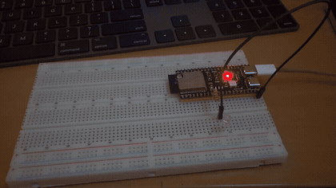
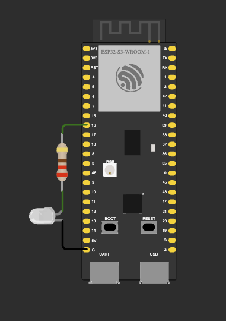
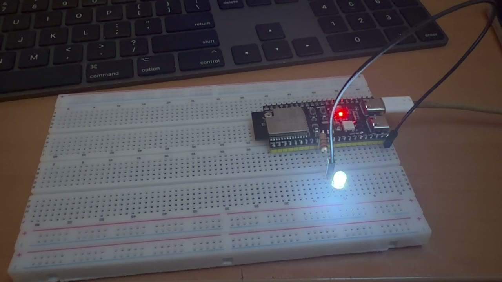

# ДЗ 2.1 — Блимання через регістри GPIO (EMBEDDED C++)

> Поза завданням. Умова ДЗ закрита варіантами [`blink`](../blink/) і [`blink_modes`](../blink_modes/); цей варіант я дописав для себе, щоб закрити ті частини уроку, які в завдання не потрапили: memory-mapped I/O, бітові маски, ініціалізація периферії на рівні регістрів.

Те саме блимання, що у [`blink`](../blink/), але без `pinMode()` і `digitalWrite()`: пін налаштовується і смикається прямо через регістри мікроконтролера. Тут `volatile` виступає у другій своїй ролі з уроку — не прапорець від ISR, як у [`blink_modes`](../blink_modes/), а доступ до апаратури.

## Демо, схема і фото

Залізо і зовнішня поведінка тут ті самі, що у [`blink`](../blink/): світлодіод на GPIO 16 через резистор 220 Ω на GND, блимання раз на 500 мс. Відрізняється тільки код, тому відео і фото я не перезнімав — нижче ті самі файли з папки базового варіанту.

<a href="../blink/video.mp4"></a>

▶️ [Відео в повній якості (MP4)](../blink/video.mp4)

| Схема (Wokwi) | Зібрана плата |
|---|---|
|  |  |

## Карта регістрів

```cpp
namespace Reg {
  constexpr uint32_t GPIO_BASE   = 0x60004000;
  constexpr uint32_t OUT_W1TS    = GPIO_BASE + 0x008; // запис одиниці -> пін у HIGH
  constexpr uint32_t OUT_W1TC    = GPIO_BASE + 0x00C; // запис одиниці -> пін у LOW
  constexpr uint32_t ENABLE_W1TS = GPIO_BASE + 0x024; // запис одиниці -> увімкнути драйвер виходу

  constexpr uint32_t SIG_GPIO_OUT = 256;
  constexpr uint32_t funcOutSel(uint8_t pin) { return GPIO_BASE + 0x554 + 4u * pin; }

  constexpr uint32_t IO_MUX_BASE = 0x60009000;
  constexpr uint32_t ioMux(uint8_t pin) { return IO_MUX_BASE + 0x04 + 4u * pin; }
}
```

Адреси — `constexpr`, тобто обчислюються компілятором і в RAM не лежать. `funcOutSel()` і `ioMux()` — теж `constexpr`-функції: для константного піна вся арифметика зникає ще на етапі компіляції, в коді лишається готове число.

Адреси звірив із заголовками SDK: `framework-arduinoespressif32/tools/sdk/esp32s3/include/soc/esp32s3/include/soc/` — `soc.h` (бази), `gpio_reg.h`, `io_mux_reg.h`. У бойовому коді ці заголовки підключають, а не переписують; тут виписав вручну навмисно, щоб уся адресація була видимою.

| Регістр | Адреса | Навіщо |
|---|---|---|
| `IO_MUX` для GPIO 16 | `0x60009044` | вивести пін з альтернативної функції у звичайний GPIO |
| `GPIO_FUNC16_OUT_SEL_CFG` | `0x60004594` | що саме подавати на пін: сигнал периферії чи вміст `GPIO_OUT` |
| `GPIO_ENABLE_W1TS` | `0x60004024` | увімкнути драйвер виходу |
| `GPIO_OUT_W1TS` / `GPIO_OUT_W1TC` | `0x60004008` / `0x6000400C` | підняти / опустити рівень на піні |

## Бітові маски і зсуви

У регістрі один біт відповідає одному піну, тому номер піна треба перетворити на маску:

```cpp
constexpr explicit Led(uint8_t pin) : pin_(pin), mask_(1u << pin) {}
```

Для GPIO 16 це `1u << 16` = `0x00010000` — одиниця у 16-му біті, нулі скрізь. Літера `u` в `1u` не косметична: `1 << 31` для знакового `int` — це переповнення і формально невизначена поведінка, тож маски завжди будують від беззнакової одиниці.

Чотири операції, якими тримається вся робота з регістрами:

| Дія | Запис | Що відбувається |
|---|---|---|
| виставити біт | `reg \|= mask` | свій біт в 1, решта без змін |
| скинути біт | `reg &= ~mask` | `~mask` — інверсія, нуль лише у своєму біті |
| перевірити біт | `reg & mask` | не нуль, якщо біт стоїть |
| записати поле | `(reg & ~FIELD_MASK) \| (value << FIELD_SHIFT)` | спершу занулити поле, потім вкласти значення |

Останній рядок — це рівно те, що робить `init()` з `IO_MUX`:

```cpp
constexpr uint32_t MCU_SEL_SHIFT = 12;
constexpr uint32_t MCU_SEL_MASK  = 0x7u << MCU_SEL_SHIFT;  // 0x00007000

*ioMux = (*ioMux & ~Reg::MCU_SEL_MASK) | (Reg::FUNC_GPIO << Reg::MCU_SEL_SHIFT);
```

`MCU_SEL` — не один біт, а поле з трьох біт (значення 0–7) на позиції 12. Тому маска будується як `0x7 << 12`, і перед записом поле зануляється: якби я просто зробив `|=`, старе значення змішалося б з новим по «або» і дало б третю, зовсім не ту функцію піна.

Одне обмеження цього коду варто назвати вголос: `1u << pin` працює для пінів 0–31. У ESP32-S3 пінів більше, і для 32+ є другий комплект регістрів (`GPIO_OUT1_W1TS` і далі) — маска там рахується від `pin - 32`. Для GPIO 16 це не проблема, але клас у такому вигляді не універсальний.

## Ініціалізація на рівні регістрів

```cpp
void init() {
  // 1. IO_MUX: вивести пін з альтернативної функції у звичайний GPIO
  volatile uint32_t* const ioMux = Reg::at(Reg::ioMux(pin_));
  *ioMux = (*ioMux & ~Reg::MCU_SEL_MASK) | (Reg::FUNC_GPIO << Reg::MCU_SEL_SHIFT);

  // 2. Матриця GPIO: на вихід подати вміст GPIO_OUT, а не сигнал периферії
  *Reg::at(Reg::funcOutSel(pin_)) = Reg::SIG_GPIO_OUT;

  // 3. Увімкнути драйвер виходу для цього піна
  *Reg::at(Reg::ENABLE_W1TS) = mask_;

  set(LedState::Off);
}
```

Три кроки, і кожен видно. Перший не формальність: у таблиці IO_MUX цей пін називається `XTAL_32K_N` — його альтернативна функція це вхід годинникового кварцу на 32 кГц. Поки в полі `MCU_SEL` не стоїть функція 1, пін належить не GPIO, а цій підсистемі.

Другий крок — матриця GPIO. На ESP32 майже будь-який сигнал будь-якої периферії можна вивести майже на будь-який пін, і саме матриця вирішує, що на пін потрапить. Значення 256 (`SIG_GPIO_OUT_IDX`) означає «нічого спеціального, бери біт із `GPIO_OUT`».

Третій — власне дозвіл виходу. Без нього пін лишається входом, регістр `GPIO_OUT` пишеться, але назовні нічого не з'являється.

Саме цю роботу `pinMode(pin, OUTPUT)` і робить під капотом, плюс перевірки, облік зайнятості піна і підтримку решти режимів. Видно це по прошивці: у зібраному `.elf` цього варіанту немає ні символа `__pinMode`, ні `gpio_config` — лінкер викинув увесь драйвер конфігурації GPIO, бо його ніхто не викликає. Прошивка вийшла на 1524 байти менша за базовий варіант (274 857 проти 276 381).

## Чому W1TS/W1TC, а не GPIO_OUT

```cpp
void set(LedState state) {
  *Reg::at(state == LedState::On ? Reg::OUT_W1TS : Reg::OUT_W1TC) = mask_;
  state_ = state;
}
```

Очевидний спосіб змінити один біт — `GPIO_OUT |= mask`. Це читання, модифікація і запис, три операції, між якими може влізти переривання. Якщо ISR у цей момент змінить інший пін того ж порту, його зміна загубиться: ми запишемо назад значення, прочитане до неї.

`W1TS` і `W1TC` (write 1 to set / write 1 to clear) зроблені саме проти цього. Одиниця в біті виставляє або скидає свій пін, нуль не чіпає нічого. Виходить один запис без читання — атомарно з точки зору апаратури, без критичних секцій і без гонки з перериваннями. Той самий прийом є в більшості сучасних MCU, і це причина, чому в даташитах під один порт є три регістри замість одного.

## Що насправді робить volatile

Найкраще це видно не в тексті, а в дизасемблері. У файлі є дві функції, які відрізняються рівно одним словом і які ніхто не викликає — вони існують тільки заради цього порівняння:

```cpp
void storeVolatile(uint32_t mask) {
  volatile uint32_t* out = Reg::at(Reg::OUT_W1TS);
  for (uint8_t i = 0; i < 8; ++i) {
    *out = mask;
  }
}

void storePlain(uint32_t mask) {
  uint32_t* out = reinterpret_cast<uint32_t*>(Reg::OUT_W1TS);
  for (uint8_t i = 0; i < 8; ++i) {
    *out = mask;
  }
}
```

Збираємо і дивимось, що з них вийшло:

```
$ xtensa-esp32s3-elf-objdump -d -j .text._Z13storeVolatilej main.cpp.o

00000000 <_Z13storeVolatilej>:
   0:	004136   entry	a1, 32
   3:	000081   l32r	a8, ...
   6:	0020c0   memw
   9:	0829     s32i.n	a2, a8, 0
   b:	0020c0   memw
   e:	0829     s32i.n	a2, a8, 0
  10:	0020c0   memw
  13:	0829     s32i.n	a2, a8, 0
  ...                       (і так вісім разів)
  2e:	f01d     retw.n
```

```
$ xtensa-esp32s3-elf-objdump -d -j .text._Z10storePlainj main.cpp.o

00000000 <_Z10storePlainj>:
   0:	004136   entry	a1, 32
   3:	000081   l32r	a8, ...
   6:	0829     s32i.n	a2, a8, 0
   8:	f01d     retw.n
```

48 байт проти 10. У версії з `volatile` цикл розгорнувся у вісім записів, і кожен стоїть на місці — плюс перед кожним інструкція `memw`, бар'єр, який не дає процесору переставити доступи до пам'яті місцями. У версії без `volatile` компілятор міркує просто: вісім разів підряд записати одне й те саме значення за однією адресою — це те саме, що записати його один раз. Цикл зник, лишився **один** `s32i.n`.

Для звичайної змінної це бездоганна оптимізація. Для апаратного регістра це зламана програма: вісім імпульсів на піні перетворилися на один. І компілятор тут ні в чому не винен — без `volatile` він просто не має звідки дізнатися, що за цією адресою не пам'ять, а залізо.

Та сама логіка стосується і читання: без `volatile` компілятор має право прочитати регістр один раз і далі користуватися значенням з регістра процесора, і цикл очікування якогось прапорця статусу повисне назавжди. Це і є та сама причина, через яку в [`blink_modes`](../blink_modes/) прапорець від ISR оголошений `volatile`.

## Вивід

Serial Monitor, 115200 бод, зі старту плати:

```
=== DZ 2.1: blink via GPIO registers (MMIO) ===
LED on GPIO 16, mask 0x00010000, interval 500 ms
IO_MUX 0x60009044, GPIO_FUNC16_OUT_SEL 0x60004594, OUT_W1TS 0x60004008, OUT_W1TC 0x6000400C

2000 writes each:
  digitalWrite()      650 us total,  325 ns per write
  GPIO_OUT_W1TS/C     134 us total,   67 ns per write
  speedup x4

[     500 ms] LED ON
[    1000 ms] LED OFF
[    1500 ms] LED ON
[    2000 ms] LED OFF
```

Банер друкує сам себе з `constexpr`-виразів: маска `0x00010000` — це `1u << 16`, а всі чотири адреси порахували `ioMux()` і `funcOutSel()` ще на етапі компіляції.

### Що показав бенчмарк

**325 нс проти 67 нс на один запис, тобто майже вп'ятеро.** У рядку `speedup x4` ділення цілочисельне (650 / 134), точне відношення — 4.9.

Різниця в 258 нс — це те, що `digitalWrite()` робить навколо самого запису: виклик функції, перевірка номера піна, звернення до таблиці, яка стежить, хто з периферії зараз володіє піном, і вже потім `gpio_set_level()`. Корисної роботи там рівно один запис у регістр, решта — безпека і універсальність.

**Але й прямий запис не безкоштовний.** 67 нс на 240 МГц — це близько шістнадцяти тактів ядра, а в циклі стоїть одна інструкція `s32i.n`. Регістри периферії живуть на повільнішій за ядро шині, і `memw` перед кожним записом змушує дочекатися, поки запис реально доїде, а не просто ляже в буфер. Тобто «один запис у регістр» ≠ «один такт», і це теж корисно знати до того, як розраховувати тайминги.

**Чи варте воно того.** Для блимання раз на 500 мс — ні, різниця в 258 нс там не існує. Воно починає важити там, де піном смикають тисячі разів на секунду: програмний SPI, однопровідні протоколи на кшталт WS2812, генерація імпульсів вручну. Там вартість одного фронту прямо обмежує максимальну швидкість.

Зворотний бік видно в тому ж коді: замість одного рядка `pinMode(pin, OUTPUT)` — три записи в регістри, які треба звірити з даташитом, плюс клас, прив'язаний до ESP32-S3 і до пінів 0–31. `digitalWrite()` платить 258 наносекунд саме за те, що цього всього знати не треба.

## Запуск

### На залізі (PlatformIO)

1. У [`platformio.ini`](../../platformio.ini) розкоментуй рядок цього варіанту:
   ```ini
   build_src_filter = +<../dz2.1 (EMBEDDED C++)/blink_mmio/main.cpp>
   ```
2. `pio run -t upload && pio device monitor`

### У симуляторі (Wokwi for VS Code)

1. `pio run`
2. `Wokwi: Select Config File` → [`wokwi.toml`](wokwi.toml)
3. Відкрий [`diagram.json`](diagram.json) і запусти `Wokwi: Start Simulator`

## Файли

| Файл | Опис |
|---|---|
| [`main.cpp`](main.cpp) | прошивка |
| [`diagram.json`](diagram.json) | схема для Wokwi |
| [`wokwi.toml`](wokwi.toml) | конфіг симулятора |
| [`../blink/`](../blink/) | схема, фото і відео — спільні з базовим варіантом |

Варіанти, якими закрите саме завдання: [**blink**](../blink/) — блимання на `digitalWrite()`; [**blink_modes**](../blink_modes/) — кнопка на перериванні та профайлер superloop.
