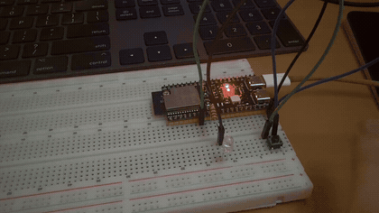
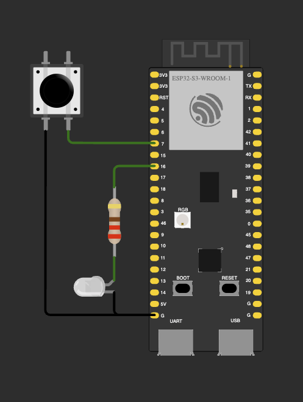
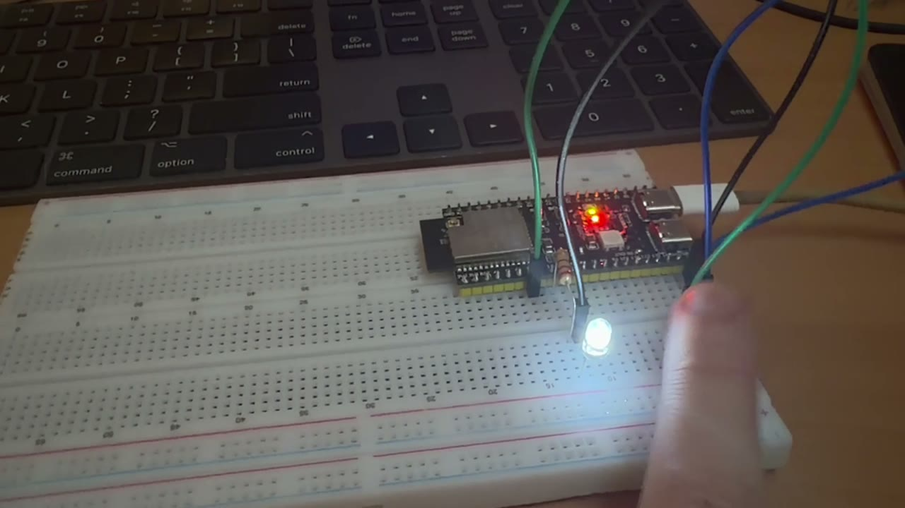

# ДЗ 2.1 — Режими по кнопці та профіль superloop (EMBEDDED C++)

Той самий неблокуючий blink, що у [`blink`](../blink/), плюс дві опційні частини ДЗ: кнопка через апаратне переривання і вимір часу однієї ітерації `loop()`.

| Режим | Що робить світлодіод |
|---|---|
| `BLINK` | блимає раз на 500 мс |
| `ALWAYS_ON` | горить постійно |
| `ALWAYS_OFF` | не горить |

Кнопка перемикає їх по колу: блимання → постійно увімкнено → вимкнено → блимання. ISR при натисканні виставляє один `volatile` прапорець і більше нічого не робить — і перемикання режимів, і антидребезг живуть у `loop()`.

## Демо

<a href="video.mp4"></a>

▶️ [Відео в повній якості (MP4)](video.mp4)

## Схема та фото

| Схема (Wokwi) | Зібрана плата |
|---|---|
|  |  |

Фото — кадр із того ж відео.

### Підключення

| Компонент | Пін ESP32-S3 | Примітка |
|---|---|---|
| Білий LED | GPIO 16 | через резистор 220 Ω, катод → GND |
| Кнопка | GPIO 7 | другий контакт → GND, `INPUT_PULLUP` |

Кнопка активна низьким рівнем: підтяжка тримає пін у `HIGH`, натискання замикає його на GND. GPIO 7 — звичайний пін без strapping-функцій, на відміну від GPIO 3, з яким я мучився у [ДЗ 1.7](../../dz1.7%20%28TWILIGHT%20SWITCH%29/twilight_with_modes/).

## Конфігурація

```cpp
struct Config {
  static constexpr uint8_t LED_PIN         = 16;
  static constexpr uint8_t BUTTON_PIN      = 7;
  static constexpr bool    LED_ACTIVE_HIGH = true;

  static constexpr uint32_t BLINK_INTERVAL_MS = 500;
  static constexpr uint32_t DEBOUNCE_MS       = 50;

  static constexpr uint32_t SERIAL_BAUD              = 115200;
  static constexpr uint16_t STATS_EVERY_N_ITERATIONS = 1000;
};
```

Пін, полярність, інтервал блимання, вікно антидребезгу і розмір вибірки для статистики — усе тут, нижче по коду голих чисел немає. Детальніше, чим `static constexpr` кращий за `#define` і за звичайний `const`, розписав [у базовому варіанті](../blink/).

## Режими

```cpp
enum class LedMode : uint8_t {
  Blink = 0,
  AlwaysOn,
  AlwaysOff,
  Count,
};

constexpr LedMode nextMode(LedMode mode) {
  return static_cast<LedMode>(
    (static_cast<uint8_t>(mode) + 1) % static_cast<uint8_t>(LedMode::Count)
  );
}
```

`Count` — не режим, а кількість режимів. Завдяки йому перемикання по колу не треба правити при додаванні четвертого режиму: `nextMode()` сам почне рахувати по модулю чотири. `constexpr` у `nextMode()` і в `modeName()` означає, що для константного аргументу компілятор порахує результат сам, а в рантаймі лишиться звичайний дешевий код.

`enum class` тут заодно рятує від класичної помилки: `LedMode` і `LedState` — різні типи, і передати режим туди, де чекають стан світлодіода, не вийде, хоча під капотом обидва — `uint8_t`.

## Кнопка: ISR і volatile

```cpp
static volatile bool buttonEvent = false;

void IRAM_ATTR onButtonEdge() {
  buttonEvent = true;
}
```

Це єдина глобальна змінна прошивки, і вона обовʼязково `volatile`. Компілятор бачить у `loop()` читання прапорця, не бачить у цьому ж коді жодного запису — і має повне право прочитати його один раз, покласти в регістр і далі крутити цикл на закешованому значенні. З `volatile` кожне звертання — це справжнє читання з памʼяті, і натискання не губиться.

`IRAM_ATTR` кладе обробник у внутрішню памʼять. Якщо ISR лишиться у flash, то переривання під час роботи з flash (запис у NVS, OTA) впаде на `Cache disabled but cached memory region accessed`.

Сама ISR робить рівно одну дію — виставляє прапорець. Ніякого `Serial.print`, ніяких `delay()`, ніякої логіки режимів: обробник переривання виконується з вимкненими перериваннями того ж рівня, і все, що в ньому затягнеться, з'їсть таймінги всієї системи.

```cpp
attachInterrupt(digitalPinToInterrupt(Config::BUTTON_PIN), onButtonEdge, FALLING);
```

`FALLING` — фронт натискання: пін падає з `HIGH` (підтяжка) на `LOW` (замкнули на GND).

## Антидребезг — цілком у loop()

```cpp
if (buttonEvent) {
  buttonEvent = false;
  lastEdgeMs = now;

  if (!waitingForRelease) {
    waitingForRelease = true;
    mode = nextMode(mode);
    lastToggleMs = now;
    Serial.printf("mode -> %s\r\n", modeName(mode));
  }
}

if (waitingForRelease &&
    digitalRead(Config::BUTTON_PIN) == HIGH &&
    now - lastEdgeMs >= Config::DEBOUNCE_MS) {
  waitingForRelease = false;
}
```

Режим перемикається на **першому** фронті — реакція миттєва, без штучної затримки у 50 мс. Далі кнопка вважається «розрядженою», і наступне натискання приймається тільки після того, як пін протримає `HIGH` довше за `DEBOUNCE_MS` від останнього побаченого фронту.

Важливий момент, який видно тільки на залізі: при відпусканні контакт дзвенить так само, як при натисканні, і кожен його стрибок вниз — це теж фронт `FALLING`, тобто ще одне переривання. Наївна перевірка «минуло 50 мс від попереднього натискання» на цьому ламається: потримав кнопку секунду, відпустив — і дзвін відпускання прилетів через 50 мс після прийнятого натискання, тобто зарахувався б як друге натискання. Умова «пін стабільно `HIGH`» закриває обидва дзвони одним правилом. Як цей дзвін виглядає на логічному аналізаторі, я розбирав [у ДЗ 1.5](../../dz1.5%20%28BUTTON%20BOUNCE%29/).

Прапорець знімається одним рядком `buttonEvent = false`. Теоретично між перевіркою і скиданням може влізти переривання, і тоді подія загубиться — але це буде черговий фронт дзвону в межах того самого натискання, який антидребезг усе одно мав відкинути.

## Вимір часу ітерації loop()

```cpp
class LoopProfiler {
    uint32_t sumUs_ = 0;
    uint32_t minUs_ = UINT32_MAX;
    uint32_t maxUs_ = 0;
    uint16_t count_ = 0;
  public:
    void add(uint32_t durationUs);
    bool full() const;
    uint32_t averageUs() const;
    uint32_t minUs() const;
    uint32_t maxUs() const;
    void reset();
};
```

Клас тільки накопичує цифри — не друкує і нічого не знає про Serial. Два екземпляри міряють різні речі:

- **body** — час від початку до кінця корисної роботи в `loop()`: `micros()` на вході, `micros() - startUs` після обробки кнопки і світлодіода.
- **period** — повний такт між двома входами в `loop()`, тобто `body` плюс усе, що Arduino робить між викликами: скидання watchdog і `serialEventRun()`.

Різниця між ними і є накладні витрати самого фреймворку, і безкоштовно її не побачити ніяк.

Кожні `STATS_EVERY_N_ITERATIONS` = 1000 ітерацій у порт летить рядок з середнім, мінімумом і максимумом. Ітерація, у якій цей рядок друкується, у вибірку не потрапляє: `add()` викликається до друку. Тому середнє показує чисту роботу циклу, а не швидкість UART. Зате друк видно в `period max` наступного вікна — такт, у якому `Serial.printf` чекав на звільнення буфера передачі, виходить на порядки довшим за решту.

Рядок `mode -> ...` при перемиканні режиму, навпаки, друкується всередині виміряної частини — тому в тому вікні, де я натискав кнопку, видно сплеск у `body max`.

Побічний ефект: при ітерації в кілька мікросекунд 1000 ітерацій минають за одиниці мілісекунд, і звіти сиплються швидше, ніж 115200 бод встигає їх виштовхнути — порт стає вузьким місцем. Це добре видно в логу і чесно відображає ціну діагностики в superloop. Якщо потрібен спокійніший монітор — це одна константа в `Config`.

## Скільки це коштує

```
$ xtensa-esp32s3-elf-nm -C -S ".pio/build/esp32-s3-devkitc-1/dz2.1 (EMBEDDED C++)/blink_modes/main.cpp.o"
                              # зовнішні символи (U) прибрав
00000000 00000010 T onButtonEdge()
00000000 000001aa T loop()
00000000 000000d2 T setup()
00000000 00000030 W Led::set(LedState)
00000000 00000001 b buttonEvent
00000000 00000003 d led
00000000 00000010 d loop()::body
00000000 00000010 d loop()::period
00000000 00000001 b loop()::mode
00000000 00000004 b loop()::lastToggleMs
00000000 00000004 b loop()::lastEdgeMs
00000000 00000004 b loop()::previousStartUs
00000000 00000001 b loop()::waitingForRelease
00000000 00000004 b loop()::windowNumber
```

Увесь стан прошивки — **54 байти**: три байти світлодіода, по 16 на кожен профайлер, прапорець від ISR і шість лічильників. Усе розподілено на етапі лінкування, купа не використовується взагалі.

Окремо варто подивитись на два рядки:

- `d loop()::body` і `d loop()::period` — профайлери лежать у `.data`, а не в `.bss`, бо `minUs_` ініціалізується не нулем. Guard-змінних (`_ZGVZ4loopvE4body`) поруч немає: конструктор у класу constexpr-тривіальний, тому статичні локальні об'єкти ініціалізуються на етапі компіляції, без перевірки «чи вже створено» на кожному заході в `loop()`.
- `onButtonEdge()` — 16 байт коду, і в секціях об'єктника він лежить в `.iram1.28`, тобто `IRAM_ATTR` справді спрацював.
- `W Led::set(LedState)` — 48 байт. У базовому варіанті компілятор вбудував усі виклики і окремої функції не лишив; тут `set()` викликається з трьох місць (дві гілки `switch` і `toggle()`), тому одну копію він вирішив лишити поза рядком. Це єдиний слід класу в коді — ні таблиці віртуальних функцій, ні службових обгорток.

Прошивка цілком: **19 528 байт RAM** (6.0%) і **279 197 байт flash** (8.4%).

## Вивід

Serial Monitor, 115200 бод, зі старту плати:

```
=== DZ 2.1: blink with modes + loop profiler ===
LED on GPIO 16 (active HIGH), button on GPIO 7 (INPUT_PULLUP, FALLING)
blink interval 500 ms, debounce 50 ms, stats every 1000 iterations
sizeof(Led) = 3 B, sizeof(LoopProfiler) = 16 B

  window | body avg | body min | body max | period avg | period max | mode
---------+----------+----------+----------+------------+------------+------------
       1 |     2 us |     2 us |    10 us |       3 us |      16 us | BLINK
       2 |     2 us |     2 us |    10 us |       3 us |     101 us | BLINK
       3 |     2 us |     2 us |    10 us |       3 us |      79 us | BLINK
       4 |     2 us |     2 us |    10 us |      13 us |   10313 us | BLINK
       5 |     2 us |     2 us |    10 us |       3 us |      86 us | BLINK
```

І шматок з натисканням кнопки:

```
    2818 |     2 us |     2 us |    10 us |       3 us |      99 us | BLINK
    2819 |     2 us |     2 us |    10 us |       3 us |      84 us | BLINK
    2820 |     2 us |     2 us |    10 us |      13 us |   10278 us | BLINK
    2821 |     2 us |     2 us |     9 us |       3 us |      94 us | BLINK
    2822 |     2 us |     2 us |    10 us |       3 us |      81 us | BLINK
    2823 |     2 us |     2 us |    11 us |      13 us |   10278 us | BLINK
mode -> ALWAYS_ON
    2824 |     2 us |     2 us |    21 us |       3 us |     100 us | ALWAYS_ON
    2825 |     2 us |     2 us |    10 us |      13 us |   10270 us | ALWAYS_ON
    2826 |     2 us |     2 us |    10 us |       3 us |      92 us | ALWAYS_ON
```

### Що показали цифри

**Ітерація коштує 2 мкс.** `body avg` і `body min` стабільно по 2 мкс, `period avg` — 3 мкс. Тобто корисна робота циклу — читання `millis()`, перевірка прапорця, порівняння таймера — це дві мікросекунди, і ще приблизно одна йде на те, що Arduino робить між викликами `loop()`: скидання watchdog і `serialEventRun()`. У режимі без друку це близько 330 тисяч ітерацій на секунду.

**`body max` 10–11 мкс проти середніх 2.** Раз за вікно щось розтягує ітерацію вп'ятеро, при незмінному мінімумі. Найімовірніше це тік планувальника FreeRTOS: він іде з частотою 1 кГц, вікно в 1000 ітерацій займає близько 3 мс, тобто на вікно припадає десь три тіки, і котрийсь із них влучає всередину виміряної ділянки. Перериванню байдуже, що я в цей момент міряю, — і саме такі речі видно тільки виміром, а не читанням коду.

**Друк дорожчий за всю роботу циклу.** Кожне друге вікно має `period max` близько 10.3 мс. Це такт, у якому `Serial.printf` уперся в повний буфер передачі і чекав, поки UART його виштовхне. Виходить, два рядки звіту займають приблизно 16 мс — 125 рядків на секунду при рядку в ~78 байт, тобто порт на 115200 бод завантажений майже під зав'язку. Тисяча ітерацій корисної роботи — це 2–3 мс, один рядок діагностики — 10 мс очікування. Діагностика в superloop коштує дорожче за сам superloop, і без виміру це неочевидно.

**Натискання видно в `body max`.** У вікнах 2824 і далі після кожного `mode -> ...` максимум підскакує до 21–23 мкс: рядок про зміну режиму друкується всередині виміряної частини, на відміну від рядка статистики. Двадцять мікросекунд — це `Serial.printf`, який встиг покласти коротке повідомлення у вільний буфер і не блокувався.

Один раз за прогін йому не пощастило:

```
    2157 |    12 us |     2 us | 10246 us |      13 us |   10247 us | BLINK
```

`mode -> BLINK` потрапив рівно на повний буфер, і `Serial.printf` заблокував саму ітерацію на 10.2 мс — середнє по вікну одразу зросло з 2 до 12 мкс. Це та сама причина, через яку в ISR не можна друкувати: один необережний `Serial.print` у гарячому шляху з'їдає таймінги на порядки більше, ніж уся решта роботи.

## Запуск

### На залізі (PlatformIO)

1. У [`platformio.ini`](../../platformio.ini) вкажи цей файл як джерело:
   ```ini
   build_src_filter = +<../dz2.1 (EMBEDDED C++)/blink_modes/main.cpp>
   ```
2. `pio run -t upload && pio device monitor`

### У симуляторі (Wokwi for VS Code)

1. `pio run`
2. `Wokwi: Select Config File` → [`wokwi.toml`](wokwi.toml)
3. Відкрий [`diagram.json`](diagram.json) і запусти `Wokwi: Start Simulator`

## Файли

| Файл | Опис |
|---|---|
| [`main.cpp`](main.cpp) | прошивка |
| [`diagram.json`](diagram.json) | схема для Wokwi |
| [`wokwi.toml`](wokwi.toml) | конфіг симулятора |
| [`schema.png`](schema.png) | скриншот схеми |
| [`photo.jpeg`](photo.jpeg) | фото зібраної схеми |
| [`demo.gif`](demo.gif), [`video.mp4`](video.mp4) | відео роботи |

Базовий варіант цього ДЗ: [**blink**](../blink/) — те саме блимання без кнопки і профайлера.
