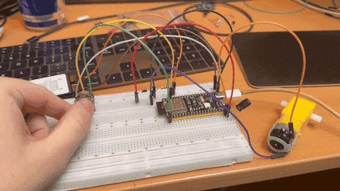
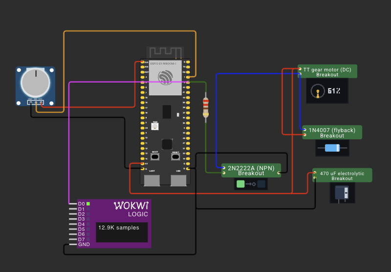
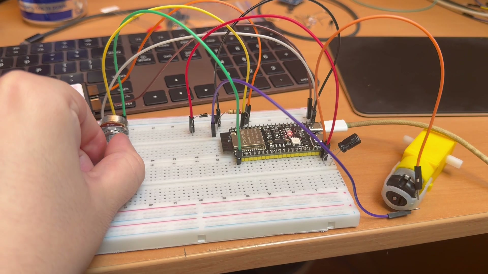
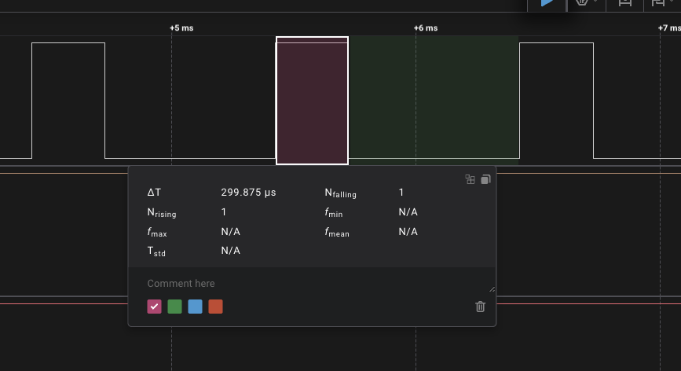
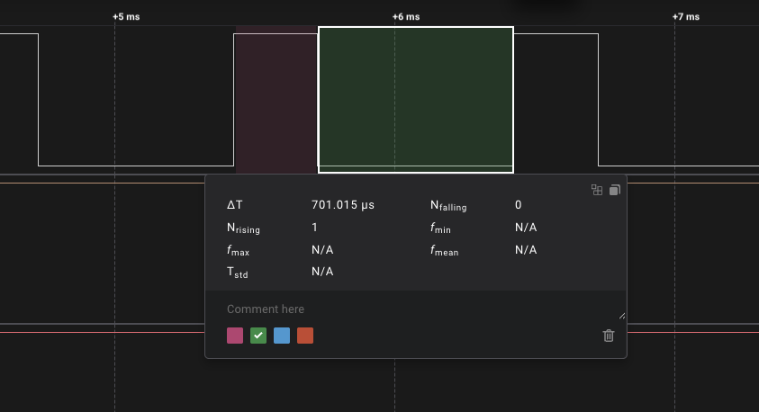
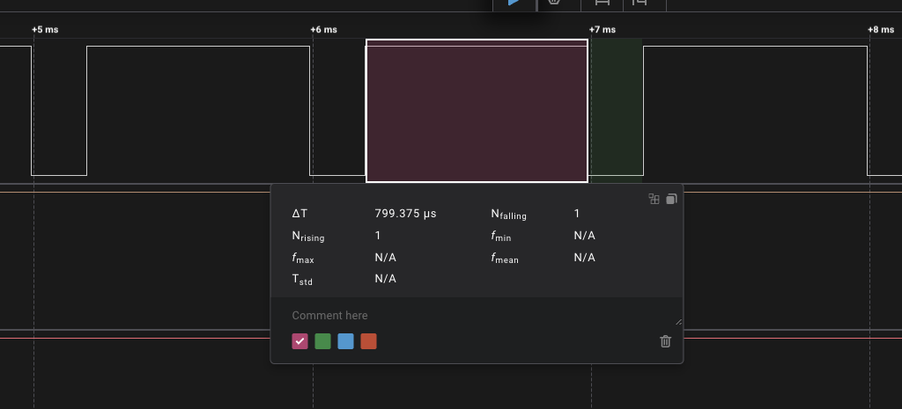
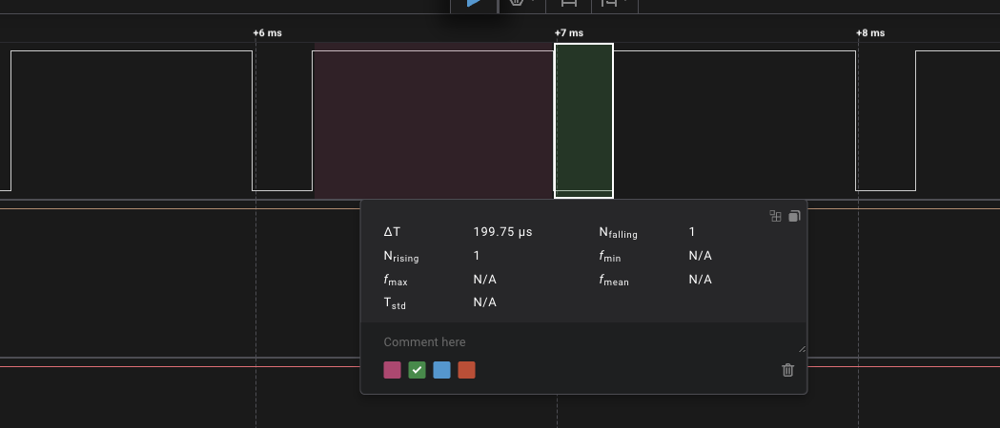

# ДЗ 2.2 — Програмний ШІМ для двигуна (POWER LOAD)

Потенціометр крутить швидкість TT-моторчика. **ESP32-S3-DevKitC-1** читає АЦП, перетворює значення на тривалість високого й низького рівня і формує ШІМ руками, на `micros()` — без `ledcWrite()` і без `delay()`. Заодно рахує, наскільки фронти спізнюються проти розкладу: це ціна софтового ШІМ, яку інакше не побачиш.

## Демо

<a href="video.mp4"></a>

https://github.com/user-attachments/assets/bf001ae6-3650-4b70-83be-98d9b4d83f29

## Схема та фото

| Схема (Wokwi) | Зібрана плата |
|---|---|
|  |  |

Фото — кадр із того ж відео. У симуляторі кастомний чип двигуна показує поточну шпаруватість цифрою і крутить ротор, а діод підсвічується в момент, коли справжній 1N4007 відкривався б.

### Підключення

| Вузол | Пін ESP32-S3 | Примітка |
|---|---|---|
| Потенціометр 10 кОм, крайні виводи | 3V3 і GND | |
| Середня точка потенціометра | GPIO 1 | ADC1_CH0 |
| База VT1 (2N2222A) через R1 220 Ом | GPIO 2 | вихід ШІМ |
| Емітер VT1 | GND | спільна земля |
| Колектор VT1 | мінус двигуна | |
| Плюс двигуна | 5V | пін плати, живлення з USB |
| Flyback-діод 1N4007 паралельно двигуну | — | смужка (катод) до плюса |
| Конденсатор 100…470 мкФ, не менше 10 В | — | плюсом до 5V, ближче до мотора |

### Цоколівка: 2N2222A не такий, як BC547B

Обидва в корпусі TO-92 і зовні однакові, але виводи в них **дзеркальні**:

```
    BC547B                     2N2222A
  (плоским боком до себе, ніжки вниз)

   ___________                ___________
  |           |              |           |
  |___________|              |___________|
     |   |   |                  |   |   |
     C   B   E                  E   B   C
```

Тобто якщо повторити розводку з [ДЗ 1.7](../../dz1.7%20%28TWILIGHT%20SWITCH%29/twilight/) один в один, колектор з емітером поміняються місцями. Транзистор при цьому не згорить, але працюватиме в інверсному режимі: коефіцієнт підсилення впаде зі ста до двійки-трійки, і двигун або ледь смикнеться, або не рушить узагалі.

Перевірити мультиметром у режимі «продзвонювання діодів»: червоний щуп на середню ніжку (база), чорним торкнутись крайніх — обидві мають показати 0.6…0.7 В. Далі та з крайніх, що показує трохи **менше**, — колектор. Якщо мультиметра під рукою немає, а двигун не крутиться — просто поміняй місцями дві крайні ніжки.

## Чому не BC547B

У ДЗ 1.7 ключем був BC547B, і для реле він підходив: вхід модуля бере одиниці міліампер. Тут навантаження інше.

| | Струм |
|---|---|
| Пін GPIO ESP32-S3 | ~12 мА безпечно, 40 мА абсолютний максимум |
| TT-моторчик на 5 В, вільний вал | ~150 мА |
| Той самий моторчик, якщо притримати вал | до ~1 А |
| BC547B, максимум колектора | 100 мА |
| 2N2222A, максимум колектора | 800 мА |

Тобто двигун прямо з піна — це струм у десять-вісімдесят разів більший за те, на що пін розрахований, і вихідний каскад згорить. Але й BC547B у ролі ключа згорів би не набагато пізніше: його стеля нижча за робочий струм двигуна. Тому ключ тут — 2N2222A, єдиний транзистор у моїй коробці, що тримає такий струм.

Опір у базі рахується від того, який струм треба прокачати через колектор:

```
Ib = (3.3 В - Vbe) / Rb = (3.3 - 1.1) / 220 = 10 мА
```

Десять міліампер пін віддає спокійно. При такому струмі бази 2N2222A входить у насичення (режим повністю відкритого ключа) аж до ~400 мА колекторного струму — двигуну з вільним валом вистачає з запасом. Поставити замість 220 Ом кілоом — і транзистор перейде в лінійний режим: почне грітися сам замість того, щоб віддавати потужність двигуну.

## Обв'язка, без якої схема живе недовго

**Flyback-діод.** Обмотка двигуна — індуктивність. Коли ключ закривається, струм у ній не може зникнути миттєво, і напруга на колекторі стрибає вгору на десятки вольт. 2N2222A тримає 40 В між колектором і емітером; сплеск це перевищує. Діод 1N4007 паралельно двигуну замикає струм сам на себе і не випускає сплеск у схему. При ШІМ 1 кГц ключ закривається тисячу разів на секунду — без діода транзистор проб'є за секунди.

**Конденсатор по живленню.** Двигун бере струм ривками, особливо на старті. Окремого джерела для силової частини в мене немає, тому мотор висить на тому самому піні 5V, з якого живиться плата, — і кожна просадка від кидка струму б'є прямо по мікроконтролеру. Електроліт 100…470 мкФ поруч із мотором працює резервуаром: віддає заряд у момент кидка і згладжує провал. Напруга на корпусі має бути не менша за 10 В — це межа, а не робоче значення, і на шині 5 В підійде будь-який від 10 В і вище. У правильній схемі це страховка, у моїй — умова працездатності.

У мене знайшовся тільки один електроліт на 100 мкФ, і цього вистачило: основну роботу тут робить не він, а плавний розгін у прошивці, бо він узагалі не дає виникнути кидку від старту. Поруч стоїть ще керамічний на 100 нФ — електроліт великий, але повільний через власну індуктивність, а кераміка гасить швидкі викиди на фронтах комутації.

Щоб було видно, коли конденсатора не вистачило, `setup()` друкує причину останнього старту:

```cpp
Serial.printf("причина останнього старту: %s\r\n", resetReasonName(esp_reset_reason()));
```

`BROWNOUT` у цьому рядку означає рівно одне: живлення просіло нижче порога і плата перезавантажилась. Лікується це конденсатором, а не кодом.

**Не тримати вал.** Із того ж приводу: вільний TT-моторчик на 5 В бере ~150 мА, а загальмований — під ампер. USB стільки не дасть, і плата гарантовано піде в ребут. Це не поломка схеми, а межа живлення з однієї шини.

**Спільна земля.** У моїй схемі джерело одне, тому земля спільна сама собою. Але правило варто розуміти: транзистор порівнює напругу бази з напругою свого емітера. Якби мотор живився від батарейного відсіку, а емітер сидів на його мінусі, спільної точки відліку з платою не було б — і «3.3 В на базі» перестало б щось означати. Мінуси всіх джерел завжди зводяться в одну точку.

## Як зроблено ШІМ

Уся математика завдання — у двох рядках:

```cpp
void setDuty(uint8_t percent) {
  if (percent > 100) percent = 100;
  highUs_ = periodUs_ * percent / 100;
  lowUs_  = periodUs_ - highUs_;
}
```

`tick()` викликається першим рядком кожної ітерації `loop()` і нічого не чекає: дивиться на `micros()`, і якщо запланований момент фронту вже настав — перекидає пін.

```cpp
if (static_cast<int32_t>(now - nextEdgeUs_) < 0) return;
...
write(!level_);
nextEdgeUs_ += level_ ? highUs_ : lowUs_;
```

Наступний фронт відраховується від **запланованого** часу, а не від поточного. Якби я писав `nextEdgeUs_ = now + highUs_`, кожне запізнення додавалося б до періоду, і частота повзла б униз тим сильніше, чим більше роботи в циклі. Порівняння через `int32_t` від різниці, а не `now >= nextEdgeUs_`, коректно переживає переповнення `micros()` кожні 71 хвилину.

Крайні положення ручки оброблені окремо: при 0 % і 100 % фронтів не робиться взагалі, пін просто стоїть у потрібному рівні. Інакше на кожній ітерації смикався б нульової довжини імпульс.

## Плавний розгін

Заповнення не стрибає слідом за ручкою, а доганяє її кроками по 2 % кожні 20 мс — повний хід від нуля до сотні розтягується на секунду:

```cpp
static uint8_t rampToward(uint8_t current, uint8_t target) {
  if (target > current) {
    return (target - current > Config::RAMP_STEP) ? current + Config::RAMP_STEP : target;
  }
  ...
}
```

Причина та сама, що й у конденсатора: різкий перехід з нуля на повну дає кидок струму, який просаджує шину 5V, з якої живиться і сам мікроконтролер. Розтягнутий старт зменшує цей кидок до того, що конденсатор уже спокійно тягне. Побічна користь — редуктор не отримує ударного старту.

У логу через це дві колонки: `ціль` — те, що просить ручка, `зараз` — те, що реально подається на ключ. Різниця між ними видна рівно в момент, коли крутиш ручку, і саме тоді двигун розганяється.

## Поштовх при старті

Двигун виявився не симетричним: зі спокою він зривається з місця тільки на **50 %**, а вже розкручений тримає оберти аж до **25 %**. Це тертя спокою — щоб зрушити, потрібно більше зусилля, ніж щоб підтримувати рух.

Через це нижня половина ходу ручки була б мертвою: виставляєш 30 %, а двигун стоїть і гуде. Лікується короткою «затравкою»:

```cpp
if (requested > 0 && targetDuty == 0) {
  kickUntilMs = now + Config::KICK_MS;
}
...
if (kickUntilMs != 0 && static_cast<int32_t>(now - kickUntilMs) < 0) {
  duty = Config::KICK_DUTY;   // поштовх свідомо йде повз плавний розгін
} else {
  duty = rampToward(duty, targetDuty);
}
```

`KICK_DUTY` = 58 % — трохи вище зміряного порога зриву, `KICK_MS` = 80 мс. Після цього керування віддається ручці, і двигун спокійно крутиться на 25…30 %, куди сам би не рушив.

Поштовх навмисно обходить плавний розгін: розгін бере живлення від кидка струму, а поштовх цей кидок якраз і створює. Дві частини прошивки тягнуть у різні боки, і це свідомо — на моєму живленні навіть 100 % не викликали `BROWNOUT`, тобто запас є.

Керування тут розімкнуте: датчика обертів немає, тому прошивка не знає, чи двигун уже рушив. Тривалість — просто підібране число, і підбирати довелося двічі. Спершу 200 мс: двигун помітно перекручувався понад задане й потім сідав назад. Скоротив до 120 — стало краще, але смикання лишилось.

Виявилось, що винен не сам поштовх, а його хвіст. Коли поштовх закінчувався, заповнення сповзало до заданого тим самим плавним розгоном — 2 % за 20 мс, тобто з 58 % до 26 % ще третину секунди, і весь цей час двигун крутився швидше за задане. Тому після поштовху заповнення падає на місце одразу:

```cpp
} else {
  kickUntilMs = 0;
  duty = targetDuty;   // без сповзання
}
```

Обмежувати швидкість **зниження** заповнення нема сенсу взагалі: кидок струму буває на розгоні, а не тоді, коли ключ відкривається менше. Разом зі скороченням до 80 мс цього вистачило.

## Чому АЦП читається по одному виміру

Очевидний спосіб прибрати шум АЦП — прочитати 8 разів поспіль і усереднити. Тут так робити не можна: `analogRead()` коштує десятки мікросекунд, вісім підряд — це вже частка мілісекунди, тобто половина періоду ШІМ. Фронт спізнився б, і це було б видно на аналізаторі як плаваюча шпаруватість.

Тому вимір рівно один за виклик, раз на 20 мс, а усереднення — ковзне вікно на 8 значень:

```cpp
void sample() {
  const uint16_t raw = analogRead(pin_);
  sum_ -= window_[index_];
  window_[index_] = raw;
  sum_ += raw;
  index_ = (index_ + 1) % Config::ADC_WINDOW;
}
```

Вікно — степінь двійки, тому ділення компілятор перетворює на зсув; це закріплено `static_assert`.

Нижня мертва зона (`ADC_DEADBAND`) робить «вимкнено» справді вимкненим, а решта ходу ручки розтягується від `MIN_DUTY` до 100 %: двигун рушає одразу, як тільки ручка зійшла з нуля. Без цього перша третина обороту була б мертвою — двигун гудів би, але не крутився.

## Вивід

Serial Monitor, 115200 бод. Один прохід ручкою від нуля до максимуму й назад; повний лог — у [`analysis/serial.log`](analysis/serial.log).

```
   ADC | ціль | зараз | high us | low us | фронт/с | ШІМ late |  max | ADC avg |  max |  print
-------+------+-------+---------+--------+---------+----------+------+---------+------+-------
     0 |   0% |    0% |       0 |   1000 |       0 |        0 |    0 |      59 |   72 |    130
    71 |  25% |   58% |     580 |    420 |      22 |        6 |   64 |      59 |   68 |    132  <- поштовх
   189 |  27% |   27% |     270 |    730 |    1998 |        0 |    2 |      60 |   75 |    155
   477 |  32% |   32% |     320 |    680 |    2000 |        0 |    2 |      60 |   71 |    155
  1242 |  46% |   46% |     460 |    540 |    2000 |        0 |    2 |      60 |   70 |    154
  1695 |  55% |   55% |     550 |    450 |    2000 |        0 |    2 |      60 |   70 |    155
  2113 |  63% |   63% |     630 |    370 |    2000 |        0 |    2 |      60 |   75 |    153
  2519 |  70% |   70% |     700 |    300 |    1998 |        0 |   55 |      60 |   71 |    156
  2743 |  74% |   74% |     740 |    260 |    2000 |        2 |  153 |      60 |   77 |    156
  3654 |  91% |   91% |     910 |     90 |    2000 |        2 |  155 |      60 |   75 |    159
  4095 | 100% |  100% |    1000 |      0 |       0 |        0 |    0 |      60 |   74 |    157
  3463 |  88% |   88% |     880 |    120 |    2000 |        0 |   99 |      60 |   71 |    156
  3040 |  80% |   80% |     800 |    200 |    2000 |        0 |    2 |      60 |   77 |    157
  1488 |  51% |   51% |     510 |    490 |    2000 |        0 |    2 |      60 |   70 |    155
   268 |  28% |   28% |     280 |    720 |    2000 |        0 |    2 |      60 |   75 |    153
    44 |   0% |   21% |     210 |    790 |    2000 |        0 |    2 |      60 |   71 |    154
     0 |   0% |    0% |       0 |   1000 |       0 |        0 |    0 |      60 |   72 |    130
```

### Що показали цифри

**Перетворення точне по всьому ходу ручки.** 32 % дають 320 і 680 мкс, 55 % — 550 і 450, 91 % — 910 і 90. Фронтів рівно 2000 на секунду, тобто два на період при 1 кГц. На крайніх положеннях ШІМ не смикається взагалі: фронтів нуль, пін просто стоїть у потрібному рівні.

**Поштовх видно окремим рядком:** ціль 25 %, на ключ іде 58 %, а вже в наступному рядку — 27 % без жодного сповзання. Рядок нижче показує і розгін у зворотний бік: ціль 0 %, а на ключі ще 21 %.

**Те саме, зміряне аналізатором.** Прошивка друкує `high us` і `low us` із власних змінних, тому цифрам потрібен незалежний свідок. Щуп на GPIO 2, ручка затримана в одному положенні, виділення в Logic 2 показує тривалість:

**Ручка на 30 %.** Високий рівень — 299.875 мкс, прошивка заявляла 300:

<a href="analysis/pwm-30-high.png"></a>

Низький — 701.015 мкс проти заявлених 700:

<a href="analysis/pwm-30-low.png"></a>

**Ручка на 80 %.** Високий рівень — 799.375 мкс проти 800:

<a href="analysis/pwm-80-high.png"></a>

Низький — 199.75 мкс проти 200:

<a href="analysis/pwm-80-low.png"></a>

Розбіжність із заявленим — менше мікросекунди на імпульс. Але цінніше те, що дає сума двох вимірів:

| | Період | Реальне заповнення |
|---|---|---|
| 30 % | 1000.9 мкс | 29.96 % |
| 80 % | 999.1 мкс | 80.01 % |

Заповнення змінилось у два з половиною рази, а період зрушив на 0.1 %. Це і є доказ, що відлік наступного фронту від **запланованого** часу працює як задумано: якби я рахував від поточного, кожне запізнення додавалося б до періоду, і на 80 % він поповз би вгору помітно.

**Запізнення фронтів має два стійкі рівні:** 153…156 мкс і 2…6. Різниця в сімдесят разів, і розбиралися з нею три прогони — кожен додавав по колонці й спростовував попередню здогадку.

Спершу підозра впала на `analogRead()`. Колонка `ADC max` дала 68…78 мкс — величина реальна, але замала. Тоді додалася колонка `print`: **130…161 мкс** на один рядок звіту. Ось і збіг, причому запізнення завжди трохи менше за час друку — фронт настає десь усередині `printf` і спізнюється на залишок.

Тобто найдовший блокуючий виклик у циклі — це не робота з периферією, а **власна діагностика**. Рядок, який я друкую, щоб дізнатися про затримки, сам створює найбільшу з них. Те саме вилізло в [ДЗ 2.1](../../dz2.1%20%28EMBEDDED%20C++%29/blink_modes/) з профайлером `loop()`.

**Чому рівні стійкі, а не випадкові.** АЦП читається раз на 20 мс, звіт друкується раз на 500 мс, період ШІМ — 1000 мкс. Обидва інтервали кратні періоду рівно, тому кожен блокуючий виклик щоразу потрапляє в ту саму фазу періоду. Або він накладається на фронт — і тоді зіткнення в кожному вікні, або не накладається — і тоді не буває ніколи. Проміжного в логу немає.

**А ось від чого залежить, накладеться чи ні.** Фронтів у періоді два: один на межі періоду, другий — на позиції `high us`. Перший стоїть на місці, а другий їздить разом із заповненням. Тому режим перемикається просто від обертання ручки: у цьому прогоні тиша трималася до 63 %, на 70 % почалося часткове влучання, а з 74 % — стабільне зіткнення. Другий фронт наїхав на фазу друку.

Прохід через 0 % або 100 % діє інакше: там `tick()` фронтів не робить і щоразу переставляє мітку наступного фронту на поточний момент, тобто заново прив'язує всю сітку ШІМ. Після нього фаза інша — у логу видно, що на спуску ті самі 88 % дали 99 мкс, а 80 % уже 2, хоча на підйомі ці ж заповнення стабільно збігали з друком.

Точну фазу з логу не відновити, але картину вона пояснює цілком: і перемикання на 70 % посеред підйому, і різну поведінку однакових заповнень до й після максимуму.

**Практичний висновок.** Середнє запізнення по всьому прогону — 0…2 мкс: із двох тисяч фронтів у вікні страждає один. Але найгірший випадок дорівнює найдовшому блокуючому виклику в циклі, і на 1 кГц це 15 % періоду. Апаратний LEDC такої залежності не має взагалі — там фронт формує таймер, і йому байдуже, чим зайнятий процесор. Ціна софтового ШІМ — саме в цьому рядку, і побачити її можна тільки виміром.

## Запуск

### На залізі (PlatformIO)

1. У [`platformio.ini`](../../platformio.ini):
   ```ini
   build_src_filter = +<../dz2.2 (POWER LOAD)/motor_pwm/main.cpp>
   ```
2. `pio run -t upload && pio device monitor`

### У симуляторі (Wokwi for VS Code)

1. `pio run`
2. `Wokwi: Select Config File` → [`wokwi.toml`](wokwi.toml)
3. Відкрий [`diagram.json`](diagram.json) і запусти `Wokwi: Start Simulator`

У Wokwi немає жодної з силових деталей цієї схеми: ні двигуна постійного струму (є тільки крокові), ні діода, ні конденсатора, ні транзистора. Тому кожну з них я зібрав окремим кастомним чипом із тією ж кількістю виводів, що й у справжньої деталі, — щоб схема в симуляторі збігалася з платою один в один, а не зводила чотири компоненти в один прямокутник.

| Чип | Виводи | Що робить у симуляторі |
|---|---|---|
| [`2n2222-switch`](chips/2n2222-switch.chip.c) | `C` `B` `E` | база висока — притискає колектор до землі, база низька — відпускає |
| [`dc-motor`](chips/dc-motor.chip.c) | `POS` `NEG` | міряє шпаруватість на своєму мінусі й крутить ротор тим швидше, чим вона більша; поруч показує відсоток |
| [`flyback-diode`](chips/flyback-diode.chip.c) | `A` `K` | засвічується на фронті вгору на аноді — тобто рівно тоді, коли справжній діод відкривається |
| [`electrolytic-cap`](chips/electrolytic-cap.chip.c) | `POS` `NEG` | показує полярність смужкою мінуса і гасне, коли на шині немає напруги |

Підтяжка на виводі `NEG` двигуна — не хитрість, а модель самої обмотки: при закритому ключі цей вузол з'єднаний із плюсом через мідь, тобто стоїть у високому рівні. Саме тому чип бачить на ньому нормальний прямокутник і може порахувати шпаруватість.

Чого симулятор не показує чесно: Wokwi не рахує ані струмів, ані аналогових напруг. Пускового кидка, справжнього сплеску зворотної ЕРС і просадки живлення там немає — діод і конденсатор у схемі стоять, але гасити їм нема чого. Це видно тільки на платі. Що в симуляторі правда — форма сигналу на піні, і її пише `wokwi-logic-analyzer` у VCD.

Перезібрати чипи після правок: `make` у папці [`chips/`](chips/) (потрібен `clang` із ціллю wasm32; на macOS `brew install llvm lld`).

## Файли

| Файл | Опис |
|---|---|
| [`main.cpp`](main.cpp) | прошивка |
| [`diagram.json`](diagram.json) | схема для Wokwi |
| [`wokwi.toml`](wokwi.toml) | конфіг симулятора |
| [`chips/`](chips/) | кастомні чипи Wokwi: транзистор, двигун, діод, конденсатор |
| [`analysis/serial.log`](analysis/serial.log) | лог із плати |
| [`analysis/pwm-*.png`](analysis/) | виміри тривалостей логічним аналізатором |
| [`schema.png`](schema.png) | скриншот схеми |
| [`photo.jpeg`](photo.jpeg) | фото зібраної схеми |
| [`demo.gif`](demo.gif), [`video.mp4`](video.mp4) | відео роботи |

Інші варіанти цього ДЗ: [**relay_timing**](../relay_timing/) — вимір часу спрацювання реле, [**uart_pwm**](../uart_pwm/) — UART як джерело ШІМ.
