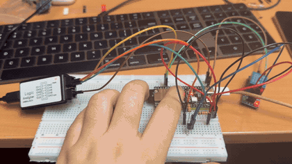
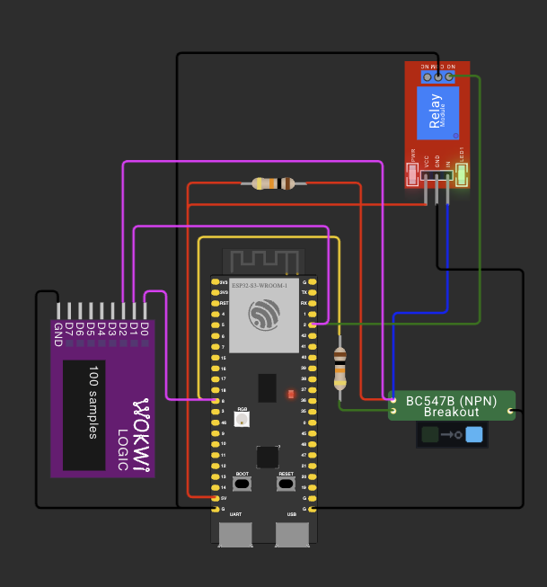
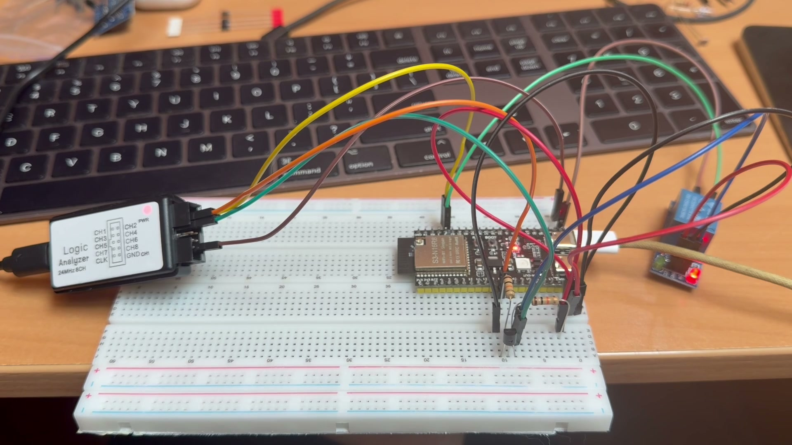
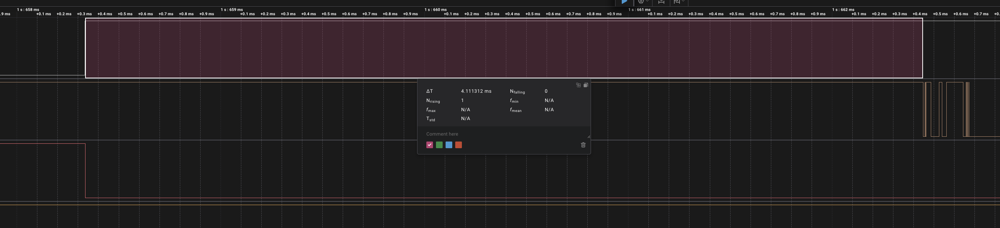
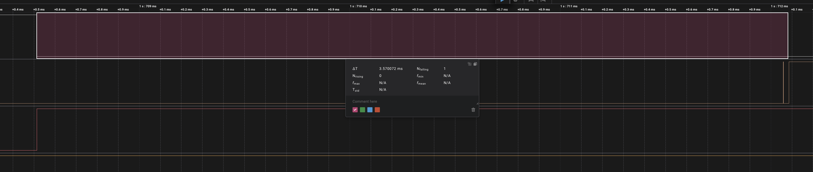

# ДЗ 2.2 — Час спрацювання реле (POWER LOAD)

Реле — єдиний компонент у схемі, який рухається фізично, і це видно по часу. Прошивка на **ESP32-S3-DevKitC-1** подає команду на обмотку, ловить перериванням момент, коли сухий контакт реально замкнувся, і рахує різницю в мікросекундах. Серія з 15 циклів увімкнення/вимкнення, у кінці — середнє, мінімум і максимум.

## Демо

<a href="video.mp4"></a>

https://github.com/user-attachments/assets/638f5a57-5c12-4a43-8604-ffe7c11162df

## Схема та фото

| Схема (Wokwi) | Зібрана плата |
|---|---|
|  |  |

Фото — кадр із того ж відео. Ліворуч на макетці висить логічний аналізатор, праворуч видно модуль реле зі спрацьованим індикатором.

### Підключення

| Вузол | Пін ESP32-S3 | Примітка |
|---|---|---|
| База VT1 (BC547B) через R3 10 кОм | GPIO 8 | керування обмоткою |
| Колектор VT1 | вхід `IN` реле | і через R4 10 кОм на +5V |
| Емітер VT1 | GND | спільна земля плати й модуля |
| `VCC` / `GND` модуля реле | 5V / GND | |
| `COM` реле | GND | |
| `NO` реле | GPIO 2 | `INPUT_PULLUP`, переривання по `CHANGE` |
| Логічний аналізатор (необов'язково) | GPIO 8, GPIO 2, колектор VT1 | GND аналізатора → GND плати |

Обидва піни звичайні. GPIO 3, на який спокусливо повісити обмотку, — strapping-пін ESP32-S3, той самий, через який я мучився в [ДЗ 1.7](../../dz1.7%20%28TWILIGHT%20SWITCH%29/twilight_with_modes/).

Аналізатор для цього завдання не потрібен — усе, що треба, прошивка міряє сама й друкує в Serial. Але три канали на команду, вхід модуля реле й контакт дають ту саму затримку, зміряну незалежно від коду, тому в схемі вони стоять: у симуляторі це безкоштовний VCD, а на платі — справа п'яти хвилин, якщо захочеться перевірити себе.

Ключ на BC547B — той самий, що в [ДЗ 1.7](../../dz1.7%20%28TWILIGHT%20SWITCH%29/twilight/): він узгоджує 3.3 В плати з 5-вольтовим входом модуля і заодно інвертує сигнал, тому з оптомодулем «low level trigger» реле вмикається рівнем `HIGH` на GPIO. Це одна константа `RELAY_ON_LEVEL` у коді.

Нове тут — друге плече. Сухий контакт реле нікуди не комутує навантаження, а працює як звичайна кнопка для мікроконтролера: `COM` посаджений на землю, `NO` заведений на GPIO 2 з внутрішньою підтяжкою. Контакт розімкнутий — підтяжка тримає пін у `HIGH`; контакт замкнувся — `COM` притискає пін до `LOW`. Гальванічно це вже інша частина схеми, плата бачить тільки замикання двох шматків металу.

## Що саме міряється

Від команди до готового контакту проходить три різні речі, і в таблиці вони окремими колонками:

| Колонка | Що це |
|---|---|
| `t1` | від `digitalWrite()` до **першого** фронту на контакті — власне механіка: струм наростає в обмотці, якір рушає, контакт торкнувся |
| `ts` | від команди до **останнього** фронту — момент, коли контакт остаточно перестав стрибати |
| `bnc` | `ts - t1`, тривалість брязкоту |
| `n` | скільки фронтів побачив мікроконтролер за це перемикання |

`t1` — це відповідь на питання завдання. `bnc` і `n` — відповідь на застереження в завданні про брязкіт.

## Брязкіт і переривання

Наївний варіант виглядає так: почекати переривання й записати час. Він дає правильний `t1` і зовсім неправильне уявлення про те, що сталося далі — бо контакт реле після удару підстрибує так само, як контакт кнопки в [ДЗ 1.5](../../dz1.5%20%28BUTTON%20BOUNCE%29/), і на один рух якоря прилітає кілька переривань.

Тому ISR не вирішує нічого. Вона запам'ятовує три числа і виходить:

```cpp
void IRAM_ATTR onContactEdge() {
  const uint32_t now = micros();

  portENTER_CRITICAL_ISR(&edgeMux);
  if (edgeCount == 0) firstEdgeUs = now;
  lastEdgeUs = now;
  ++edgeCount;
  portEXIT_CRITICAL_ISR(&edgeMux);
}
```

Перший фронт — момент дотику, останній — кінець брязкоту, лічильник — скільки разів контакт відскочив. `micros()` береться найпершим рядком, до входу в критичну секцію, інакше в результат потрапив би час очікування на м'ютексі.

`portENTER_CRITICAL_ISR` потрібен, бо трьох змінних не можна прочитати атомарно: без нього `loop()` міг би зловити новий `lastEdgeUs` зі старим `edgeCount`. У `loop()` знімається один злагоджений знімок:

```cpp
static Capture snapshot() {
  Capture c;
  portENTER_CRITICAL(&edgeMux);
  c.first = firstEdgeUs;
  c.last  = lastEdgeUs;
  c.count = edgeCount;
  portEXIT_CRITICAL(&edgeMux);
  return c;
}
```

Перемикання вважається завершеним, коли після останнього фронту минуло `SETTLE_US` = 5 мс і пін стоїть у очікуваному стані. Якщо за `TIMEOUT_US` = 100 мс не прилетіло жодного фронту — це промах: або реле не спрацювало, або `RELAY_ON_LEVEL` стоїть навпаки.

Точку відліку і саму команду я поставив впритул:

```cpp
const uint32_t commandUs = micros();
digitalWrite(Config::COIL_PIN, coilLevel);
```

Усе, що влізло б між цими рядками, додалося б до результату як час спрацювання реле, хоча ніякого відношення до механіки не має.

## Вивід

Serial Monitor, 115200 бод. Прогнав три серії поспіль, нижче перша; повний лог — у [`analysis/serial.log`](analysis/serial.log).

```
--- перевірка ланцюга, без переривань ---
GPIO 8 = HIGH -> контакт замкнутий
GPIO 8 = LOW -> контакт розімкнутий
ланцюг у порядку, міряю час

   # | on: t1 | on: ts | on: bnc | n | off: t1 | off: ts | off: bnc | n
-----+--------+--------+---------+---+---------+---------+----------+---
   1 |   4120 |   4348 |     228 | 10 |    3578 |    3578 |        0 | 1
   2 |   4136 |   4358 |     222 | 9 |    3578 |    3578 |        0 | 1
   3 |   4134 |   4362 |     228 | 9 |    3579 |    3579 |        0 | 1
   4 |   4135 |   4364 |     229 | 9 |    3578 |    3578 |        0 | 1
   5 |   4150 |   4377 |     227 | 9 |    3550 |    3578 |       28 | 2
   6 |   4143 |   4371 |     228 | 9 |    3550 |    3577 |       27 | 2
   7 |   4138 |   4366 |     228 | 9 |    3577 |    3577 |        0 | 1
   8 |   4139 |   4365 |     226 | 12 |    3576 |    3576 |        0 | 1
   9 |   4140 |   4367 |     227 | 9 |    3546 |    3574 |       28 | 2
  10 |   4141 |   4369 |     228 | 12 |    3576 |    3576 |        0 | 1
  11 |   4149 |   4376 |     227 | 9 |    3546 |    3574 |       28 | 2
  12 |   4150 |   4378 |     228 | 9 |    3545 |    3575 |       30 | 2
  13 |   4140 |   4368 |     228 | 10 |    3542 |    3571 |       29 | 2
  14 |   4151 |   4379 |     228 | 9 |    3571 |    3571 |        0 | 1
  15 |   4159 |   4387 |     228 | 10 |    3542 |    3571 |       29 | 2

=== підсумок за 15 циклів ===
увімкнення (pull-in) avg   4141 us (4.14 ms) | min   4120 us | max   4159 us
брязкіт при увімкненні avg    227 us (0.22 ms) | min    222 us | max    229 us
вимкнення (release) avg   3562 us (3.56 ms) | min   3542 us | max   3579 us
брязкіт при вимкненні avg     13 us (0.01 ms) | min      0 us | max     30 us
фронтів при увімкненні: 144 на 15 вимірів (9.6 на спрацювання)
фронтів при вимкненні:  22 на 15 вимірів (1.4 на спрацювання)
```

### Що показали цифри

**Вимкнення швидше за увімкнення на 0.6 мс** — 3.56 проти 4.14 мс. Щоб притягнути якір, треба накачати струм в індуктивність обмотки і подолати зусилля пружини; відпускає якір сама пружина, щойно поле зникло. Тому pull-in довший за release, і так буде на будь-якому електромагнітному реле.

**Брязкіт живе тільки на замиканні.** 227 мкс і в середньому 9.6 фронтів на кожне увімкнення — проти 1.4 фронта і майже нуля мікросекунд на вимкнення. Контакт дзвенить, коли вдаряється об нерухому пластину, а не коли від неї відходить. Розмикається він чисто: у третій серії всі п'ятнадцять вимкнень дали рівно по одному фронту.

Це прямо відповідає на застереження в умові. Якби ISR зараховувала перше ж переривання як готовий результат, на одне спрацювання прилетіло б до дванадцяти подій, і лічильник перемикань збрехав би вдесятеро.

**Те саме, зміряне аналізатором.** Прошивка міряє себе сама, тому цифрам варто мати другий, незалежний свідок. Два канали на команду й на контакт, виділення в Logic 2 показує тривалість:

| Увімкнення | Вимкнення |
|---|---|
|  |  |
| ΔT = **4.1113 мс**, далі пачка брязкоту | ΔT = **3.5701 мс**, один чистий фронт |

Картинки доводять те, чого таблиця довести не може: чотири мілісекунди між командою і контактом — це справді порожнеча, поки рухається залізо, а не артефакт коду.

Цікава дрібниця в тому, що аналізатор показує трохи **менше** за прошивку: 4111 мкс проти 4120 мкс мінімуму в тій самій серії. Різниця в 10…30 мкс — це затримка входу в переривання, тобто та сама похибка методики, яку я оцінив у 13 мкс за прогоном у симуляторі. Три незалежні речі — константа моделі Wokwi, розкид на залізі й розбіжність між МК і аналізатором — дали один і той самий порядок.

**Реле гріється, і це видно в цифрах.** Три серії підряд, без пауз:

| Серія | pull-in | release |
|---|---|---|
| 1 | 4141 us | 3562 us |
| 2 | 4149 us | 3556 us |
| 3 | 4160 us | 3557 us |

Увімкнення повзе вгору, вимкнення — вниз. Усередині третьої серії те саме, майже монотонно: з 4138 до 4178 мкс. Причина одна на обидва напрямки: обмотка нагрівається, мідь збільшує опір, струм падає. Слабше поле — якір притягується пізніше і відпускає раніше.

Дрейф за весь прогін — 58 мкс, тобто 1.4 %. Стверджувати, що це не шум, я можу тільки завдяки прогону в симуляторі: там модель реле — фіксована константа, і розкид 13 мкс, який вона дала, і є похибка методики. 58 більше за 13 з запасом.

**Симулятор проти заліза.** Wokwi дав 5022 мкс в обидва боки, нуль брязкоту, нуль розкиду. Вгадав тільки порядок величини — усе інше, що робить це завдання завданням, видно лише на платі.

| | Wokwi | залізо |
|---|---|---|
| pull-in | 5022 us | 4141 us |
| release | 5022 us | 3562 us |
| брязкіт при замиканні | 0 us | 227 us |
| фронтів на замикання | 1 | 9.6 |

**Вікно заспокоєння взяте з великим запасом.** `SETTLE_US` = 5000 мкс проти реальних 227 мкс брязкоту — у двадцять разів більше, ніж треба. Для виміру це нешкідливо, бо на результат `t1` не впливає взагалі, а от у робочому коді таке вікно з'їло б реакцію: 5 мс на кожне перемикання. Знаючи цифру, там вистачило б 500 мкс.

## Запуск

### На залізі (PlatformIO)

1. У [`platformio.ini`](../../platformio.ini):
   ```ini
   build_src_filter = +<../dz2.2 (POWER LOAD)/relay_timing/main.cpp>
   ```
2. `pio run -t upload && pio device monitor`

Якщо в моніторі суцільні «промахи» — постав `RELAY_ON_LEVEL = LOW`: у модуля вхід активний високим рівнем.

### У симуляторі (Wokwi for VS Code)

1. `pio run`
2. `Wokwi: Select Config File` → [`wokwi.toml`](wokwi.toml)
3. Відкрий [`diagram.json`](diagram.json) і запусти `Wokwi: Start Simulator`

Транзистор VT1 зібраний кастомним чипом [`chips/bc547-switch.chip.c`](chips/bc547-switch.chip.c) — той самий, що в ДЗ 1.7.

Симулятор виявився змістовнішим, ніж я очікував — Wokwi моделює механічну затримку реле:

```
=== підсумок за 15 циклів ===
увімкнення (pull-in) avg   5014 us (5.01 ms) | min   5009 us | max   5022 us
брязкіт при увімкненні avg      0 us (0.00 ms) | min      0 us | max      0 us
вимкнення (release) avg   5022 us (5.02 ms) | min   5022 us | max   5022 us
брязкіт при вимкненні avg      0 us (0.00 ms) | min      0 us | max      0 us
фронтів при увімкненні: 15 на 15 вимірів (1.0 на спрацювання)
```

П'ять мілісекунд — величина реалістична, але брязкоту немає взагалі: рівно один фронт на перемикання, `bnc` = 0. Симулятор дає половину картини — затримку показує, дзвін контакту ні.

Несподівано корисною виявилась друга половина таблиці. Модель реле в Wokwi — фіксована константа, вона не може іноді спрацювати на 13 мкс швидше. Отже, розкид 5009…5022 мкс — це не реле, а **похибка самого виміру**: затримка входу в переривання, поки `loop()` крутиться в критичних секціях. Виходить, ідеально стабільний еталон відкалібрував інструмент — і на залізі всьому, що дрібніше за ~20 мкс, вірити не варто, там шум методики, а не механіка.

**Пастка з полярністю модуля.** Атрибут `transistor` у `wokwi-relay-module` працює не так, як я прочитав у документації. Перевірено на поведінці: з `"npn"` при `IN` = `HIGH` модуль з'єднує `COM` з `NO`, тобто вхід активний **високим** рівнем. Реальний оптомодуль «low level trigger» — навпаки. Тому в схемі стоїть `"pnp"`: із ним симулятор поводиться як залізо, і константа `RELAY_ON_LEVEL = HIGH` лишається правильною для обох. Якщо перевірка ланцюга скаже «контакт рухається, але у зворотний бік» — значить, твій модуль інший, і треба поміняти саме константу в коді.

## Файли

| Файл | Опис |
|---|---|
| [`main.cpp`](main.cpp) | прошивка |
| [`diagram.json`](diagram.json) | схема для Wokwi |
| [`wokwi.toml`](wokwi.toml) | конфіг симулятора |
| [`chips/`](chips/) | кастомний чип BC547B для Wokwi |
| [`analysis/serial.log`](analysis/serial.log) | повний лог трьох серій із плати |
| [`analysis/pull-in.png`](analysis/pull-in.png), [`analysis/release.png`](analysis/release.png) | захоплення логічного аналізатора |
| [`schema.png`](schema.png) | скриншот схеми |
| [`photo.jpeg`](photo.jpeg) | фото зібраної схеми |
| [`demo.gif`](demo.gif), [`video.mp4`](video.mp4) | відео роботи |

Інші варіанти цього ДЗ: [**motor_pwm**](../motor_pwm/) — програмний ШІМ із потенціометра, [**uart_pwm**](../uart_pwm/) — UART як джерело ШІМ.
