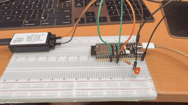
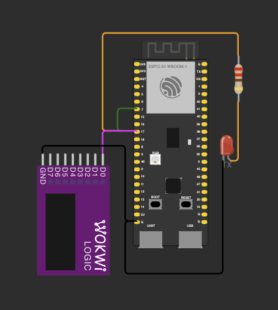
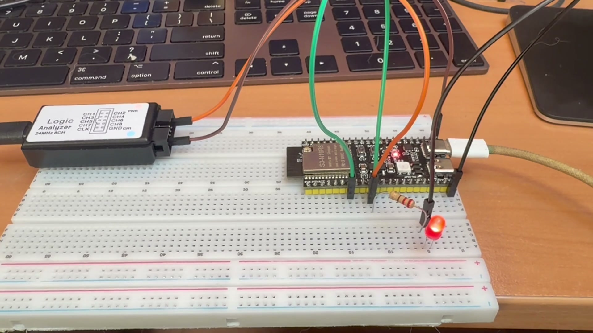
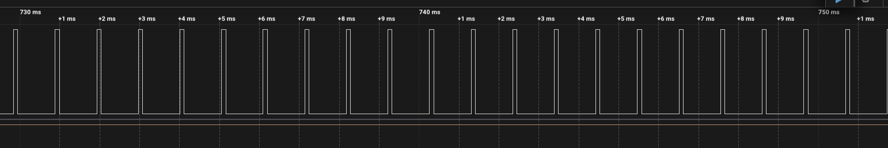
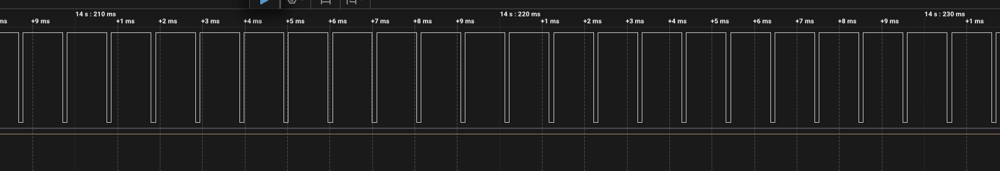
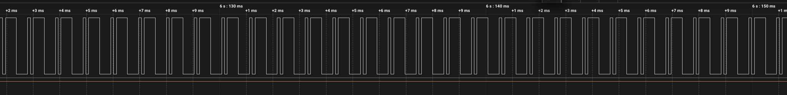
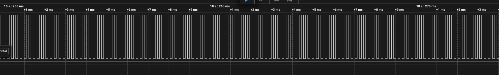

# ДЗ 2.2 — UART як джерело ШІМ (POWER LOAD)

Експеримент із завдання: якщо безперервно передавати той самий байт, лінія TX стає генератором прямокутних імпульсів, а сам байт задає шпаруватість. **ESP32-S3-DevKitC-1** жене потік у Serial1, перемичка з TX на сусідній пін дозволяє прошивці зміряти реальне заповнення, а логічний аналізатор показує форму.

## Демо

<a href="video.mp4"></a>

▶️ [Відео в повній якості (MP4)](video.mp4)

Ніхто нічого не крутить: прошивка перебирає байти сама, по 4 секунди на кожен. Яскравість іде по колу — тьмяно на `0x00`, однаково середньо на `0x0F` і `0x55`, яскраво на `0xFF`. Те, що два середні кроки виглядають однаково, і є суть експерименту: заповнення в них справді однакове, а форма сигналу різна.

## Схема та фото

| Схема (Wokwi) | Зібрана плата |
|---|---|
|  |  |

Фото — кадр із того ж відео, знятий на `0xFF`, тобто в найяскравішій фазі.

### Підключення

| Вузол | Пін ESP32-S3 | Примітка |
|---|---|---|
| Світлодіод через резистор 220 Ом | GPIO 17 | Serial1 TX, катод → GND |
| Перемичка з GPIO 17 | GPIO 7 | вхід для виміру заповнення |
| CH1 логічного аналізатора | GPIO 17 | GND аналізатора → GND плати |

Світлодіод має бути червоний, жовтий або зелений — у них пряме падіння близько 2 В, і через 220 Ом від піна потече ~6 мА. Білий і синій тут не годяться: їм треба понад 3 В, а пін дає 3.3, тож світились би ледве помітно. А яскравість тут — це і є та величина, яку ми спостерігаємо.

Живлення нікуди не підключається: пін живить світлодіод сам. Щоб цим сигналом крутити двигун, його треба завести на базу ключа зі схеми [motor_pwm](../motor_pwm/) замість GPIO 2 — форма сигналу від цього не міняється.

## Звідки береться шпаруватість

Кадр 8N1 — це рівно 10 біт: старт (завжди низький), вісім біт даних молодшим уперед і стоп (завжди високий). Тобто в кожному кадрі один біт гарантовано нуль, один гарантовано одиниця, а решту вісім задаю я.

| Байт | Кадр на лінії | Високих біт | Заповнення |
|---|---|---|---|
| `0x00` | `0 00000000 1` | 1 з 10 | 10 % |
| `0x0F` | `0 11110000 1` | 5 з 10 | 50 % |
| `0x55` | `0 10101010 1` | 5 з 10 | 50 % |
| `0xFF` | `0 11111111 1` | 9 з 10 | 90 % |

Частота — це швидкість порту, поділена на 10: на 9600 бод кадр триває 1.04 мс, тобто ~960 Гц.

Найцікавіша пара — `0x0F` і `0x55`. Заповнення в них однакове, а форма геть різна. `0x0F` дає широкий імпульс на чотири біти й окремий вузький стоп. А в `0x55` біти чергуються, і разом зі стартовим бітом наступного кадру виходить нескінченне `0101…` — тобто чистий меандр на **половині** бітової швидкості, 4800 Гц при 9600 бод. Двигун на такому сигналі поводиться так само, як на `0x0F` (середня напруга та сама), а от свистить інакше. Це і є різниця між «яка шпаруватість» і «яка частота».

## Потік має бути безперервним

Уся арифметика вище справджується тільки якщо кадри йдуть щільно, без пауз. Щойно буфер передачі спорожніє, лінія стає в idle — а idle в UART це високий рівень, і заповнення підскакує до 100 %.

Тому Serial1 піднімається з великим кільцевим буфером, а `loop()` доливає в нього, поки є місце:

```cpp
static void topUpStream() {
  if (!streaming) return;
  while (Serial1.availableForWrite() >= Config::CHUNK) {
    Serial1.write(chunk, Config::CHUNK);
  }
}
```

Далі байти в лінію віддає драйвер UART у перериванні, і `loop()` може спокійно займатися чимось іншим. `setTxBufferSize()` викликається до `begin()` — після підняття драйвера він уже нічого не змінить.

## Вимір заповнення без переривань

Прошивка звіряє теорію з реальністю сама, по перемичці TX → GPIO 7. Спокуса поставити переривання на цей пін і рахувати тривалості велика, але на 115200 бод фронт приходить кожні 8.7 мкс — сто тисяч ISR на секунду з'їли б процесор цілком.

Тому вимір статистичний: у вікні 50 мс просто рахую, скільки разів пін прочитався високим.

```cpp
while (micros() - startUs < Config::MEASURE_WINDOW_US) {
  if (digitalRead(Config::SENSE_PIN) == HIGH) ++high;
  ++total;
}
```

Вибірка не синхронізована з бітами, і саме тому працює: за 50 мс набирається десятки тисяч відліків, розкиданих по кадрах випадково, і їхнє середнє сходиться до справжнього заповнення. Половина мілісекунди коду замість лічильника фронтів.

Оскільки цей цикл блокує `loop()` на 50 мс, буфер передачі доливається безпосередньо перед ним — інакше потік би висох рівно під час виміру і зіпсував би результат.

## Автоперебір замість клавіш

Спершу байт вибирався тільки з клавіатури. Виявилось, що монітор, запущений як задача IDE, показує вивід, але натискання в порт не передає — прошивка просто не бачила клавіш. Тому вона перебирає всі чотири байти сама, по 4 секунди на кожен, а перше ж натискання вимикає автоперебір і віддає керування рукам. Заодно для аналізатора це зручніше: одне захоплення на 16 секунд ловить усі чотири патерни підряд.

## Вивід

Serial Monitor, 115200 бод. Повний лог — у [`analysis/serial.log`](analysis/serial.log).

```
 байт | бод    | кадр us | теорія % | виміряно % | вільно в буфері
------+--------+---------+----------+------------+----------------
 0x0F |   9600 |    1041 |      50% |        10% |            1974
 0x0F |   9600 |    1041 |      50% |        50% |            1922
 0x0F |   9600 |    1041 |      50% |        50% |            1960
 0x55 |   9600 |    1041 |      50% |        50% |            1998
 0x55 |   9600 |    1041 |      50% |        50% |            2026
 0xFF |   9600 |    1041 |      90% |        50% |            1974
 0xFF |   9600 |    1041 |      90% |        90% |            1922
 0xFF |   9600 |    1041 |      90% |        90% |            1960
 0x00 |   9600 |    1041 |      10% |        90% |            1998
 0x00 |   9600 |    1041 |      10% |        49% |            2026
 0x00 |   9600 |    1041 |      10% |        10% |            1936
 0x00 |   9600 |    1041 |      10% |        10% |            1974
```

**Теорія зійшлася точно.** Усі чотири байти дають рівно те заповнення, яке рахується з кадру: `0x00` — 10 %, `0x0F` і `0x55` — по 50 %, `0xFF` — 90 %. Жодного відхилення, бо це не аналогова величина, а просто частка одиниць у десяти бітах.

**Буфер передачі — це труба з затримкою.** Перші один-два рядки після кожного перемикання показують **старе** заповнення. `fillChunk()` міняє те, що піде в порт далі, але в буфері вже лежить до 2048 байт попереднього патерна, а на 9600 бод це 2.1 секунди мовлення. Видно навіть проміжний рядок із 49 % — вимір застав момент, коли в 50-мілісекундне вікно потрапили і хвіст `0xFF`, і початок `0x00`.

Затримка рахується просто: розмір буфера поділити на швидкість. Клавіша `+` піднімає порт до 115200, і перемикання стає майже миттєвим — ті самі 2048 байт проїжджають за 178 мс.

**Буфер при цьому майже порожній** — у колонці стабільно 1920…2030 вільних байт із 2048. Це не ознака голодування: якби потік рвався, лінія йшла б у idle, а idle в UART високий, і заповнення для `0x00` показало б значно більше за 10 %. Насправді драйвер перекладає байти з буфера в апаратний FIFO, щойно там звільняється місце, тому в кільці лежить сотня байт, а не тисячі. Запасу все одно вистачає, щоб пережити 50-мілісекундне вікно виміру.

## Що показав аналізатор

Захоплення на GPIO 17, 9600 бод. Прошивка сама перебирає байти кожні 4 секунди, тому всі чотири зняті з одного запису і **в одному масштабі** — 20 мс на екран, приблизно двадцять кадрів. Порівнювати можна безпосередньо.

**`0x00` — 10 %.** Один вузький пік на кадр, це стоповий біт. Решта дев'ять бітів низькі.



**`0xFF` — 90 %.** Дзеркальна картинка: лінія майже весь час висока, вниз провалюється тільки стартовий біт.



**`0x0F` — 50 %.** Чотири одиниці підряд дають широкий імпульс, потім чотири нулі — широку паузу, а стоповий біт іде окремим вузьким піком.



**`0x55` — теж 50 %.** Біти чергуються, і разом зі стартовим бітом наступного кадру виходить нескінченне `0101…` — рівна гребінка без жодної широкої ділянки.



**Ось заради чого все це.** У `0x0F` і `0x55` заповнення однакове — 50 %, і світлодіод на них горить абсолютно однаково. Прошивка теж міряє в обох випадках 50 %. А сигнал на лінії геть різний: у `0x0F` найширший імпульс триває 416 мкс, у `0x55` жоден не перевищує 104 мкс, тобто перемикань удвічі більше.

Двигуну ця різниця байдужа — він реагує на середню напругу. А от котушці, трансформатору чи будь-чому, де мають значення втрати на перемиканні, — ні. Заповнення і частота це дві незалежні характеристики, і з логу цього не побачиш, а з картинок видно одразу.

Окремо зміряв тривалість кадру: **1.042 мс** проти розрахункових 1.0417. Десять біт на 9600 бод — сходиться до третього знака, тобто кадр справді десятибітний, а не вісім і не дев'ять.

## Запуск

### На залізі (PlatformIO)

1. У [`platformio.ini`](../../platformio.ini):
   ```ini
   build_src_filter = +<../dz2.2 (POWER LOAD)/uart_pwm/main.cpp>
   ```
2. `pio run -t upload && pio device monitor`

Керування з монітора: `1`…`4` — байт, `+`/`-` — швидкість порту, `s` — пауза потоку, `?` — підказка.

Пауза корисна для перевірки: зупинив потік — лінія йде в idle, світлодіод горить рівно, виміряне заповнення 100 %. Це наочно показує, звідки береться помилка, якщо буфер не встигає наповнюватись.

### У симуляторі (Wokwi for VS Code)

1. `pio run`
2. `Wokwi: Select Config File` → [`wokwi.toml`](wokwi.toml)
3. Відкрий [`diagram.json`](diagram.json) і запусти `Wokwi: Start Simulator`

У схемі стоїть `wokwi-logic-analyzer` на GPIO 17 — він пише VCD, який видно в Logic 2 чи PulseView, тож форму кадрів можна подивитись ще до того, як чіпати плату.

## Файли

| Файл | Опис |
|---|---|
| [`main.cpp`](main.cpp) | прошивка |
| [`diagram.json`](diagram.json) | схема для Wokwi |
| [`wokwi.toml`](wokwi.toml) | конфіг симулятора |
| [`analysis/serial.log`](analysis/serial.log) | лог із плати |
| [`analysis/uart-*.png`](analysis/) | форма сигналу для кожного байта |
| [`schema.png`](schema.png) | скриншот схеми |
| [`photo.jpeg`](photo.jpeg) | фото зібраної схеми |
| [`demo.gif`](demo.gif), [`video.mp4`](video.mp4) | відео роботи |

Інші варіанти цього ДЗ: [**relay_timing**](../relay_timing/) — вимір часу спрацювання реле, [**motor_pwm**](../motor_pwm/) — програмний ШІМ із потенціометра.
