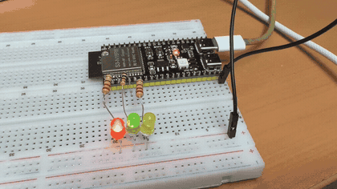
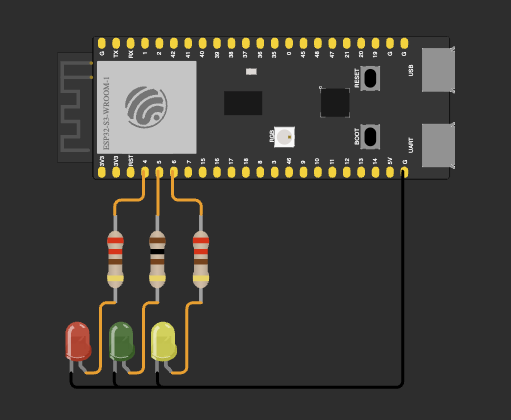
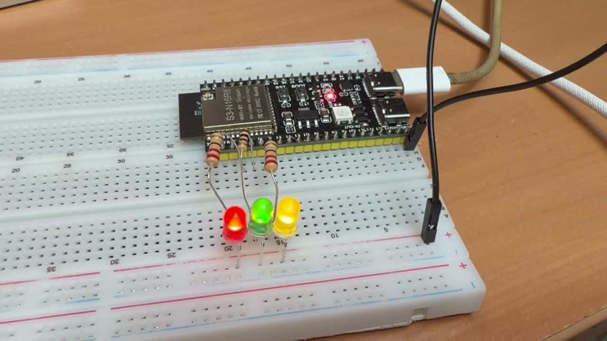

# ДЗ 2.3 — Три незалежні задачі в одному superloop (SUPERLOOP)

Три світлодіоди блимають одночасно і незалежно один від одного на **ESP32-S3-DevKitC-1**. Жодного `delay()` і жодного `while()` для очікування часу: кожен світлодіод сам тримає свій таймер на `millis()`, а `loop()` лише питає всіх трьох, чи вже час перемикатися.

| LED | Пін | Інтервал перемикання | Повний цикл |
|---|---|---|---|
| 🔴 Червоний | GPIO 4 | 200 мс | 400 мс |
| 🟢 Зелений | GPIO 5 | 500 мс | 1000 мс |
| 🟡 Жовтий | GPIO 6 | 1000 мс | 2000 мс |

## Демо

<a href="video.mp4"></a>

▶️ [Відео в повній якості (MP4)](video.mp4)

## Схема та фото

| Схема (Wokwi) | Зібрана плата |
|---|---|
|  |  |

Фото — кадр із того ж відео.

### Підключення

| Компонент | Пін ESP32-S3 | Примітка |
|---|---|---|
| Червоний LED | GPIO 4 | через резистор 220 Ω, катод → GND |
| Зелений LED | GPIO 5 | через резистор 220 Ω, катод → GND |
| Жовтий LED | GPIO 6 | через резистор 220 Ω, катод → GND |

Усі три резистори в анодах, катоди на спільну землю плати.

## Як працює код

Файл: [`main.cpp`](main.cpp)

Уся конфігурація — три піни, три інтервали і швидкість порту — лежить у `Config` зі `static constexpr`, нижче по файлу голих чисел немає.

Задача одного світлодіода — це клас `LED`, і кожен його об'єкт носить власний таймер:

```cpp
class LED {
public:
  uint8_t pin_;
  uint16_t interval_;
  uint32_t lastToggleTime_;

  void update() {
    uint32_t currentTime = millis();
    if (currentTime - lastToggleTime_ >= interval_) {
      lastToggleTime_ = currentTime;
      digitalWrite(pin_, !digitalRead(pin_));
    }
  }
};
```

`update()` нічого не чекає: якщо час ще не вийшов, функція просто закінчується. Тому `loop()` виглядає так, як і має виглядати superloop із трьох незалежних задач:

```cpp
void loop() {
  redLED.update();
  greenLED.update();
  yellowLED.update();
}
```

Жодна з трьох задач не знає про інші й не залежить від них. Додати четверту — це ще один об'єкт і ще один рядок у `loop()`, таймінг решти не зачепить.

Три деталі, які тут важливі:

- **Таймер у кожного свій.** `lastToggleTime_` — поле об'єкта, а не одна глобальна змінна на всіх. Саме тому 200, 500 і 1000 мс рахуються паралельно, а не по черзі.
- **Віднімання беззнакових.** `currentTime - lastToggleTime_` працює і після переповнення `millis()` через 49.7 доби. Запис виду `currentTime >= lastToggleTime_ + interval_` у цей момент зламався б.
- **`digitalRead()` на піні, налаштованому як вихід.** В Arduino-ESP32 `OUTPUT` — це `0x03`, тобто `INPUT | OUTPUT`: вхідний буфер лишається увімкненим, і читається реальний рівень на піні. На іншій платі я б для надійності тримав стан у полі об'єкта, а не перепитував пін.

Serial тут тільки відкривається — прошивка в нього нічого не пише, вся картина видна на самій платі.

## Чому не delay()

`delay(200)` зупиняє процесор цілком. Поки він стоїть, другий і третій світлодіоди не перемикаються, бо їх код просто не виконується. Три `delay()` підряд — це не три паралельні задачі, а одна послідовність з періодом у суму всіх затримок. Те саме з `while (millis() - t < 200) {}`: формально без `delay()`, але цикл так само нікуди не віддає керування.

Тут же плата весь час вільна: найдовша ітерація — це три порівняння і щонайбільше три записи в пін.

## Скільки це коштує

```
$ xtensa-esp32s3-elf-nm -C -S ".pio/build/esp32-s3-devkitc-1/dz2.3 (SUPERLOOP)/three_leds/main.cpp.o"
                              # зовнішні символи (U) прибрав
00000000 00000037 t _GLOBAL__sub_I__Z5setupv
00000000 00000020 T loop()
00000000 00000041 T setup()
00000000 00000008 b redLED
00000000 00000008 b greenLED
00000000 00000008 b yellowLED
00000000 0000001b t _ZN3LED4initEv$isra$0
00000000 00000032 W LED::update()
```

Один об'єкт — **8 байт**: пін, інтервал, мітка часу і один байт вирівнювання. Увесь стан прошивки — 24 байти, статично, без купи. `loop()` — 32 байти коду на три виклики.

Малий `b` біля об'єктів означає `.bss`, а поруч стоїть `_GLOBAL__sub_I` на 55 байт: конструктор `LED` не `constexpr`, тому три об'єкти збираються не компілятором, а на старті плати. У [ДЗ 2.1](../../dz2.1%20%28EMBEDDED%20C%2B%2B%29/blink/) з `constexpr`-конструктором цього символу не було взагалі, а об'єкт лежав у `.data` вже готовим.

Прошивка цілком: **18 904 байти RAM** (5.8%) і **276 045 байт flash** (8.3%) — майже все це Arduino-core.

## Запуск

### На залізі (PlatformIO)

1. У [`platformio.ini`](../../platformio.ini) вкажи цей файл як джерело:
   ```ini
   build_src_filter = +<../dz2.3 (SUPERLOOP)/three_leds/main.cpp>
   ```
2. `pio run -t upload`

### У симуляторі (Wokwi for VS Code)

1. `pio run`
2. `Wokwi: Select Config File` → [`wokwi.toml`](wokwi.toml)
3. Відкрий [`diagram.json`](diagram.json) і запусти `Wokwi: Start Simulator`

## Файли

| Файл | Опис |
|---|---|
| [`main.cpp`](main.cpp) | прошивка |
| [`diagram.json`](diagram.json) | схема для Wokwi |
| [`wokwi.toml`](wokwi.toml) | конфіг симулятора |
| [`schema.png`](schema.png) | скриншот схеми |
| [`photo.jpeg`](photo.jpeg) | фото зібраної схеми |
| [`demo.gif`](demo.gif), [`video.mp4`](video.mp4) | відео роботи |
