# ДЗ 2.4 — Усунення брязкоту контактів кнопки (BUTTON DEBOUNCE)

Одна тактова кнопка на **ESP32-S3-DevKitC-1** і чотири способи порахувати її натискання: без фільтра взагалі, фільтр по часу, фільтр по рівню і варіант зовсім без переривань. Кожен зібраний двічі — на голих контактах і на кнопці з RC-фільтром, — тож прошивок вісім, парами.

Уся робота на цій сторінці: нижче по кожному з шести завдань є що треба було зробити, що вийшло і лог із плати. Посилання ведуть у папку відповідної прошивки, якщо треба подивитися код.

| Завдання | Що це | Прошивка |
|---|---|---|
| 1 | базова реалізація без debounce | [`raw_interrupt`](raw_interrupt/) |
| 2 | software debounce через таймер (time-based) | [`time_debounce`](time_debounce/) |
| 3 | debounce через перевірку рівня (state-based) | [`state_debounce`](state_debounce/) |
| 4 | polling + debounce без переривань | [`polling_debounce`](polling_debounce/) |
| 5 | hardware debounce, RC-фільтр | [`raw_interrupt_rc`](raw_interrupt_rc/), [`time_debounce_rc`](time_debounce_rc/), [`state_debounce_rc`](state_debounce_rc/), [`polling_debounce_rc`](polling_debounce_rc/) |
| 6 | порівняльна таблиця | [нижче](#завдання-6--порівняльна-таблиця) |

У парі прошивок код однаковий до рядка, крім `BUTTON_MODE` у `Config`: з апаратним фільтром підтяжку робить зовнішній резистор, і внутрішню доводиться вимикати. Решта різниці — тільки в схемі й на платі.

## Схема

| Компонент | Пін ESP32-S3 | Примітка |
|---|---|---|
| Тактова кнопка | GPIO 16 | другий контакт → GND |
| LED (реакція) | GPIO 4 | через резистор 220 Ω, катод → GND |

Логічний аналізатор підключений по-різному в двох половинах ДЗ — у завданні 5 з'являється третій канал, щоб бачити лінію до фільтра і після нього одночасно.

| Канал | Завдання 1-4 | Завдання 5 |
|---|---|---|
| D0 | лінія кнопки (GPIO 16) | вузол між 100 Ω і кнопкою, **до** фільтра |
| D1 | світлодіод (GPIO 4) | GPIO 16, **після** фільтра |
| D2 | — | світлодіод (GPIO 4) |

Схема в двох конфігураціях — у завданнях 1-4 підтяжка внутрішня, у завданні 5 її замінює зовнішній резистор разом із RC-ланкою:

| | Схема (Wokwi) | Зібрана плата |
|---|---|---|
| **Завдання 1-4** | 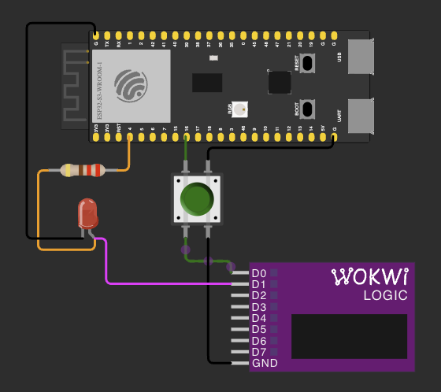 | 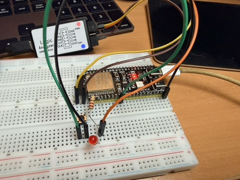 |
| **Завдання 5** | 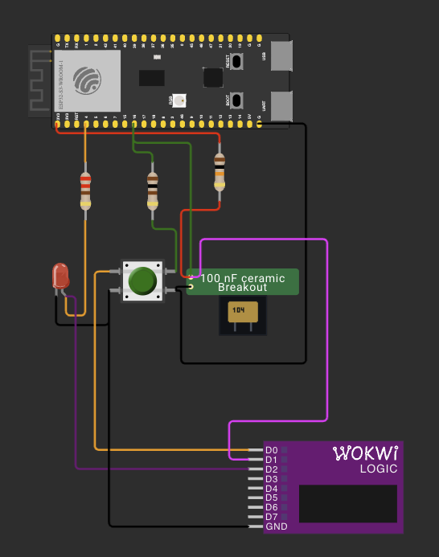 | 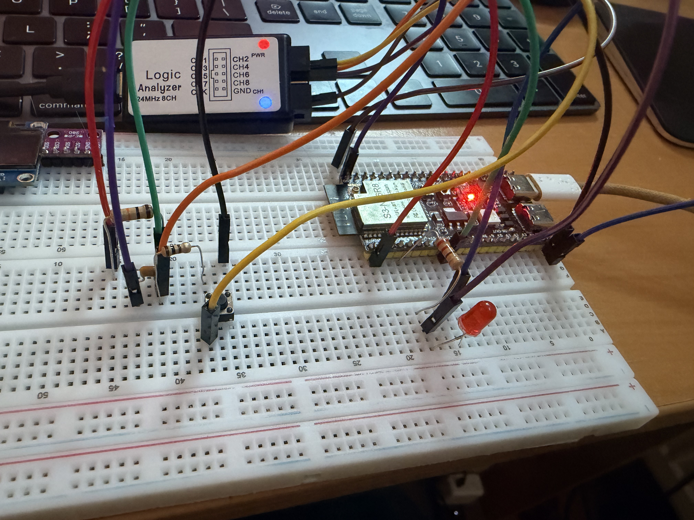 |

Номінали й розрахунок RC-ланки — у [завданні 5](#завдання-5--hardware-debounce-rc-фільтр).

GPIO 16 — та сама кнопка, що в [ДЗ 1.5](../dz1.5%20%28BUTTON%20BOUNCE%29/), тому заміри порівнювані. Світлодіод не прикраса: по ньому видно критерій «рівно одна реакція на одне натискання», не вчитуючись у лог.

## Як міряв

Для кожної з восьми прошивок одна й та сама серія: 20 натискань — повільних, швидких, сильних і ледь-ледь. Хибне спрацювання — це будь-яка подія понад 20.

Затримку міряв логічним аналізатором: від першого фронту на лінії кнопки до перемикання світлодіода (D0 → D1, у завданні 5 — D0 → D2). Запис у Logic 2 на 24 MS/s, як у ДЗ 1.5; CSV експортував, VCD у репозиторій не клав.

Що вже відомо про цю кнопку з [ДЗ 1.5](../dz1.5%20%28BUTTON%20BOUNCE%29/): брязкіт майже весь на відпусканні, в середньому 0.5 мс, найдовший 2.6 мс, до 13 імпульсів. На натисканні він майже не трапляється.

## Завдання 1 — без debounce

Переривання на `FALLING`, лічильник інкрементується в ISR, `loop()` друкує кожну нову подію. Фільтра немає свідомо: це еталон, з яким порівнюється решта.

ISR робить рівно одну дію — `counter++`. Друк і `digitalWrite` винесені в `loop()`, бо `Serial.print()` всередині обробника — це десятки мілісекунд, за які загубляться наступні переривання.

| Натискань | Подій у лозі | Хибних | Медіанна затримка |
|---:|---:|---:|---:|
| 20 | 23 | **3** | 2.8 мкс |

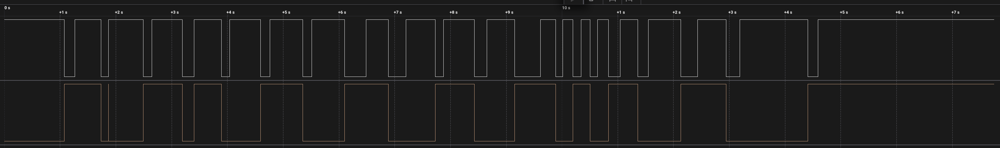

Весь брязкіт — на відпусканні: 2 відпускання з 20, найдовше 0.504 мс. На натисканні жодного зайвого фронту, ні оком, ні в CSV. Це збігається з тим, що я міряв у ДЗ 1.5 на цій же кнопці.

Окремо цікаве: МК нарахував 23 переривання, а аналізатор записав 22 спадних фронти, причому розбіжності різноспрямовані — двічі МК побачив спад там, де в захопленні тільки наростання, і один раз проігнорував блип завдовжки 291 нс. Схоже на різні пороги логічної одиниці в аналізатора і на вході ESP32 при повільному фронті від слабкої внутрішньої підтяжки ~45 кΩ. Розбір — у [README прошивки](raw_interrupt/#чому-мк-нарахував-більше-ніж-бачив-аналізатор).

```
Button interrupt count: 1
...
Button interrupt count: 23
```

Код, скриншоти, [`serial.log`](raw_interrupt/serial.log) і [`digital.csv`](raw_interrupt/digital.csv): [`raw_interrupt`](raw_interrupt/).

## Завдання 2 — software debounce по часу

Подія приймається, лише якщо від попередньої прийнятої минуло ≥ 50 мс. Умова вимагає тримати фільтр поза ISR, тому обробник лише запам'ятовує час фронту і піднімає прапорець, а рішення ухвалює `loop()`. Час беру `micros()` першим рядком ISR — це момент самого фронту, а не момент, коли до нього дійшов `loop()`.

| Натискань | Переривань | Прийнято | Відкинуто | Хибних | Медіанна затримка |
|---:|---:|---:|---:|---:|---:|
| 20 | 27 | 26 | 1 | **6** | 3.8 мкс |

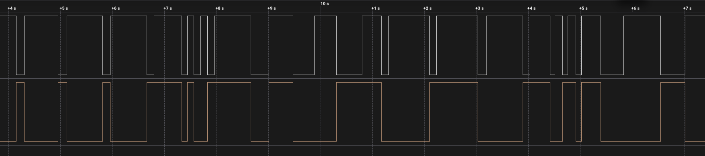

Фільтр відпрацював бездоганно і майже нічого не дав. За весь запис знайшлася рівно одна пара спадних фронтів, ближчих за 50 мс — через 0.268 мс, — і саме її він відкинув. Більше ловити не було чого.

Решта зайвих подій прийшла на відпусканні, через 108-470 мс після прийнятого натискання. Кнопку я тримав у середньому 142 мс, тож відпускання завжди настає вже після того, як вікно блокування закінчилось, і для фільтра виглядає законним новим натисканням.

Щоб вікно накрило відпускання, воно мало б бути довшим за час утримання — понад 490 мс у цій серії. Тоді кнопка перестала б реагувати на два свідомі натискання підряд. Це межа самого методу: фільтр міряє лише паузу між подіями і не знає, натиснута кнопка зараз чи відпущена.

| Що фільтр відкинув | Що пропустив |
|---|---|
| 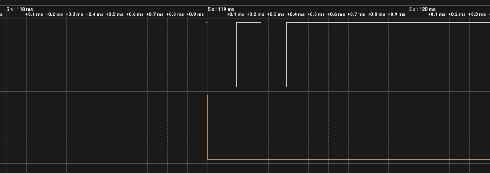 | 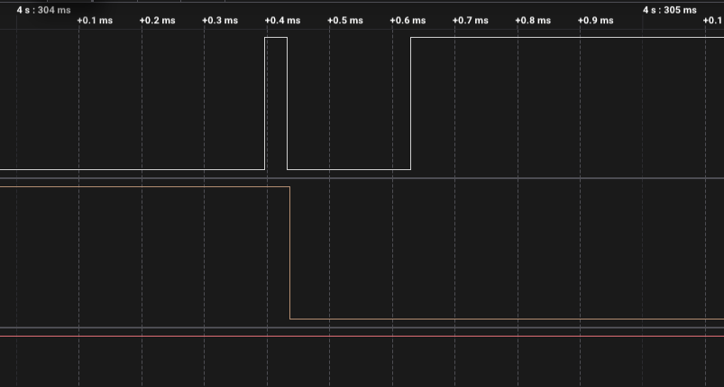 |
| два спади за 0.268 мс, одна реакція | відпускання через 159 мс, зарахована як нове натискання |

```
Accepted button events: 4, total interrupts: 4
Rejected button event at: 9828720 us
Accepted button events: 5, total interrupts: 6
...
Accepted button events: 26, total interrupts: 27
```

Код, скриншоти, [`serial.log`](time_debounce/serial.log) і [`digital.csv`](time_debounce/digital.csv): [`time_debounce`](time_debounce/).

## Завдання 3 — debounce по рівню

Переривання на `CHANGE` не вирішує нічого — лише каже «на лінії щось сталося». `loop()` витримує 10 мс, читає реальний рівень піна і зараховує натискання, тільки якщо кнопка досі притиснута до GND. Другий прапорець — сам стан кнопки: без нього серія фронтів усередині одного натискання дала б кілька подій, бо рівень весь цей час лишається низьким.

| Натискань | Реакцій | Хибних | На відпускання | Медіанна затримка |
|---:|---:|---:|---:|---:|
| 28 | 28 | **0** | **0** | 9.98 мс |

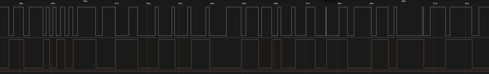

Рівно одна реакція на натискання і жодної на відпускання — перший метод, який виконує умову повністю. З 33 спадних фронтів прошивка зарахувала 28; п'ять зайвих були брязкотом відпускання, і жоден не дійшов до світлодіода.

| Брязкіт, який метод проігнорував | Межа методу |
|---|---|
| 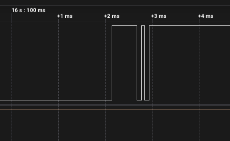 | 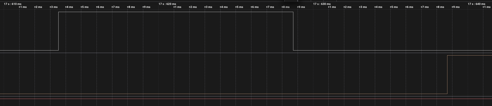 |
| чотири фронти за 0.797 мс, нуль реакцій | повторний контакт через 15 мс зарахований як нове натискання |

Фільтр не рахує брязкіт не тому, що той короткий, а тому, що через 10 мс пін читається як HIGH — кнопка відпущена, значить події немає. Саме цієї інформації не мав time-based.

Зворотний бік — затримка 9.98 мс, тобто рівно `delay(10)`, і поріг: усе, що тримається довше за цей час, зараховується як справжнє натискання. Так сталося о 17.6135 с, коли контакт замкнувся знову через 15 мс і протримався 401 мс. Це вже палець, а не брязкіт, тож реакція правильна — але відрізнити одне від одного метод не вміє.

Код, скриншоти, [`serial.log`](state_debounce/serial.log) і [`digital.csv`](state_debounce/digital.csv): [`state_debounce`](state_debounce/).

## Завдання 4 — polling без переривань

`attachInterrupt()` тут немає зовсім. `loop()` опитує пін раз на 5 мс, а фільтр — машина станів із чотирьох станів: рівень стає справжнім тільки після чотирьох однакових вимірів поспіль. Такт відмірюється на `millis()`, без `delay()`.

| Натискань | Реакцій | Хибних | На відпускання | Затримка |
|---:|---:|---:|---:|---:|
| 20 | 20 | **0** | **0** | 15.08 – 19.82 мс |

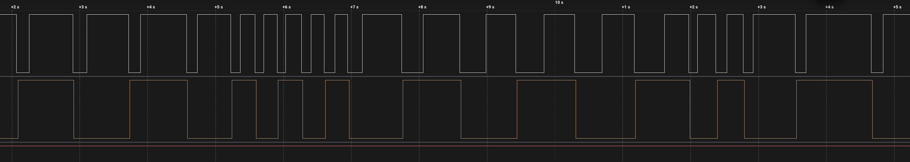

Принципова відмінність від трьох попередніх методів: тут брязкоту просто **не існує**. У завданнях 1-3 переривання бачило кожен фронт, і весь фільтр будувався на тому, щоб зайві потім відкинути. Polling між двома вимірами має 5 мс, а єдина голка цієї серії жила 1.6 мкс — вона не потрапила в жоден вимір.

Ціна — затримка, і вона плаває на цілий такт:

| Найкоротша реакція | Найдовша реакція |
|---|---|
| 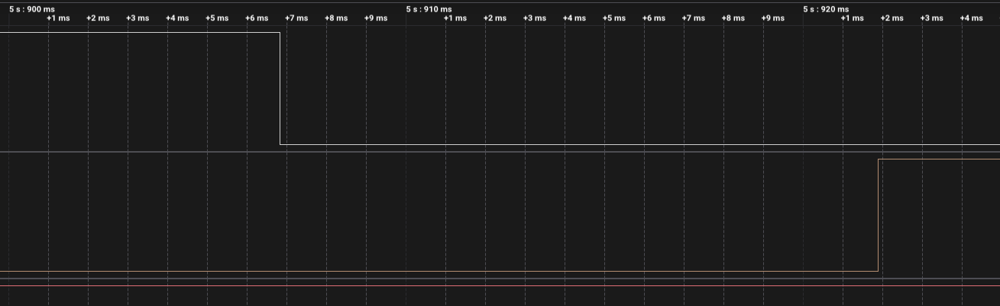 | 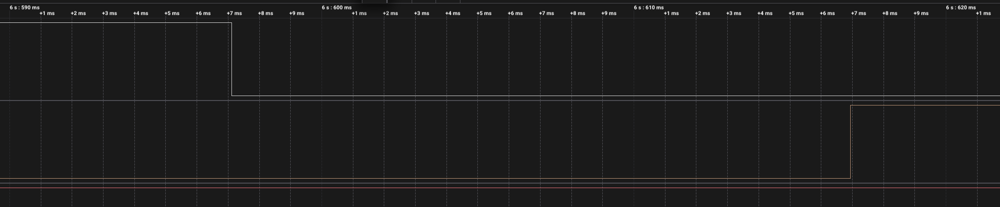 |
| 15.08 мс | 19.82 мс |

Код той самий, кнопка та сама, різниця 4.74 мс — рівно `POLL_INTERVAL_MS`. Натискання падає у випадкову точку між опитуваннями: пощастило — чекаєш три такти, не пощастило — майже чотири. У [завданні 3](#завдання-3--debounce-по-рівню) затримка трималася в межах 9.52–10.48 мс, бо реакція йшла на сам фронт, а не на сітку вимірів.

Код, скриншоти, [`serial.log`](polling_debounce/serial.log) і [`digital.csv`](polling_debounce/digital.csv): [`polling_debounce`](polling_debounce/).

## Завдання 5 — hardware debounce, RC-фільтр

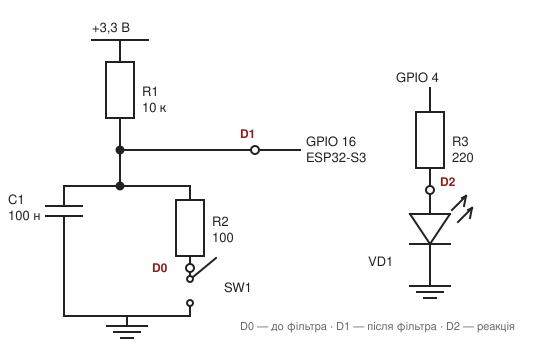

| Деталь | Номінал | Навіщо |
|---|---|---|
| Підтяжка | 10 кΩ на 3.3 V | тримає лінію в HIGH, коли кнопка відпущена |
| Конденсатор | 100 нФ на GND | згладжує фронт, бо не може змінити напругу миттєво |
| Послідовний резистор | 100 Ω | обмежує струм розряду конденсатора через контакти (3.3 В / 100 Ω ≈ 33 мА замість короткого замикання) |

Внутрішню підтяжку вимикаю (`BUTTON_MODE = INPUT`): паралельні ~45 кΩ зменшили б сталу часу приблизно до 0.8 мс.

Фільтр виходить несиметричним, і це головне, що тут цікаво:

- **відпускання, фронт угору**: конденсатор заряджається через 10 кΩ, τ ≈ 1 мс, до порога логічної одиниці лінія йде приблизно стільки ж;
- **натискання, фронт униз**: конденсатор розряджається через 100 Ω, τ = 10 мкс, фронт майже такий самий різкий, як без фільтра.

Я очікував, що RC добре вб'є брязкіт натискання, а на відпусканні голки пройдуть. Заміри показали інше, і значно цікавіше.

### Фільтр зробив сигнал ідеальним

На сирій лінії брязкіт нікуди не подівся — контакт як брязкотів, так і брязкотить. А після конденсатора від нього не лишається нічого:

| | Фронтів на сирій лінії | Після фільтра |
|---|---:|---:|
| `raw_interrupt_rc` | 38 | 38 |
| `time_debounce_rc` | 38 | 38 |
| `state_debounce_rc` | 42 | **40** |
| `polling_debounce_rc` | 50 | **40** |

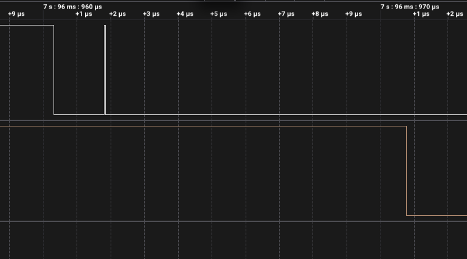

Найкоротша голка, яку вдалося зловити, — **41 нс**, тобто один семпл аналізатора на 24 MS/s. Конденсатор за такий час не встигає перезарядитися, бо τ розряду 10 мкс, і до піна вона не доходить.

### І при цьому зробив систему непридатною

| | Без RC | З RC |
|---|---:|---:|
| Зайвих фронтів на вході МК | 2 | **0** |
| Переривань на 20 натискань | 23 | **296** |

Сигнал чистий, а лічильник переривань зріс у тринадцять разів. Усі зайві — на відпусканні, по ~15 на кожне.

Причина в тій самій несиметричності. Натискання — розряд через 100 Ω, виміряні **9.46 мкс** проти розрахункових 10. Відпускання — заряд через 10 кΩ, тобто **у сто разів повільніше**. Поки напруга повзе через зону перемикання входу, вона живе там сотні мікросекунд, і найменший шум перекидає внутрішній рівень десятки разів.

Аналізатор цього не показує: у нього власний поріг із гістерезисом. А в ESP32 гістерезису немає — [тригерів Шмітта на входах GPIO в ESP немає](https://esp32.com/viewtopic.php?p=138699). Саме тому RC-ланку в нормальних схемах заводять не прямо на пін, а через буфер 74HC14.

Формулювання, яке варто запам'ятати: **фільтрувати брязкіт і формувати крутий фронт — різні задачі, і RC-ланка вміє тільки першу.**

### Що з цим зробили чотири методи

Та сама серія, кожна прошивка окремо:

| Метод | Хибних без RC | Хибних з RC | Затримка без RC | Затримка з RC |
|---|---:|---:|---:|---:|
| Без debounce | 3 | **277** | 2.8 мкс | 10 мкс |
| Time-based | 6 | **19** | 3.8 мкс | 10.4 мкс |
| State-based | 0 | **0** | 10 мс | 10 мс |
| Polling | 0 | **0** | 15–20 мс | 16–20 мс |

Розкол проходить рівно по тому, **на що метод дивиться**.

Хто рахує фронти, той зламався. `raw_interrupt` зловив усі 296. `time_debounce` відкинув 124 з 162 — вікно в 50 мс ріже пачку бездоганно, — але сліпий до її **першого** фронту, а той приходить через 100+ мс після натискання і виглядає законною подією. Було шість хибних спрацювань із дев'ятнадцяти відпускань, стало дев'ятнадцять з дев'ятнадцяти.

Хто дивиться на рівень, той навіть не помітив. `state_debounce` через 10 мс читає пін і бачить HIGH. `polling` між вимірами має 5 мс, тож пачки завдовжки 175 мкс для нього не існує. Нуль хибних спрацювань до фільтра, нуль після.

### Де фільтри склалися шарами

Один випадок у [`polling_debounce_rc`](polling_debounce_rc/) показує це найкраще. Відпускання о 6.7723 с закінчилося тим, що контакт замкнувся знову і протримався 1.8 мс. Конденсатор його чесно пропустив — проти 10 мкс сталої часу це вічність. А машина станів відкинула, бо їй потрібні 20 мс стабільного рівня.

Наносекундні голки зрізало залізо, мілісекундний дребезг — програма. Поодинці жоден із них цього б не зробив.

Деталі кожного заміру: [`raw_interrupt_rc`](raw_interrupt_rc/), [`time_debounce_rc`](time_debounce_rc/), [`state_debounce_rc`](state_debounce_rc/), [`polling_debounce_rc`](polling_debounce_rc/).

## Завдання 6 — порівняльна таблиця

| Метод | Кількість хибних спрацювань | Затримка | Складність | Коментар |
|---|---|---|---|---|
| Без debounce | 3 на 20 натискань | 2.8 мкс | найменша: лічильник і один рядок в ISR | непридатна: відпускання дає зайві події |
| Time-based | 6 на 20 натискань | 3.8 мкс | низька: прапорець, мітка часу і одне порівняння | ріже пачку, але сліпий до її першого фронту |
| State-based | 0 на 28 натискань | 10 мс | середня: прапорець, стан кнопки і очікування | дивиться на рівень, тому брязкіт для нього не існує |
| Polling | 0 на 20 натискань | 15–20 мс | найбільша: машина станів із чотирьох станів | найстабільніший, але затримка плаває на цілий такт |
| Hardware RC | 277 на 19 натискань | 10 мкс | паяння трьох деталей, коду нуль | сигнал ідеальний, та без тригера Шмітта МК захлинається |

Та сама таблиця в розрізі «з фільтром і без»:

| Метод | Хибних без RC | Хибних з RC | Затримка без RC | Затримка з RC |
|---|---:|---:|---:|---:|
| Без debounce | 3 | 277 | 2.8 мкс | 10 мкс |
| Time-based | 6 | 19 | 3.8 мкс | 10.4 мкс |
| State-based | 0 | 0 | 10 мс | 10 мс |
| Polling | 0 | 0 | 15–20 мс | 16–20 мс |

Колонку «хибних» не можна читати як просте порівняння методів: брязкіт різниться від серії до серії, і в запису завдання 2 відпускань із голками трапилося більше, ніж у завданні 1. Чесніша міра — скільки зайвих подій узагалі було в межах досяжності методу. Для time-based таких була одна з шести, і він її зловив.

## Висновки

**Брязкіт цієї кнопки живе на відпусканні.** За вісьма серіями на натисканні зайвих фронтів майже не трапляється, а на відпусканні контакт торкається ще раз голками від 41 нс до 0.8 мс. Те саме я бачив у [ДЗ 1.5](../dz1.5%20%28BUTTON%20BOUNCE%29/), тож це властивість конкретної кнопки, а не випадковість.

**Фільтр по часу лікує не ту хворобу.** Вікно в 50 мс ріже все, що приходить **після** прийнятої події, і робить це бездоганно — 124 відкинутих переривання зі 162. Але відпускання настає через 100–490 мс після натискання, тобто завжди поза вікном. Щоб його накрити, вікно мало б перевищувати час утримання кнопки, і тоді два свідомі натискання підряд просто не пройшли б. Це межа методу, а не налаштування.

**Вирішує не довжина фільтра, а те, на що він дивиться.** Обидва методи, які читають рівень піна, дали нуль хибних спрацювань у всіх чотирьох серіях — і з RC, і без. Їм байдуже, скільки фронтів прилетіло: через 10 чи 20 мс вони питають «кнопка зараз натиснута?» і отримують однозначну відповідь. Методи, що рахують фронти, зламалися обидва.

**Апаратний фільтр сам по собі зробив гірше.** Це найнесподіваніший результат усієї роботи: RC-ланка прибрала з лінії весь брязкіт до останньої наносекундної голки — і підняла кількість переривань з 23 до 296. Повільний фронт відпускання тримає вхід ESP32 у зоні перемикання сотні мікросекунд, а тригера Шмітта там немає. Фільтрувати брязкіт і формувати крутий фронт — різні задачі.

**Разом вони працюють краще, ніж окремо.** Конденсатор зрізає те, що коротше за десятки мікросекунд, програмний фільтр — те, що коротше за десятки мілісекунд. У [`polling_debounce_rc`](polling_debounce_rc/) це видно буквально на одній події: наносекундні голки зняло залізо, повторне замикання на 1.8 мс відкинула машина станів.

**Що я поставив би в робочий пристрій.** State-based на перериванні: нуль хибних спрацювань, 10 мс затримки, десяток рядків коду і жодної додаткової деталі. Polling надійніший, але з'їдає такт опитування і дає втричі більшу затримку. RC-фільтр має сенс лише разом із буфером 74HC14 — інакше на ESP32 він створює більше проблем, ніж розв'язує.

## Запуск

Активна прошивка вибирається одним розкоментованим рядком `build_src_filter` у [`platformio.ini`](../platformio.ini) — там лежать усі вісім:

```ini
build_src_filter = +<../dz2.4 (BUTTON DEBOUNCE)/raw_interrupt/main.cpp>
```

Далі:

```sh
./tools/compiledb.sh                  # щоб IDE бачила джерела
pio run -t upload && pio device monitor
```

### У симуляторі (Wokwi for VS Code)

1. `pio run`
2. `Wokwi: Select Config File` → `wokwi.toml` потрібного варіанту
3. відкрити `diagram.json` і запустити `Wokwi: Start Simulator`

Брязкіт кнопки Wokwi симулює сам, тож `raw_interrupt` там теж рахує зайве. Вимкнути це можна атрибутом `"bounce": "0"` у `diagram.json` — зручно, щоб відокремити помилки коду від брязкоту.

Конденсатора в Wokwi немає — у [ДЗ 2.2](../dz2.2%20%28POWER%20LOAD%29/motor_pwm/) мені вже довелося писати власні чипи замість транзистора, діода й конденсатора. Тому 100 нФ тут — кастомний чип [`chips/ceramic-cap.chip.c`](chips/ceramic-cap.chip.c) рівно на два виводи, як у деталі на платі. Обидва резистори звичайні, `wokwi-resistor`, тож схема в симуляторі збігається з платою один в один.

Фільтрувати цей чип не може, і жоден інший не зміг би: Wokwi рахує логічні рівні, а конденсатор на платі — шунт на землю. Щоб вносити затримку фронту, елемент мусив би стояти в розрив лінії й мати вхід та вихід, тобто вже не був би конденсатором. Тому в симуляторі чотири RC-варіанти поводяться так само, як без фільтра, а вся різниця завдання 5 міряється на залізі логічним аналізатором.

Чип спільний для всіх чотирьох RC-варіантів, збирається один раз:

```sh
make -C "dz2.4 (BUTTON DEBOUNCE)/chips"
```

## Файли

```
dz2.4 (BUTTON DEBOUNCE)/
├── raw_interrupt/         завдання 1
├── time_debounce/         завдання 2
├── state_debounce/        завдання 3
├── polling_debounce/      завдання 4
├── raw_interrupt_rc/      завдання 5 до завдання 1
├── time_debounce_rc/      завдання 5 до завдання 2
├── state_debounce_rc/     завдання 5 до завдання 3
├── polling_debounce_rc/   завдання 5 до завдання 4
└── chips/                 кастомний чип RC-фільтра для Wokwi
```

У кожній папці прошивки: `main.cpp`, `README.md`, `diagram.json` і `wokwi.toml`.
