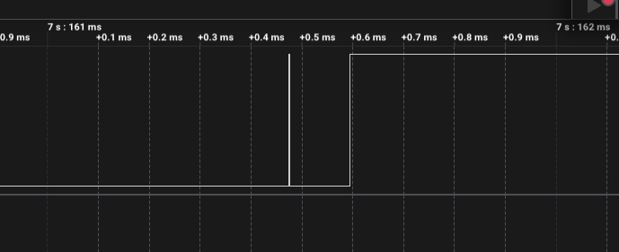

# ДЗ 2.4 — Polling без переривань (BUTTON DEBOUNCE)

Завдання 4. `attachInterrupt()` тут немає зовсім. `loop()` опитує пін раз на 5 мс, а фільтр — машина станів із чотирьох станів: рівень стає справжнім тільки після чотирьох однакових вимірів поспіль. Усе, що коротше, машина відкидає і повертається в попередній стан.

Такт відмірюється на `millis()`, без `delay()`: якщо час ще не вийшов, ітерація просто закінчується і плата лишається вільною.

Схема й плата ті самі, що в [завданні 1](../raw_interrupt/): кнопка на GPIO 16 з `INPUT_PULLUP`, світлодіод на GPIO 4 через 220 Ω.

| Схема (Wokwi) | Зібрана плата |
|---|---|
|  |  |

## Результати

20 натискань, запис аналізатора 24 MS/s на 16.3 с.

| | |
|---|---:|
| Натискань | 20 |
| Реакцій | 20 |
| **Хибних спрацювань** | **0** |
| **Реакцій на відпускання** | **0** |
| Спадних фронтів на аналізаторі | 21 |
| Затримка | 15.08 – 19.82 мс, медіана 17.75 |


## Брязкіт, якого метод навіть не побачив

У цій серії брязкіт був один — на відпусканні о 7.1615 с, голка завдовжки **1.6 мкс**.



І в цьому принципова відмінність від трьох попередніх методів. У завданнях 1-3 переривання бачило **кожен** фронт, і весь фільтр будувався на тому, щоб зайві потім відкинути. Polling таких подій не має взагалі: між двома вимірами проходить 5 мс, а голка живе 1.6 мкс. Між опитуваннями її просто не існує.

Звідси й стабільність: щоб обдурити фільтр, завада має протриматися 20 мс — а брязкіт цієї кнопки не перевищував 0.8 мс за всі чотири заміри.

## Затримка плаває на цілий такт

Це головна особливість методу, і вона добре видно на двох натисканнях із тієї самої серії:

| Найкоротша реакція | Найдовша реакція |
|---|---|
|  |  |
| 15.08 мс | 19.82 мс |

Код той самий, кнопка та сама — а різниця 4.74 мс, тобто рівно один такт опитування.

Причина проста. Натискання падає у випадкову точку між двома опитуваннями: якщо пощастило і вимір стався одразу, далі треба лише три такти по 5 мс, разом 15 мс. Якщо натиснути одразу після опитування, доведеться чекати ще майже повний такт, і виходить під 20 мс. Фіксовані тут тільки три підтвердження, а перше — лотерея.

Ні переривання, ні state-based такого розкиду не мають: вони реагують на сам фронт, тому в завданні 3 затримка трималася в межах 9.52–10.48 мс, тобто плавала на мілісекунду, а не на п'ять.

| | Затримка |
|---|---|
| Мінімум | 15.08 мс |
| Медіана | 17.75 мс |
| Максимум | 19.82 мс |
| Розкид | 4.74 мс ≈ `POLL_INTERVAL_MS` |

Хочеш менший розкид — опитуй частіше, але тоді `loop()` більше зайнятий. Хочеш меншу затримку — зменшуй `STABLE_SAMPLES`, але тоді фільтр стає коротшим за можливий брязкіт. У завданні 5 я перевіряю, наскільки це вікно можна скоротити, коли брязкіт уже зняв RC-фільтр.

```
Button pressed: 1
Button released
Button pressed: 2
Button released
...
Button pressed: 20
Button released
```

Повний лог — у [`serial.log`](serial.log), сирі фронти — у [`digital.csv`](digital.csv).

## Запуск

1. У [`platformio.ini`](../../platformio.ini):
   ```ini
   build_src_filter = +<../dz2.4 (BUTTON DEBOUNCE)/polling_debounce/main.cpp>
   ```
2. `./tools/compiledb.sh`
3. `pio run -t upload && pio device monitor`

## Файли

| Файл | Опис |
|---|---|
| [`main.cpp`](main.cpp) | прошивка |
| [`serial.log`](serial.log) | лог серії з 20 натискань |
| [`digital.csv`](digital.csv) | фронти з Logic 2, 24 MS/s |
| [`diagram.json`](diagram.json) | схема для Wokwi |
| [`wokwi.toml`](wokwi.toml) | конфіг симулятора |
| `capture-*.png` | скриншоти з аналізатора |

Завдання 5 для цієї прошивки — [**polling_debounce_rc**](../polling_debounce_rc/): той самий код на платі з RC-фільтром, polling поверх апаратного.
