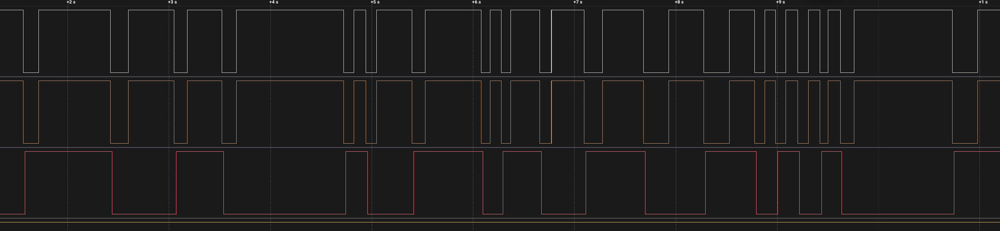
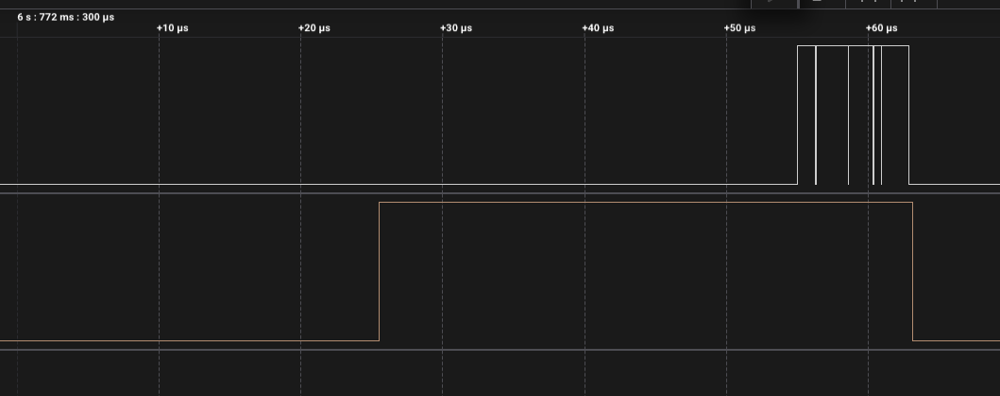
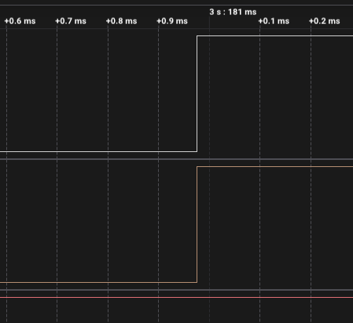

# ДЗ 2.4 — Polling, з RC (BUTTON DEBOUNCE)

Завдання 5 для [`polling_debounce`](../polling_debounce/). Прошивка та сама, на вході RC-фільтр 100 Ω + 100 нФ і зовнішня підтяжка 10 кΩ; у коді змінився лише `BUTTON_MODE`.

Розрахунок фільтра і схема — у [README завдання](../README.md#завдання-5--hardware-debounce-rc-фільтр).

| Схема (Wokwi) | Зібрана плата |
|---|---|
|  |  |

## Результат

| | Без RC | З RC |
|---|---:|---:|
| Натискань | 20 | 19 |
| Реакцій | 20 | 19 |
| **Хибних спрацювань** | **0** | **0** |
| Реакцій на відпускання | 0 | **0 з 20** |
| Затримка | 15.08 – 19.82 мс | 15.65 – 19.85 мс |
| Розкид | 4.74 мс | 4.20 мс |



Поведінка не змінилася, розкид так само дорівнює одному такту опитування. Для методу, який між вимірами має 5 мс, зміни на лінії в мікросекундному масштабі просто не існують — ні брязкіт, ні пачки переривань від повільного фронту.

## Найкращий кадр брязкоту за все ДЗ

На сирій лінії за весь запис **50 фронтів**, після фільтра — **40**. Ось натискання о 7.0970 с:


```
7.096960292   D0 ↓   контакт торкнувся
7.096961792   D0 ↑   відскочив через 1.5 мкс
7.096961833   D0 ↓   замкнувся — голка 41 нс, один семпл аналізатора
7.096970750   D1 ↓   після фільтра один спад, через 10.5 мкс
```

Голка завдовжки 41 нс — це межа того, що аналізатор на 24 MS/s узагалі здатен побачити. Конденсатор за такий час не встигає перезарядитися, бо τ розряду 10 мкс, і до піна вона не доходить.

А ось те саме на відпусканні, де контакт брязкотів довше:



Сира лінія смикається, відфільтрована тримає рівень — поки контакт не замкнувся надовго.

## Де проходить межа методу

Те відпускання о 6.7723 с закінчилося тим, що контакт замкнувся знову і протримався **1.8 мс**. RC-фільтр його чесно пропустив — проти 10 мкс сталої часу це ціла вічність. А машина станів відкинула: їй потрібні чотири однакові виміри поспіль, тобто 20 мс стабільного рівня, і подія завдовжки 1.8 мс до неї навіть не потрапила.

Тобто фільтри тут склалися шарами: конденсатор зрізав наносекундні голки, а опитування — усе, що коротше за 20 мс. Жоден із них поодинці цього б не зробив.

## Відпускання



Усі 20 відпускань дали нуль реакцій. Пачка переривань від повільного фронту, яка зламала [завдання 1](../raw_interrupt_rc/) і [завдання 2](../time_debounce_rc/), тут не має значення взагалі: `attachInterrupt()` не викликається, а між опитуваннями 5 мс.

```
Button pressed: 1
Button released
...
Button pressed: 19
Button released
```

Повний лог — у [`serial.log`](serial.log), сирі фронти — у [`digital.csv`](digital.csv).

## Файли

| Файл | Опис |
|---|---|
| [`main.cpp`](main.cpp) | прошивка, та сама що в `../polling_debounce/` |
| [`serial.log`](serial.log) | лог серії |
| [`digital.csv`](digital.csv) | три канали з Logic 2, 24 MS/s |
| [`diagram.json`](diagram.json) | схема з RC-фільтром для Wokwi |
| [`wokwi.toml`](wokwi.toml) | конфіг симулятора разом із чипом конденсатора |
| `capture-*.png` | скриншоти з аналізатора |
