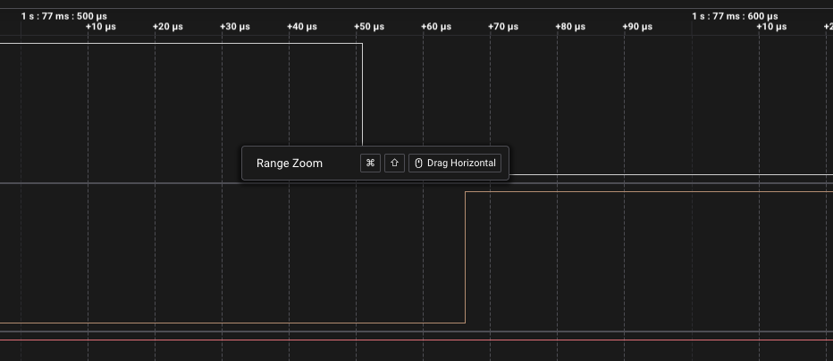
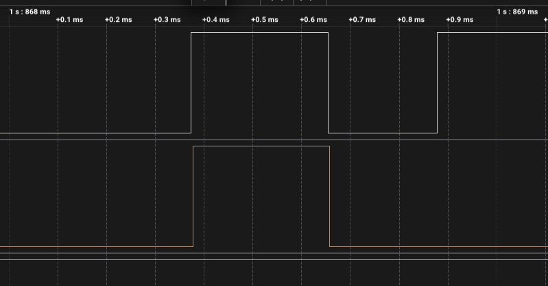
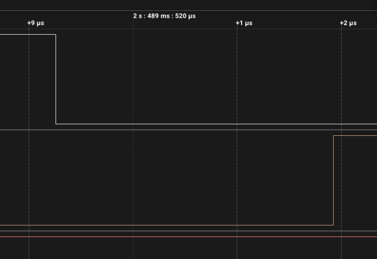

# ДЗ 2.4 — Переривання без фільтра (BUTTON DEBOUNCE)

Завдання 1. Переривання на `FALLING`, лічильник інкрементується в ISR, `loop()` друкує кожну нову подію і перемикає світлодіод. Фільтра немає свідомо: це еталон, з яким порівнюються три наступні прошивки.

ISR тут робить рівно одну дію — `counter++`. Усе інше (порівняння, друк, `digitalWrite`) винесено в `loop()`, бо `Serial.print()` всередині обробника — це десятки мілісекунд, за які загубляться наступні переривання.

| Що | Пін |
|---|---|
| Кнопка | GPIO 16, `INPUT_PULLUP`, другий контакт на GND |
| LED | GPIO 4, через 220 Ω на GND |

| Схема (Wokwi) | Зібрана плата |
|---|---|
|  |  |

## Результати

20 натискань різної сили і швидкості, запис аналізатора 24 MS/s на 17.7 с.

| | |
|---|---:|
| Натискань зроблено | 20 |
| Переривань у МК (лог) | 23 |
| **Хибних спрацювань** | **3** |
| FALLING-фронтів на аналізаторі | 22 |
| Перемикань світлодіода | 23 |


Брязкіт розподілився так:

| | Скільки разів | Найдовший |
|---|:---:|:---:|
| Натискання | 0 з 20 | — |
| Відпускання | 2 з 20 | 0.504 мс |

На натисканні не знайшлося жодного зайвого фронту — ні оком, ні в CSV. Весь брязкіт на відпусканні, рівно як у [ДЗ 1.5](../../dz1.5%20%28BUTTON%20BOUNCE%29/): контакт при розмиканні встигає торкнутися ще раз, і кожен такий дотик дає новий спад.

| Чисте натискання | Брязкіт відпускання |
|---|---|
|  |  |

### Затримка реакції

Від спадного фронту на кнопці до перемикання світлодіода:

| | Затримка |
|---|---:|
| Медіана | 2.8 мкс |
| Максимум (крім першого натискання) | 3.7 мкс |
| Перше натискання після старту | 15.3 мкс |



Тобто сама по собі схема «ISR ставить лічильник, `loop()` реагує» коштує одиниці мікросекунд. Усе, що буде довше в наступних завданнях, — це ціна фільтра, а не накладні витрати на переривання.

### Чому МК нарахував більше, ніж бачив аналізатор

23 переривання проти 22 спадних фронтів у захопленні. Розбіжність не одна, їх три, і вони різноспрямовані:

- **двічі** світлодіод перемкнувся одразу після наростаючого фронту (1.8684 с і 3.4019 с) — МК там побачив спад, якого в CSV немає;
- **один раз** МК не зарахував спад, який аналізатор записав: о 5.5087 с лінія на відпусканні піднялась рівно на 291 нс і впала назад, тобто сім семплів на 24 MS/s.

Схоже, обидва випадки — це одна й та сама причина: аналізатор і вхід ESP32 міряють по різних порогах. Відпускання тут повільне, бо лінію підтягує слабка внутрішня підтяжка ~45 кΩ, і напруга повзе вгору не миттєво. Поки вона проходить проміжну зону, аналізатор зі своїм порогом уже рахує HIGH, а вхід МК із вищим V_IH — ще ні, і навпаки. Звідси і «невидимі» спади, і проігнорований блип.

Перевірка в [завданні 5](../raw_interrupt_rc/) показала, що механізм угадано, а напрямок — ні. Я чекав, що зовнішня підтяжка 10 кΩ зробить фронт крутішим і розбіжність зменшиться. Натомість разом із підтяжкою на платі з'явився конденсатор 100 нФ, фронт відпускання став не крутішим, а в сто разів повільнішим — і замість трьох зайвих переривань на 20 натискань вийшло 277. Повільний фронт тримає вхід у зоні перемикання сотні мікросекунд, і це остаточно підтверджує, що річ саме в порогах: ESP32 не має тригера Шмітта на входах GPIO.

```
Button interrupt count: 1
Button interrupt count: 2
...
Button interrupt count: 23
```

Повний лог — у [`serial.log`](serial.log), сирі фронти — у [`digital.csv`](digital.csv).

## Запуск

1. У [`platformio.ini`](../../platformio.ini):
   ```ini
   build_src_filter = +<../dz2.4 (BUTTON DEBOUNCE)/raw_interrupt/main.cpp>
   ```
2. `./tools/compiledb.sh` — щоб IDE бачила джерела.
3. `pio run -t upload && pio device monitor`

У Wokwi: `pio run`, далі `Wokwi: Select Config File` → [`wokwi.toml`](wokwi.toml) і `Wokwi: Start Simulator`.

## Файли

| Файл | Опис |
|---|---|
| [`main.cpp`](main.cpp) | прошивка |
| [`serial.log`](serial.log) | лог серії з 20 натискань |
| [`digital.csv`](digital.csv) | фронти з Logic 2, 24 MS/s |
| [`diagram.json`](diagram.json) | схема для Wokwi |
| [`wokwi.toml`](wokwi.toml) | конфіг симулятора |
| [`schema.png`](schema.png) | скриншот схеми з Wokwi |
| [`photo.jpeg`](photo.jpeg) | фото зібраної схеми |
| `capture-*.png` | скриншоти з аналізатора |

Завдання 5 для цієї прошивки — [**raw_interrupt_rc**](../raw_interrupt_rc/): той самий код на платі з RC-фільтром, софтового фільтра немає зовсім, брязкіт прибирає тільки RC.
