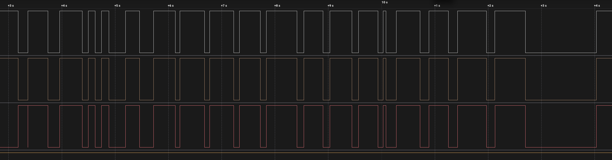
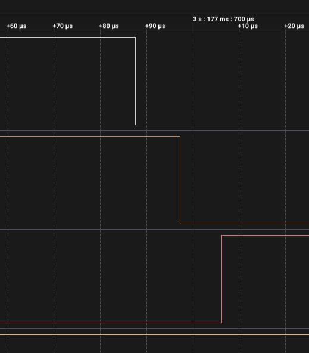
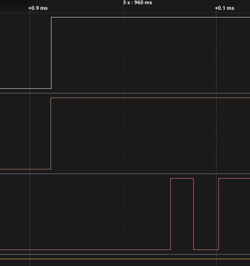

# ДЗ 2.4 — Переривання без фільтра, з RC (BUTTON DEBOUNCE)

Завдання 5 для [`raw_interrupt`](../raw_interrupt/). Прошивка та сама, брязкіт прибирає залізо: RC-фільтр 100 Ω + 100 нФ і зовнішня підтяжка 10 кΩ. У коді змінився один рядок — `BUTTON_MODE` став `INPUT`, бо внутрішня підтяжка зменшила б сталу часу приблизно до 0.8 мс:

```sh
diff "../raw_interrupt/main.cpp" main.cpp
```

Схема й розрахунок — у [README завдання](../README.md#завдання-5--hardware-debounce-rc-фільтр).

| Схема (Wokwi) | Зібрана плата |
|---|---|
|  |  |

## Результат: фільтр спрацював, а стало гірше вдесятеро

| | Без RC | З RC |
|---|---:|---:|
| Натискань | 20 | 19 |
| Фронтів на аналізаторі | 22 | 38 |
| Зайвих фронтів на аналізаторі | 2 | **0** |
| Переривань у МК | 23 | **296** |



Сигнал став бездоганним. За весь запис 19 спадів і 19 підйомів, жодного зайвого фронту — RC прибрав брязкіт повністю. А лічильник переривань зріс у тринадцять разів.

## Фільтр справді працює



Натискання: конденсатор розряджається через 100 Ω, виміряна затримка між каналами **9.46 мкс** проти розрахункових τ = 100 Ω × 100 нФ = 10 мкс. Сходиться, тож номінали на платі ті, що треба — з конденсатором `103` було б 1 мкс. Світлодіод перемикається рівно один раз.

## А ламається все на відпусканні



Один чистий підйом на лінії — і три перемикання світлодіода після нього. Причому світлодіод тут лише видима частина: `loop()` встигає зреагувати не на кожне переривання, і насправді кожне відпускання дає близько **15 переривань, розтягнутих на ~175 мкс**.

Розклад по фронтах за весь запис:

| | Перемикань світлодіода |
|---|---:|
| Натискання (спад) | 19 — рівно одне на кожне |
| Відпускання (підйом) | 56 — по три на кожне |

Усі зайві спрацювання на відпусканні, жодного на натисканні.

## Чому

Фронти несиметричні, і різниця між ними стократна:

| | Шлях струму | τ | Фронт |
|---|---|---|---|
| Натискання | розряд через 100 Ω | 10 мкс | різкий |
| Відпускання | заряд через 10 кΩ | 1 мс | **у сто разів повільніший** |

Поки напруга повільно повзе через зону перемикання входу, вона живе там сотні мікросекунд. Найменший шум у цей момент перекидає внутрішній логічний рівень туди-сюди десятки разів, і кожен перехід вниз — це нове `FALLING`-переривання.

Аналізатор цього не показує, бо має власний поріг із гістерезисом і фіксує одне перетинання. А в ESP32 гістерезису немає: [тригерів Шмітта на входах GPIO в ESP немає](https://esp32.com/viewtopic.php?p=138699). Саме тому RC-ланку в нормальних схемах заводять не прямо на пін, а через буфер із тригером Шмітта — 74HC14 або подібний.

Виходить парадокс, який варто сформулювати прямо: **апаратний фільтр зробив сигнал ідеальним і при цьому зробив систему непридатною**. Фільтрувати брязкіт і формувати крутий фронт — різні задачі, і RC-ланка вміє тільки першу.

## Що з цим робити

- **Правильно:** 74HC14 між фільтром і піном. У мене такого немає.
- **Дешево:** зменшити сталу часу, щоб вхід менше часу проводив у зоні невизначеності. Ціна — слабша фільтрація.
- **Практично:** лишити RC і додати програмний фільтр. Пачка триває 175 мкс, а найкоротший програмний фільтр у цьому ДЗ — 5 мс. Будь-який із трьох наступних варіантів її просто не помітить.

Збільшувати послідовний резистор, як може здатися, сенсу не має: через нього на відпусканні струм не тече взагалі, він задає лише спад. До того ж у нього є стеля — разом із підтяжкою він утворює дільник, і при 10 кΩ натиснута кнопка дала б на піні 1.65 В замість нуля.

```
Button interrupt count: 1
Button interrupt count: 2
Button interrupt count: 14
...
Button interrupt count: 296
```

Пропуски в лозі — це не втрачені переривання, а навпаки: лічильник встигає вирости на десяток, поки `loop()` друкує попередній рядок. Повний лог — у [`serial.log`](serial.log), сирі фронти — у [`digital.csv`](digital.csv).

## Файли

| Файл | Опис |
|---|---|
| [`main.cpp`](main.cpp) | прошивка, та сама що в `../raw_interrupt/` |
| [`serial.log`](serial.log) | лог серії |
| [`digital.csv`](digital.csv) | три канали з Logic 2, 24 MS/s |
| [`diagram.json`](diagram.json) | схема з RC-фільтром для Wokwi |
| [`wokwi.toml`](wokwi.toml) | конфіг симулятора разом із чипом конденсатора |
| [`schema.png`](schema.png) | скриншот схеми з Wokwi |
| [`photo.jpeg`](photo.jpeg) | фото зібраної схеми |
| `capture-*.png` | скриншоти з аналізатора |
