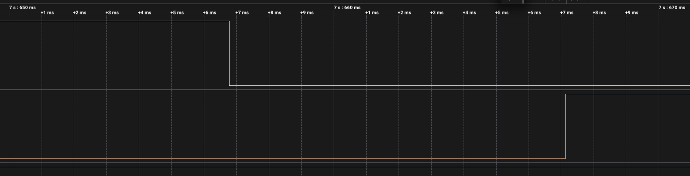

# ДЗ 2.4 — Debounce по рівню (BUTTON DEBOUNCE)

Завдання 3. Переривання повішене на `CHANGE` і не вирішує нічого — лише каже «на лінії щось сталося». `loop()` витримує `SETTLE_MS`, читає реальний рівень піна і зараховує натискання, тільки якщо кнопка досі притиснута до GND.

Другий прапорець — сам стан кнопки `pressed_`. Без нього серія фронтів усередині одного натискання дала б кілька подій, бо рівень весь цей час лишається низьким.

Схема й плата ті самі, що в [завданні 1](../raw_interrupt/): кнопка на GPIO 16 з `INPUT_PULLUP`, світлодіод на GPIO 4 через 220 Ω.

| Схема (Wokwi) | Зібрана плата |
|---|---|
|  |  |

## Результати

Серія вийшла на 28 натискань — це видно з захоплення: 28 окремих утримань кнопки тривалістю від 99 до 807 мс. Запис аналізатора 24 MS/s на 25.0 с.

| | |
|---|---:|
| Натискань | 28 |
| Реакцій | 28 |
| **Хибних спрацювань** | **0** |
| **Реакцій на відпускання** | **0** |
| Спадних фронтів на аналізаторі | 33 |
| Медіанна затримка | 9.98 мс |


З 33 спадів прошивка зарахувала 28. П'ять зайвих — це брязкіт відпускання, і жоден із них не дійшов до світлодіода.

## Брязкіт, який фільтр проігнорував

Чотири пачки на відпусканні, найдовша 0.797 мс. Усередині трапилися голки по 958 нс і навіть 83 нс — два семпли аналізатора.


Чотири фронти на кнопці — і рівна лінія світлодіода. Це і є головна відмінність від [завдання 2](../time_debounce/), де такі самі відпускання зараховувалися як нові натискання. Фільтр по рівню їх не рахує не тому, що вони короткі, а тому, що через 10 мс пін читається як HIGH — кнопка відпущена, значить події немає.

## Затримка реакції

| | Затримка |
|---|---:|
| Медіана | 9.98 мс |
| Мінімум | 9.52 мс |
| Максимум | 10.48 мс |



Це рівно `delay(SETTLE_MS)` — 10 мс. Проти мікросекунд у завданнях 1 і 2 різниця в три порядки, але вона вся в очікуванні, а не в коді: сам розбір події так само коштує одиниці мікросекунд.

Платиться за це надійністю. Зворотний бік — натискання, коротше за 10 мс, зникне безслідно: на момент читання пін уже буде HIGH. Людина так швидко не тисне, але межа саме тут.

## Де проходить межа методу

О 17.6135 с кнопка відпустилась, а через **15.193 мс** контакт замкнувся знову і протримався 401 мс. Прошивка зарахувала це як нове натискання.


І це правильно: 401 мс утримання — це вже не брязкіт, а палець. Але видно поріг методу. Усе, що тримається довше за `SETTLE_MS`, зараховується як справжнє натискання, і відрізнити «палець натиснув удруге» від «контакт залип на 15 мс» фільтр не може. Підняти `SETTLE_MS` означає підняти й затримку реакції — це і є компроміс, який у завданні 4 налаштовується явно.

```
Button pressed
Button released
Button pressed
Button released
...
```

Повний лог — у [`serial.log`](serial.log), сирі фронти — у [`digital.csv`](digital.csv).

## Запуск

1. У [`platformio.ini`](../../platformio.ini):
   ```ini
   build_src_filter = +<../dz2.4 (BUTTON DEBOUNCE)/state_debounce/main.cpp>
   ```
2. `./tools/compiledb.sh`
3. `pio run -t upload && pio device monitor`

## Файли

| Файл | Опис |
|---|---|
| [`main.cpp`](main.cpp) | прошивка |
| [`serial.log`](serial.log) | лог серії |
| [`digital.csv`](digital.csv) | фронти з Logic 2, 24 MS/s |
| [`diagram.json`](diagram.json) | схема для Wokwi |
| [`wokwi.toml`](wokwi.toml) | конфіг симулятора |
| `capture-*.png` | скриншоти з аналізатора |

Завдання 5 для цієї прошивки — [**state_debounce_rc**](../state_debounce_rc/): той самий код на платі з RC-фільтром, фільтр по рівню поверх апаратного.
