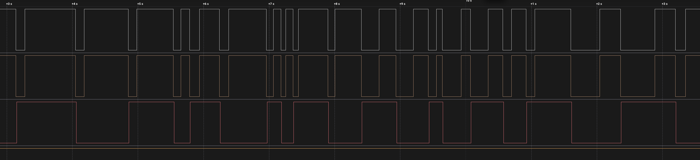
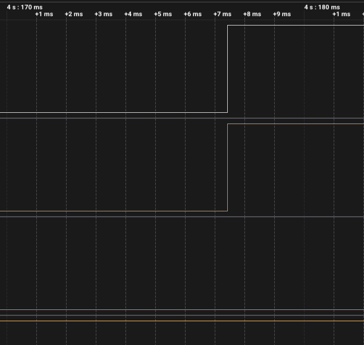
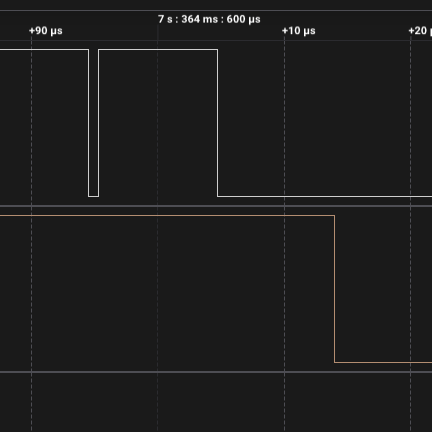
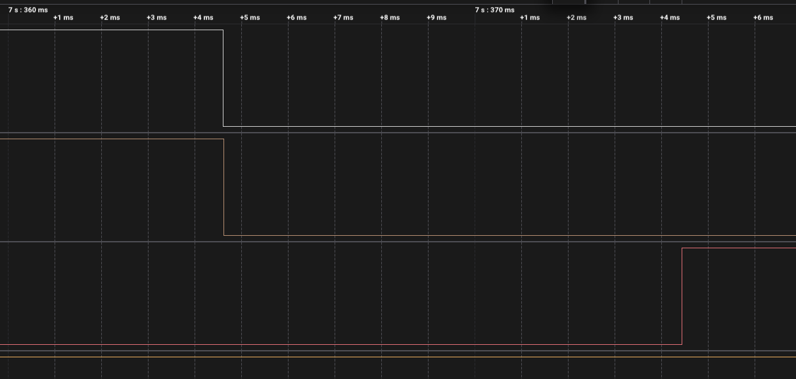

# ДЗ 2.4 — Debounce по рівню, з RC (BUTTON DEBOUNCE)

Завдання 5 для [`state_debounce`](../state_debounce/). Прошивка та сама, на вході RC-фільтр 100 Ω + 100 нФ і зовнішня підтяжка 10 кΩ; у коді змінився лише `BUTTON_MODE`.

Розрахунок фільтра і схема — у [README завдання](../README.md#завдання-5--hardware-debounce-rc-фільтр).

| Схема (Wokwi) | Зібрана плата |
|---|---|
|  |  |

## Результат

| | Без RC | З RC |
|---|---:|---:|
| Натискань | 28 | 20 |
| Реакцій | 28 | 20 |
| **Хибних спрацювань** | **0** | **0** |
| Реакцій на відпускання | 0 | **0 з 20** |
| Затримка, медіана | 9.98 мс | 10.02 мс |



Нічого не змінилося, і це головне. Метод був бездоганний без фільтра і лишився бездоганним із ним.

## Жодне відпускання не пройшло



Усі 20 відпускань дали нуль реакцій — попри те, що МК у кожне з них отримував пачку приблизно з 15 переривань (детальний розбір — у [`raw_interrupt_rc`](../raw_interrupt_rc/)).

Метод їх навіть не розглядає. Переривання для нього лише сигнал «щось сталося», а рішення ухвалюється через 10 мс за **рівнем** піна — і рівень там HIGH. Скільки саме фронтів прилетіло в пачці, не має значення.

Це й відповідь на питання, яке лишилось відкритим у [завданні 2](../time_debounce_rc/): там з RC-фільтром хибні спрацювання зросли з шести до дев'ятнадцяти. Проблема була не в довжині вікна, а в тому, що фільтр по часу міряє лише паузу між подіями і не має жодної інформації про стан кнопки.

## Фільтр спіймано на роботі

За весь запис на сирій лінії D0 **42 фронти**, а після фільтра D1 — **40**. Ось ці два:



```
7.364594500   D0 ↓   контакт торкнувся
7.364595292   D0 ↑   відскочив через 0.8 мкс
7.364604667   D0 ↓   замкнувся остаточно
7.364613917   D1 ↓   відфільтрована лінія впала — один раз
```

Контакт при натисканні брязнув: розімкнувся на 0.8 мкс і замкнувся знову. На вході мікроконтролера цього немає — конденсатор за такий час не встиг перезарядитися, бо τ розряду 10 мкс.

Це єдине місце в усьому ДЗ, де видно, як RC-ланка робить те, заради чого її ставили. Решту часу вона або нічого не змінювала, або, як у завданнях 1 і 2, псувала справу повільним фронтом відпускання.

## Затримка



Медіана 10.02 мс проти 9.98 мс без фільтра — різниці немає. Затримка тут цілком належить `delay(SETTLE_MS)`, а апаратна ланка додає мікросекунди, які на цьому тлі не видно.

```
Button pressed
Button released
...
```

Повний лог — у [`serial.log`](serial.log), сирі фронти — у [`digital.csv`](digital.csv).

## Файли

| Файл | Опис |
|---|---|
| [`main.cpp`](main.cpp) | прошивка, та сама що в `../state_debounce/` |
| [`serial.log`](serial.log) | лог серії |
| [`digital.csv`](digital.csv) | три канали з Logic 2, 24 MS/s |
| [`diagram.json`](diagram.json) | схема з RC-фільтром для Wokwi |
| [`wokwi.toml`](wokwi.toml) | конфіг симулятора разом із чипом конденсатора |
| `capture-*.png` | скриншоти з аналізатора |
