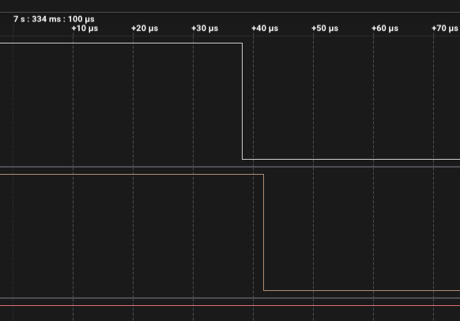
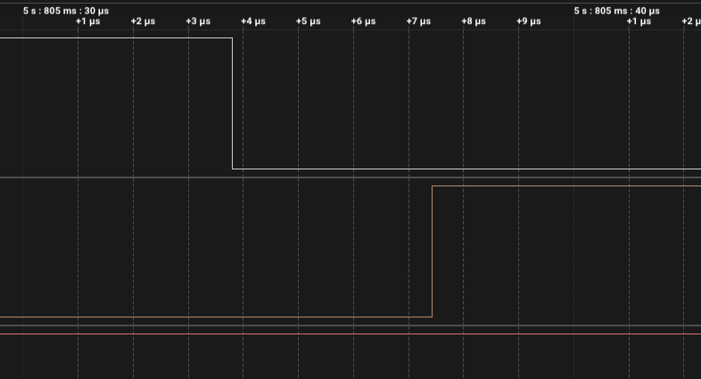

# ДЗ 2.4 — Debounce по часу (BUTTON DEBOUNCE)

Завдання 2. Те саме переривання на `FALLING`, але подія приймається, лише якщо від попередньої **прийнятої** минуло ≥ 50 мс. Умова вимагає тримати фільтр поза ISR, тому обробник лише запам'ятовує час фронту і піднімає прапорець, а рішення ухвалює `loop()`.

Час беру `micros()` першим рядком ISR — це момент самого фронту, а не момент, коли до нього дійшов `loop()`.

Схема й плата ті самі, що в [завданні 1](../raw_interrupt/): кнопка на GPIO 16 з `INPUT_PULLUP`, світлодіод на GPIO 4 через 220 Ω.

| Схема (Wokwi) | Зібрана плата |
|---|---|
|  |  |

## Результати

20 натискань, той самий набір, що й у завданні 1. Запис аналізатора 24 MS/s на 20.1 с.

| | |
|---|---:|
| Натискань зроблено | 20 |
| Переривань у МК | 27 |
| Прийнято фільтром | 26 |
| Відкинуто фільтром | 1 |
| **Хибних спрацювань** | **6** |
| FALLING-фронтів на аналізаторі | 22 |


## Фільтр спрацював правильно і майже нічого не дав

Це головний висновок завдання, і він неочевидний.

За весь запис знайшлася **рівно одна** пара спадних фронтів, ближчих один до одного за 50 мс: о 5.1190 с і 5.1193 с, тобто через 0.268 мс. Фільтр її і відкинув — єдиний рядок `Rejected` у лозі. Більше йому не було чого ловити.


Одна пачка, **два спади, одна реакція**. Перший спад прийнято — світлодіод перемкнувся. Другий, через 0.268 мс, фільтр відкинув, і лінія світлодіода лишилась рівною. Це і є той самий рядок `Rejected button event at: 9828720 us`: шкала аналізатора зсунута до `micros()` плати на 4.709 с, і 5.119264 + 4.709 = 9.8287 — сходиться до мікросекунди.

Решта зайвих подій прийшла на **відпусканні**, і ось наскільки пізно:

| Зайва подія | Минуло від попередньої прийнятої |
|---:|---:|
| 5.9538 с | 148.7 мс |
| 7.4425 с | 108.4 мс |
| 9.0109 с | 350.2 мс |
| 15.0244 с | 110.3 мс |
| 17.0174 с | 470.1 мс |

Найближча з них — 108 мс після прийнятого натискання, а вікно фільтра всього 50 мс. Для time-based вони виглядають як цілком законні нові натискання.

Причина проста: я тримав кнопку натиснутою в середньому 142 мс (від 99 до 490 мс). Відпускання завжди настає пізніше, ніж закінчується вікно блокування, тому жодне вікно, коротше за час утримання, його не зловить.

| Відпускання, яке фільтр пропустив | Чисте натискання |
|---|---|
|  |  |

### Який DEBOUNCE_MS був би достатній

Жоден розумний. Щоб вікно накрило відпускання, воно має бути довшим за час утримання кнопки — тобто більшим за 490 мс у цій серії. Але тоді два свідомі натискання підряд швидше ніж раз на півсекунди просто не пройдуть, і кнопка стане непридатною.

Це не недолік реалізації, а межа самого методу: фільтр по часу вимірює лише паузу між подіями і не має жодної інформації про те, натиснута кнопка зараз чи відпущена. Саме це й лагодить завдання 3.

### Затримка реакції

| | Затримка |
|---|---:|
| Медіана | 3.8 мкс |
| Перше натискання після старту | 15.4 мкс |



Проти 2.8 мкс у завданні 1 — трохи більше, бо `loop()` тепер ще й порівнює час. На тлі 50 мс вікна це ніщо: вся затримка методу — це саме вікно, а не код.

### Чому МК нарахував 27, а аналізатор 22

П'ять перемикань світлодіода сталися одразу після **наростаючого** фронту — МК побачив там спад, якого в захопленні немає. Це та сама картина, що в [завданні 1](../raw_interrupt/#чому-мк-нарахував-більше-ніж-бачив-аналізатор), тільки цього разу таких випадків п'ять, а не два: аналізатор і вхід ESP32 міряють по різних порогах, а відпускання повільне через слабку внутрішню підтяжку ~45 кΩ.

Тобто всі шість хибних спрацювань — це відпускання: п'ять «невидимих» голок і одна, яку аналізатор записав (о 4.3044 с).

```
Accepted button events: 4, total interrupts: 4
Rejected button event at: 9828720 us
Accepted button events: 5, total interrupts: 6
...
Accepted button events: 26, total interrupts: 27
```

Повний лог — у [`serial.log`](serial.log), сирі фронти — у [`digital.csv`](digital.csv).

## Запуск

1. У [`platformio.ini`](../../platformio.ini):
   ```ini
   build_src_filter = +<../dz2.4 (BUTTON DEBOUNCE)/time_debounce/main.cpp>
   ```
2. `./tools/compiledb.sh`
3. `pio run -t upload && pio device monitor`

## Файли

| Файл | Опис |
|---|---|
| [`main.cpp`](main.cpp) | прошивка |
| [`serial.log`](serial.log) | лог серії з 20 натискань |
| [`digital.csv`](digital.csv) | фронти з Logic 2, 24 MS/s |
| [`diagram.json`](diagram.json) | схема для Wokwi |
| [`wokwi.toml`](wokwi.toml) | конфіг симулятора |
| `capture-*.png` | скриншоти з аналізатора |

Завдання 5 для цієї прошивки — [**time_debounce_rc**](../time_debounce_rc/): той самий код на платі з RC-фільтром, фільтр по часу поверх апаратного.
