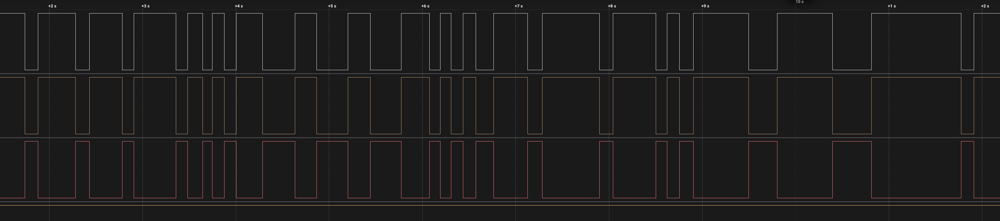
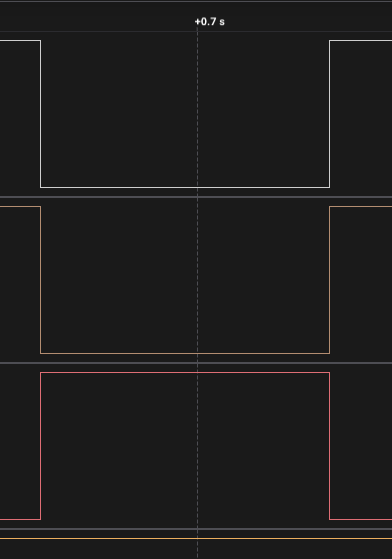
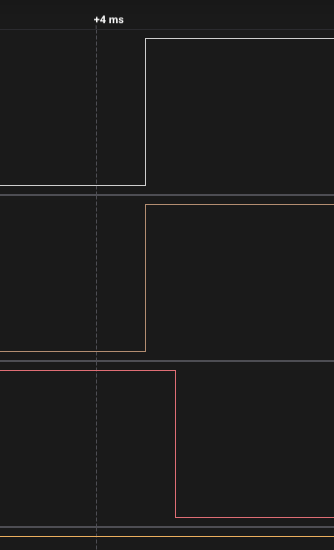

# ДЗ 2.4 — Debounce по часу, з RC (BUTTON DEBOUNCE)

Завдання 5 для [`time_debounce`](../time_debounce/). Прошивка та сама, на вході RC-фільтр 100 Ω + 100 нФ і зовнішня підтяжка 10 кΩ; у коді змінився лише `BUTTON_MODE`.

Розрахунок фільтра і схема — у [README завдання](../README.md#завдання-5--hardware-debounce-rc-фільтр).

| Схема (Wokwi) | Зібрана плата |
|---|---|
|  |  |

## Результат: стало втричі гірше

| | Без RC | З RC |
|---|---:|---:|
| Натискань | 20 | 19 |
| Переривань у МК | 27 | 162 |
| Прийнято | 26 | 38 |
| Відкинуто фільтром | 1 | 124 |
| **Хибних спрацювань** | **6** | **19** |



Раніше з 19 відпускань зайву подію давали п'ять — ті короткі голки, яких аналізатор навіть не бачив. Тепер зайву подію дає **кожне** відпускання, усі 19.

## Чому саме так

RC-фільтр зробив брязкіт відпускання надійним. Без нього голка на релізі виникала як пощастить, із нею — кожне відпускання гарантовано породжує пачку приблизно з семи переривань, бо повільний фронт тримає вхід ESP32 у зоні перемикання (детальний розбір — у [`raw_interrupt_rc`](../raw_interrupt_rc/)).

І тут видно справжню межу методу: **вікно в 50 мс сліпе до першого фронту пачки.** Решту пачки фільтр ріже бездоганно — з 162 переривань відкинуто 124. Але перший фронт приходить через 100+ мс після прийнятого натискання, і для фільтра, який уміє міряти лише паузу, це законна нова подія.

Лог це показує буквально: на кожен цикл рівно два `Accepted` і один `Rejected`.

| Один цикл цілком | Відпускання крупно |
|---|---|
|  |  |
| натиск → реакція, відпускання → **друга реакція** | лінія чиста, а подія все одно прийнята |

## Затримка

Від сирого фронту на кнопці до перемикання світлодіода — медіана **10.4 мкс**. Майже все це сам фільтр: спад через 100 Ω займає 9.5 мкс, код додає близько мікросекунди. Тобто апаратна ланка затримку практично не псує, на відміну від програмних фільтрів у завданнях 3 і 4.

```
Accepted button events: 1, total interrupts: 1
Accepted button events: 2, total interrupts: 7
Rejected button event at: 17625327 us
Accepted button events: 3, total interrupts: 9
...
Accepted button events: 38, total interrupts: 162
```

Повний лог — у [`serial.log`](serial.log), сирі фронти — у [`digital.csv`](digital.csv).

## Висновок

Апаратний фільтр не рятує метод, який не вміє відрізнити натискання від відпускання. Він лише робить його провал стабільним: було шість хибних спрацювань із дев'ятнадцяти відпускань, стало дев'ятнадцять із дев'ятнадцяти.

## Файли

| Файл | Опис |
|---|---|
| [`main.cpp`](main.cpp) | прошивка, та сама що в `../time_debounce/` |
| [`serial.log`](serial.log) | лог серії |
| [`digital.csv`](digital.csv) | три канали з Logic 2, 24 MS/s |
| [`diagram.json`](diagram.json) | схема з RC-фільтром для Wokwi |
| [`wokwi.toml`](wokwi.toml) | конфіг симулятора разом із чипом конденсатора |
| `capture-*.png` | скриншоти з аналізатора |
